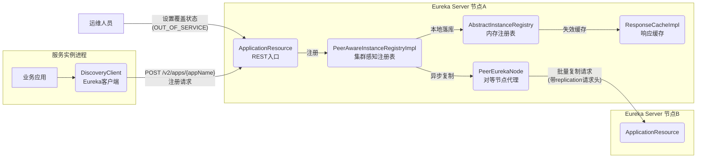
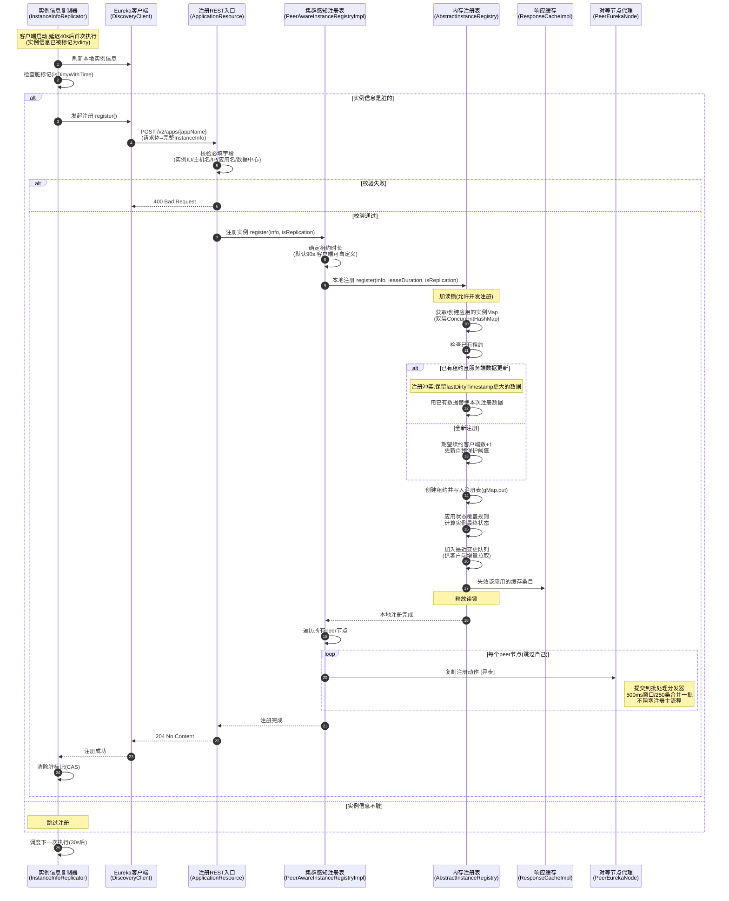
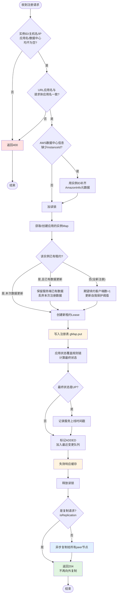
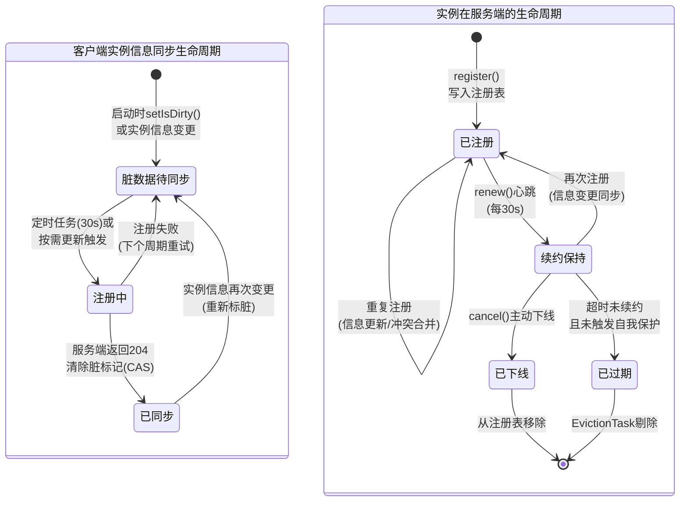
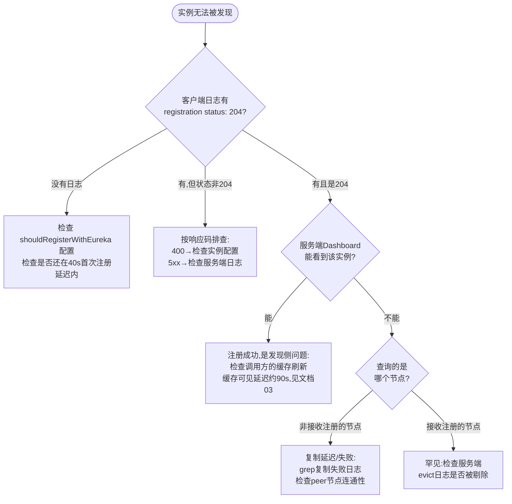

# 服务注册流程（DiscoveryClient#register → ApplicationResource#addInstance → AbstractInstanceRegistry#register）

## 文档说明

本文档分析 Eureka **服务注册**全链路的业务功能、设计决策、状态流转、质量属性与异常处理。链路覆盖：

- 客户端发起：`com.netflix.discovery.DiscoveryClient#register` 及其触发器 `InstanceInfoReplicator`
- 服务端入口：`com.netflix.eureka.resources.ApplicationResource#addInstance`
- 注册表落库：`com.netflix.eureka.registry.AbstractInstanceRegistry#register`
- 集群复制：`com.netflix.eureka.registry.PeerAwareInstanceRegistryImpl#replicateToPeers`

---

## 零、TL;DR

> **一句话摘要**：客户端把自身实例信息（InstanceInfo）以 HTTP POST 发给服务端，服务端将其包装为租约（Lease）写入双层内存 Map 注册表，失效响应缓存，并异步批量复制给集群其他节点。

- **复杂度域**：Complex（跨系统、并发控制、分布式异步复制、多级缓存）
- **业务入口**：
  - 客户端定时任务 `InstanceInfoReplicator.run()`（首次注册 + 信息变更同步）
  - 服务端 REST 接口 `POST /v2/apps/{appName}`（Jersey 路由）
- **关键依赖**：内存注册表（双层 ConcurrentHashMap）、响应缓存（ResponseCache）、对等节点（PeerEurekaNode 批处理复制）
- **关键风险点**：
  1. 集群复制是异步且"尽力而为"的，peer 节点宕机期间的注册存在数据不一致窗口，依赖心跳复制兜底修复
  2. 客户端注册失败不会立即重试，最长要等 30s 的下一个同步周期，期间实例不可被发现

## 一、业务上下文

### 1.1 业务定义

服务注册是服务发现体系的起点：一个微服务实例启动后，必须把"我是谁（应用名/实例ID）、我在哪（IP/端口）、我是否健康（状态）"告诉注册中心，其他服务才能发现并调用它。

Eureka 的注册被设计为**幂等且可重复**的操作——客户端不仅在启动时注册，之后实例信息每次发生变化（如健康状态改变），都通过"重新注册"来同步给服务端。这种"注册即同步"的设计简化了协议：服务端不需要单独的"更新"接口。

### 1.2 业务术语表（DDD Ubiquitous Language）

| 术语 | 含义 | 对应代码符号 |
|------|------|--------------|
| 实例信息 | 一个服务实例的完整描述（应用名、ID、IP、端口、状态、元数据） | `InstanceInfo` |
| 租约 | 实例在注册表中的生存凭证，靠心跳续约维持 | `Lease<InstanceInfo>` |
| 注册表 | 服务端存储所有实例租约的双层内存 Map | `AbstractInstanceRegistry.registry` |
| 脏标记 | 客户端本地实例信息已变更、尚未同步到服务端的标志 | `InstanceInfo.isInstanceInfoDirty` |
| 复制 | 把本节点收到的写操作转发给集群其他节点 | `replicateToPeers` |
| 覆盖状态 | 运维人员通过 API 强制设置的实例状态（优先于实例自报状态） | `overriddenInstanceStatusMap` |
| 自我保护 | 续约数骤降时服务端停止剔除实例的保护机制 | `numberOfRenewsPerMinThreshold` |

### 1.3 领域定位（DDD）

- **聚合根**：`InstanceInfo`（实例信息），注册表以它为中心组织数据
- **领域事件**：实例注册后写入 `recentlyChangedQueue`（最近变更队列），相当于领域事件的事件存储，供客户端增量拉取消费
- **业务不变量**：
  1. 同一 `appName + instanceId` 在注册表中最多只有一份租约
  2. 注册表中数据的"新旧"由 `lastDirtyTimestamp` 决定，新数据不能被旧数据覆盖
  3. 复制链路最多一跳：复制产生的注册不再触发二次复制
- **服务分类**：
  - `DiscoveryClient` / `InstanceInfoReplicator`：Application Service（客户端侧）
  - `AbstractInstanceRegistry`：Domain Service（核心领域逻辑）
  - `PeerEurekaNode` / `ResponseCache`：Infrastructure Service

### 1.4 触发方式

| 触发场景 | 入口方法/类 | 说明 |
|----------|-------------|------|
| 客户端启动后首次注册 | `InstanceInfoReplicator.start()` → `run()` | 默认延迟 40s，等实例信息就绪 |
| 实例信息/状态变更 | `InstanceInfoReplicator.run()`（每 30s 检查脏标记） | "注册即同步" |
| 实例状态变更（实时） | `StatusChangeListener` → `InstanceInfoReplicator.onDemandUpdate()` | 限流 4 次/分钟 |
| 心跳收到 404 | `DiscoveryClient.renew()` → `register()` | 服务端不认识本实例时立即重新注册 |
| 集群复制 | `PeerEurekaNode.register()` → 对端 `addInstance()` | 请求头 `x-netflix-discovery-replication: true` |

### 1.5 核心实现类

| 类名 | 职责 |
|------|------|
| `DiscoveryClient` | 客户端门面，封装注册 HTTP 调用 |
| `InstanceInfoReplicator` | 客户端注册的调度器：自调度循环 + 按需更新 + 限流 |
| `ApplicationResource` | 服务端 REST 入口，参数校验 |
| `PeerAwareInstanceRegistryImpl` | 集群感知注册表：本地注册 + 集群复制 |
| `AbstractInstanceRegistry` | 内存注册表本体：租约管理、变更队列、缓存失效 |
| `Lease` | 租约模型：记录注册/续约/下线/上线时间戳 |
| `PeerEurekaNode` | 对等节点代理：复制任务的批处理提交 |
| `ResponseCacheImpl` | 响应缓存：注册后需要失效对应条目 |

## 二、系统协作（C4 视角）

### 2.1 系统上下文图（C4-Context）



### 2.2 关键参与方

| 参与方 | 类型 | 与本流程的关系 |
|--------|------|----------------|
| 业务应用 | 系统（进程内） | 注册的受益方，其网络地址被注册 |
| DiscoveryClient | 模块 | 注册的发起方 |
| Eureka Server 节点A | 系统 | 接收注册、落库、发起复制 |
| Eureka Server 节点B/C... | 系统 | 复制的接收方 |
| 运维人员 | 人 | 可能预先设置实例的覆盖状态，影响注册时的最终状态计算 |
| 其他 Eureka 客户端 | 系统 | 注册结果的消费方（通过拉取注册表发现新实例） |

## 三、关键设计决策（ADR）

| 决策点 | 备选方案 | 当前选择 | 理由 | Trade-off / 风险 |
|--------|----------|----------|------|------------------|
| 注册时的锁策略 | 写锁 / 读锁 / 无锁 | **读锁**（`read.lock()`） | 注册只修改内层 ConcurrentHashMap（本身线程安全），多个实例可并发注册；写锁留给需要一致性快照的增量拉取 | 命名反直觉（"读"锁用于写操作）；注册与增量拉取互斥，增量拉取期间注册被阻塞 |
| 集群复制模式 | 同步复制 / 异步批处理 / MQ | **异步批处理**（batchingDispatcher，500ms 窗口，250 条/批） | 注册请求快速返回；批量合并大幅减少集群间 HTTP 请求数 | 复制存在延迟窗口；节点宕机时数据不一致，依赖心跳兜底 |
| 复制传播范围 | 全网广播 / 一跳复制 | **一跳复制**（isReplication 标志位） | 防止 A→B→C→A 无限循环的"毒性复制" | 三节点以上集群中，B、C 之间的数据一致性依赖 A 分别推送 |
| 注册冲突解决 | 先到先得 / 时间戳比较 / 版本号 | **lastDirtyTimestamp 比较**（取较新者） | 客户端重启、复制乱序场景下保证最终采用最新数据 | 依赖各节点时钟基本同步；时间戳相等时优先远端数据 |
| 首次注册时机 | 启动立即注册 / 延迟注册 | **延迟 40s**（initialInstanceInfoReplicationIntervalSeconds） | 等待实例信息（IP/健康检查）收集完整，避免注册不完整数据后又频繁更新 | 实例启动后最长 40s 内不可被发现 |
| 实例信息同步方式 | 专门的更新接口 / 重新注册 | **重新注册即同步** | 协议简化：服务端只需幂等的注册接口 | 每次同步传输完整 InstanceInfo，载荷较大 |
| 按需更新限流 | 不限流 / 令牌桶 | **令牌桶**（burstSize=2，4 次/分钟） | 防止健康检查抖动导致的注册风暴 | 状态快速连续变化时，最终状态的同步可能延迟到下个周期 |
| 注册成功响应码 | 200 / 201 / 204 | **204 No Content** | 历史兼容（注释明确说明 backwards compatible） | 不返回注册结果详情，客户端无法感知服务端的状态修正 |

每条 ADR 的复审时机：集群规模显著扩大（>20 节点）时应重新评估一跳复制与批处理参数。

## 四、核心流程

### 4.1 主流程时序图



### 4.2 业务流程图（服务端视角）



### 4.3 状态流转图

注册流程涉及两条生命周期：客户端的"信息同步任务"生命周期 + 实例在服务端注册表中的生命周期。



### 4.4 关键步骤说明

按时序图步骤号解析：

**步骤 1-4（客户端触发）**：`InstanceInfoReplicator.run()`（InstanceInfoReplicator.java:129）是注册的真正发起点。它先调用 `refreshInstanceInfo()` 刷新本地信息（重新读取主机名/IP、执行健康检查），若有变化则实例被标记为脏；然后检查脏标记，只有脏数据才触发注册。

**步骤 5（HTTP 请求）**：`DiscoveryClient.register()`（DiscoveryClient.java:896）通过传输层发起 POST，请求体是完整的 InstanceInfo JSON。

**步骤 6-8（服务端校验）**：`ApplicationResource.addInstance()`（ApplicationResource.java:150）做 7 项必填校验 + AWS 数据中心信息兼容处理，全部通过才进入注册表。

**步骤 9-11（租约时长确定）**：`PeerAwareInstanceRegistryImpl.register()`（PeerAwareInstanceRegistryImpl.java:410）：

```java
int leaseDuration = Lease.DEFAULT_DURATION_IN_SECS;   // 默认90秒
if (info.getLeaseInfo() != null && info.getLeaseInfo().getDurationInSecs() > 0) {
    leaseDuration = info.getLeaseInfo().getDurationInSecs();   // 客户端自定义优先
}
```

**步骤 12-15（注册冲突处理）**：`AbstractInstanceRegistry.register()`（AbstractInstanceRegistry.java:198）中，若实例已有租约，比较新旧数据的 `lastDirtyTimestamp`：

```java
// 注意是 > 而不是 >=：时间戳相等时，优先采用对端传来的数据
if (existingLastDirtyTimestamp > registrationLastDirtyTimestamp) {
    registrant = existingLease.getHolder();   // 服务端数据更新,丢弃本次注册数据
}
```

**步骤 16（自我保护计数）**：全新注册时，`expectedNumberOfClientsSendingRenews + 1` 并重新计算阈值（AbstractInstanceRegistry.java:1223）：

```java
this.numberOfRenewsPerMinThreshold = (int) (this.expectedNumberOfClientsSendingRenews
        * (60.0 / serverConfig.getExpectedClientRenewalIntervalSeconds())   // 60/30 = 每分钟2次心跳
        * serverConfig.getRenewalPercentThreshold());                        // × 0.85
```

**步骤 17-20（落库与缓存失效）**：租约写入 `gMap`、加入最近变更队列（增量拉取数据源，保留 3 分钟）、失效 ResponseCache。注意只失效读写缓存层，只读缓存要等最多 30s 的定时同步——这是其他客户端"最长 30s 才能发现新实例"的原因之一。

**步骤 21-23（集群复制）**：`replicateToPeers()`（PeerAwareInstanceRegistryImpl.java:642）遍历 peer 节点，把任务提交给 `PeerEurekaNode.register()`（PeerEurekaNode.java:140）的批处理分发器，**异步**发送，不阻塞注册主流程。

**步骤 24-26（清除脏标记）**：客户端收到 204 后，用带时间戳的 CAS 清除脏标记——若注册期间实例信息又变化了（时间戳不匹配），脏标记保留，下个周期继续同步。

## 五、前置校验

### 5.1 校验规则

服务端入口 `ApplicationResource.addInstance()`（ApplicationResource.java:150）的校验链，全部为快速失败（fail-fast）：

```java
if (isBlank(info.getId())) {
    return Response.status(400).entity("Missing instanceId").build();
} else if (isBlank(info.getHostName())) {
    return Response.status(400).entity("Missing hostname").build();
} else if (isBlank(info.getIPAddr())) {
    return Response.status(400).entity("Missing ip address").build();
} else if (isBlank(info.getAppName())) {
    return Response.status(400).entity("Missing appName").build();
} else if (!appName.equals(info.getAppName())) {
    return Response.status(400).entity("Mismatched appName...").build();
}
```

AWS 数据中心信息的兼容性修复（非校验，是自动补齐）：

```java
// 部分客户端上报的 AmazonInfo 缺少 instanceId,默认行为是用实例自身 ID 补齐
if (effectiveId == null) {
    amazonInfo.getMetadata().put(AmazonInfo.MetaDataKey.instanceId.getName(), info.getId());
}
```

### 5.2 校验规则汇总

| 校验项 | 字段条件 | HTTP状态码 | 提示信息 | 对应业务不变量 |
|--------|----------|-----------|----------|----------------|
| 实例ID非空 | `info.getId()` 非空 | 400 | Missing instanceId | 实例必须可唯一标识 |
| 主机名非空 | `info.getHostName()` 非空 | 400 | Missing hostname | 实例必须可寻址 |
| IP非空 | `info.getIPAddr()` 非空 | 400 | Missing ip address | 实例必须可寻址 |
| 应用名非空 | `info.getAppName()` 非空 | 400 | Missing appName | 实例必须归属某个应用 |
| 应用名一致 | URL路径应用名 == 请求体应用名 | 400 | Mismatched appName, expecting X but was Y | 防止数据错位 |
| 数据中心信息非空 | `info.getDataCenterInfo()` 非空 | 400 | Missing dataCenterInfo | 区分AWS/自建机房 |
| 数据中心名非空 | `dataCenterInfo.getName()` 非空 | 400 | Missing dataCenterInfo Name | 同上 |
| AWS实例ID有效 | 仅实验性配置开启时校验 | 400 | DataCenterInfo of type ... must contain a valid id | AWS环境数据完整性 |

注：客户端侧（DiscoveryClient）发起注册前没有本地校验，字段完整性由 `EurekaConfigBasedInstanceInfoProvider` 构造 InstanceInfo 时保证。

## 六、外部系统交互

### 6.1 客户端 → 服务端（注册请求）

- **触发条件**：实例信息为脏（首次启动/信息变更/心跳404）
- **交互内容**：POST /v2/apps/{appName}，请求体为完整 InstanceInfo（JSON/XML）
- **成功判断**：HTTP 204
- **失败处理**：抛异常或返回 false，**不立即重试**，等下个同步周期（30s）
- **是否可逆**：N/A（注册是幂等操作，重复执行无副作用）
- **是否需补偿**：不需要，自调度循环天然兜底

### 6.2 服务端 → Peer 节点（集群复制）

- **触发条件**：本地注册完成且本次请求不是复制请求（isReplication=false）
- **交互内容**：批量复制请求 POST /peerreplication/batch/（多个复制任务合并）
- **成功判断**：批量响应中对应条目状态为 200
- **失败处理**：
  - 网络错误：批处理框架按 100ms 间隔重试，目标节点不可用时休眠 1000ms
  - 任务过期（积压超过租约时长）：直接丢弃，靠心跳复制兜底修复
- **是否可逆**：否（peer 节点上已落库）
- **是否需补偿**：需要——心跳复制时若 peer 返回 404（实例不存在）或数据冲突，会触发该实例的重新注册/数据修复

## 七、质量属性（NFR）

| 维度 | 具体要求 / 现状 | 代码支撑 |
|------|----------------|----------|
| **性能** | 注册主流程为纯内存操作（双层 Map put + 队列 add + 缓存失效），单次注册毫秒级；复制完全异步不阻塞 | AbstractInstanceRegistry.java:198-300（无 IO 操作） |
| **并发** | 读锁允许多实例并发注册；自我保护计数用 synchronized(lock) 细粒度锁；脏标记用带时间戳的 CAS | read.lock()（:204）、synchronized (lock)（:248）、unsetIsDirty(timestamp) |
| **可用性** | 注册失败由客户端 30s 自调度循环兜底重试；心跳 404 触发立即重新注册；复制失败不影响本地注册成功 | InstanceInfoReplicator.run() finally 块重新调度（:151-153）、DiscoveryClient.renew() 404 分支（:920-928） |
| **一致性** | 最终一致（AP）：本地注册立即生效，集群复制异步；冲突用 lastDirtyTimestamp 解决；新实例对其他客户端可见延迟 = 复制延迟 + 只读缓存同步(≤30s) + 客户端拉取(≤30s) + Ribbon(≤30s) ≈ 复制延迟 + 90s | replicateToPeers 异步、ResponseCache 三级缓存 |
| **可观测性** | REGISTER 计数器（区分复制/非复制）、每种 Action 的复制耗时计时器、最近注册队列（Dashboard 展示）、关键日志 | EurekaMonitors.REGISTER.increment()（:206）、action.getTimer()（:649）、recentRegisteredQueue（:267） |
| **安全性** | 注册接口无认证授权（信任网络边界）；web.xml 中有可选的 ServerRequestAuthFilter | eureka-server/web.xml 过滤器链 |

## 八、异常与失败模式

### 8.1 错误码完整对照表

| HTTP状态码 | 错误信息 | 触发条件 | 处理方式 |
|-----------|----------|----------|----------|
| 400 | Missing instanceId | 请求体缺实例ID | 客户端检查实例配置 |
| 400 | Missing hostname | 请求体缺主机名 | 同上 |
| 400 | Missing ip address | 请求体缺IP地址 | 同上 |
| 400 | Missing appName | 请求体缺应用名 | 同上 |
| 400 | Mismatched appName, expecting X but was Y | URL与请求体应用名不一致 | 检查客户端与服务端版本/序列化 |
| 400 | Missing dataCenterInfo | 请求体缺数据中心信息 | 检查 InstanceInfo 序列化 |
| 400 | Missing dataCenterInfo Name | 数据中心信息缺名称 | 同上 |
| 400 | DataCenterInfo of type {class} must contain a valid id | 实验性校验开启 + AWS信息缺ID | 补全 AWS 元数据 |
| 204 | （无内容） | 注册成功 | 正常流程 |
| 客户端异常 | registration failed | 网络异常/服务端不可达 | 客户端记录日志,等下个周期重试 |

### 8.2 失败模式分析（FMEA）

| 步骤 | 可能失败 | 数据一致性影响 | 是否可重入 | 补偿/恢复手段 |
|------|---------|----------------|------------|----------------|
| 客户端发起注册 | 网络超时/服务端宕机 | 实例未注册,不可被发现 | 是（幂等） | 30s 后自调度循环重试；脏标记未清除保证必然重试 |
| 服务端参数校验 | 字段缺失返回400 | 无影响（未落库） | 是 | 客户端修复配置后下个周期重试 |
| 写入注册表 | JVM OOM（理论） | 节点数据丢失 | - | 客户端心跳404 → 重新注册；或从 peer 节点 syncUp 恢复 |
| 失效响应缓存 | 缓存操作异常（理论） | 其他客户端拉到旧数据 | - | readWriteCacheMap 有 180s 自动过期兜底 |
| 复制到 peer 节点 | peer 宕机/网络分区 | 集群数据不一致：A 有实例,B 没有 | 是 | ① 复制任务重试（100ms间隔）② 任务过期丢弃后,下次心跳复制返回404触发重新注册 ③ peer 重启时 syncUp 全量同步 |
| 复制任务积压 | 复制队列满（>10000） | 部分复制任务被丢弃 | - | 同上,心跳复制兜底 |
| 清除脏标记 | CAS失败（注册期间信息又变更） | 无影响 | 是 | 脏标记保留,下个周期重新注册同步 |

### 8.3 单实例 vs 集群复制的异常策略差异

- **客户端注册请求失败**：影响仅限于该实例自身的可发现性，恢复手段是客户端自身的重试循环
- **集群复制失败**：影响的是集群内数据一致性，恢复依赖三层兜底：任务级重试 → 心跳复制修复 → 节点重启全量同步。设计上"容忍短期不一致,保证最终一致"

## 九、影响半径与依赖矩阵

### 9.1 fan-in（谁调用注册）

| 调用方 | 业务场景 | 频率 | 改动需协调? |
|--------|----------|------|-------------|
| Jersey 路由 → ApplicationResource.addInstance() | 客户端注册/复制注册 | 高（每实例30s内最多数次） | 是（REST契约） |
| PeerAwareInstanceRegistryImpl.register() | REST入口调用 | 同上 | 是 |
| AbstractInstanceRegistry.register()（被子类super调用） | 本地落库 | 同上 | 是 |
| InstanceRegistry 接口的其他实现/测试 | 单元测试 | - | 否 |

> fan-in 扫描证据：
> ```
> grep -rn "registry.register(" eureka-core/src/main/java
> grep -rn "\.register(info" eureka-core/src/main/java
> grep -rn "discoveryClient.register()\|register()" eureka-client/src/main/java/com/netflix/discovery/InstanceInfoReplicator.java
> ```

### 9.2 fan-out（注册依赖谁）

| 被调用方 | 依赖类型 | 失败时影响 |
|----------|----------|------------|
| registry（双层ConcurrentHashMap） | 内存数据结构 | 整个注册功能不可用 |
| ResponseCache.invalidate() | 内存缓存 | 其他客户端最长延迟 180s 才能看到新实例（缓存自动过期） |
| InstanceStatusOverrideRule 规则链 | 内存计算 | 实例状态计算错误 |
| PeerEurekaNodes / PeerEurekaNode | HTTP（异步批处理） | 集群数据不一致（有兜底） |
| EurekaMonitors（Servo监控） | 内存计数器 | 监控数据缺失,不影响功能 |
| recentRegisteredQueue / recentlyChangedQueue | 内存队列 | 增量拉取异常/Dashboard显示异常 |

### 9.3 契约兼容性

- **REST 契约**：POST /v2/apps/{appName} 的请求体结构（InstanceInfo 的 JSON/XML schema）是客户端与服务端、服务端与服务端（复制）之间的核心契约，字段增删需要保证序列化兼容（Jackson 配置了忽略未知字段）
- **请求头契约**：`x-netflix-discovery-replication: true` 标识复制请求，去掉或改名会导致毒性复制
- **响应码契约**：客户端硬编码判断 204 为成功（DiscoveryClient.java:909），改动响应码会导致所有存量客户端注册"失败"

## 十、测试与可观测性

### 10.1 测试用例矩阵

| 场景 | 类型 | 单测/集成 | Mock 依赖 |
|------|------|-----------|-----------|
| 全新实例注册成功 | 正常 | 单测 | ResponseCache、PeerEurekaNodes |
| 重复注册（本次数据更新） | 边界 | 单测 | 同上 |
| 重复注册（服务端数据更新,发生冲突合并） | 边界 | 单测 | 同上 |
| 注册时缺失必填字段（7种） | 异常 | 单测 | registry |
| URL与请求体应用名不一致 | 异常 | 单测 | registry |
| 复制注册（isReplication=true）不再向外复制 | 正常 | 单测 | PeerEurekaNodes |
| 带覆盖状态的实例注册 | 边界 | 单测 | overriddenInstanceStatusMap |
| 并发注册同一应用的不同实例 | 并发 | 单测 | - |
| 注册后客户端能通过增量拉取发现新实例 | 正常 | 集成 | - |
| peer节点宕机时注册仍成功 | 异常 | 集成 | - |
| 现有测试参考 | - | - | `eureka-core/src/test/java/com/netflix/eureka/registry/` 下的 InstanceRegistryTest 等 |

### 10.2 可观测性

**关键日志关键字**（用于线上 grep）：

- `Registered instance {appName}/{id} with status {status}` —— 服务端注册成功（AbstractInstanceRegistry）
- `registering service...` / `registration status:` —— 客户端发起注册（DiscoveryClient）
- `Cannot replicate information to {url} for action {action}` —— 复制失败（PeerAwareInstanceRegistryImpl）
- `Missing instanceId` 等 —— 注册被拒绝（ApplicationResource，体现在 400 响应）

**监控指标**：

- **容量水位类**：
  - `localRegistrySize`（注册表实例总数,Servo Gauge）
  - 复制批处理队列水位（maxElementsInPeerReplicationPool=10000 上限）
- **异常计数类**：
  - `eurekaServer.REGISTER`（注册总数计数器,区分复制/非复制）
  - 客户端 `REREGISTER_COUNTER`（心跳404导致的重新注册次数）
  - 复制失败错误日志计数
- **补偿/重试类**：
  - 复制任务过期丢弃数（批处理框架内部,expiryTime 超时）
  - 客户端注册重试次数（脏标记未清除导致的重复注册）← **健康度核心指标**

**链路追踪**：Eureka 原生未集成分布式追踪；注册链路的"客户端→服务端→peer节点"跨进程边界无 TraceID 透传（技术债,见十二）。

## 十一、代码位置索引

> 行号基于添加中文注释后的当前代码（commit 待生成）。

### 11.1 主链路方法

| 方法 | 文件:行号 | 说明 |
|------|----------|------|
| `InstanceInfoReplicator.start()` | InstanceInfoReplicator.java:65 | 启动复制器,标脏+调度首次注册 |
| `InstanceInfoReplicator.run()` | InstanceInfoReplicator.java:129 | 检查脏标记→注册→清除标记→自调度 |
| `InstanceInfoReplicator.onDemandUpdate()` | InstanceInfoReplicator.java:95 | 状态变更时的按需注册（限流） |
| `DiscoveryClient.register()` | DiscoveryClient.java:896 | 客户端发起注册 HTTP 调用 |
| `DiscoveryClient.initScheduledTasks()` | DiscoveryClient.java:1364-1387 | 创建并启动 InstanceInfoReplicator |
| `ApplicationResource.addInstance()` | ApplicationResource.java:150 | 服务端 REST 入口+校验 |
| `PeerAwareInstanceRegistryImpl.register()` | PeerAwareInstanceRegistryImpl.java:410 | 确定租约时长+本地注册+集群复制 |
| `AbstractInstanceRegistry.register()` | AbstractInstanceRegistry.java:198 | 注册表落库核心逻辑 |
| `PeerAwareInstanceRegistryImpl.replicateToPeers()` | PeerAwareInstanceRegistryImpl.java:642 | 遍历peer节点发起复制 |
| `PeerAwareInstanceRegistryImpl.replicateInstanceActionsToPeers()` | PeerAwareInstanceRegistryImpl.java:683 | 按动作类型分发复制任务 |
| `PeerEurekaNode.register()` | PeerEurekaNode.java:140 | 复制任务提交批处理分发器 |

### 11.2 依赖服务

| 服务类 | 接口方法 | 说明 |
|--------|----------|------|
| `ResponseCache` | `invalidate(appName, vip, svip)` | 注册后失效缓存（AbstractInstanceRegistry.java:1214） |
| `InstanceStatusOverrideRule` | `apply(r, existingLease, isReplication)` | 状态覆盖规则链（AbstractInstanceRegistry.java:1373） |
| `EurekaHttpClient` | `register(InstanceInfo)` | 客户端传输层注册接口 |
| `TaskDispatcher` | `process(taskId, task, expiryTime)` | 复制任务批处理分发 |

### 11.3 相关枚举与常量

| 枚举/常量 | 位置 | 值/含义 |
|-----------|------|---------|
| `InstanceStatus` | InstanceInfo.java | UP / DOWN / STARTING / OUT_OF_SERVICE / UNKNOWN |
| `ActionType.ADDED` | InstanceInfo.java | 注册动作标记（增量队列用） |
| `Action.Register` | PeerAwareInstanceRegistryImpl.java:103 | 复制动作类型枚举 |
| `HEADER_REPLICATION` | PeerEurekaNode.java | 复制请求头名 `x-netflix-discovery-replication` |

### 11.4 关键容量/阈值常量

| 常量名 | 取值 | 位置 | 取值依据/约束来源 |
|--------|------|------|-------------------|
| `DEFAULT_DURATION_IN_SECS` | 90s | Lease.java:44 | 租约默认时长=3倍心跳间隔,容忍2次心跳丢失 |
| 首次注册延迟 | 40s | DefaultEurekaClientConfig.java:116 | 等待实例信息/健康检查就绪,避免注册不完整数据 |
| 实例信息同步间隔 | 30s | DefaultEurekaClientConfig.java:110 | 与心跳间隔保持一致 |
| `burstSize` | 2 | DiscoveryClient.java:1368 | 按需更新令牌桶突发容量 |
| 按需更新限流 | 4次/分钟 | InstanceInfoReplicator.java:59（计算:60×2/30） | 防止状态抖动导致注册风暴 |
| `recentRegisteredQueue` 容量 | 1000 | AbstractInstanceRegistry.java:121 | Dashboard 展示最近注册记录 |
| `overriddenInstanceStatusMap` 过期 | 1小时无访问 | AbstractInstanceRegistry.java:85 | 防止覆盖状态条目内存泄漏 |
| `MAX_BATCHING_DELAY_MS` | 500ms | PeerEurekaNode.java:63 | 复制批处理时间窗口,平衡延迟与吞吐 |
| `BATCH_SIZE` | 250条/批 | PeerEurekaNode.java:68 | 单个批量复制请求的任务数上限 |
| `RETRY_SLEEP_TIME_MS` | 100ms | PeerEurekaNode.java:53 | 复制失败重试间隔 |
| `SERVER_UNAVAILABLE_SLEEP_TIME_MS` | 1000ms | PeerEurekaNode.java:58 | peer不可用时的休眠时间 |
| `maxElementsInPeerReplicationPool` | 10000 | DefaultEurekaServerConfig.java:413 | 复制任务积压上限 |
| `maxThreadsForPeerReplication` | 20 | DefaultEurekaServerConfig.java:432 | 复制线程池上限 |
| `renewalPercentThreshold` | 0.85 | DefaultEurekaServerConfig.java:241 | 自我保护阈值百分比 |
| `expectedClientRenewalIntervalSeconds` | 30s | DefaultEurekaServerConfig.java:233 | 自我保护阈值计算中假定的客户端心跳间隔 |

## 十二、技术债与演化

- **TraceID 断链**：注册链路跨三层进程（客户端→服务端→peer），无任何分布式追踪上下文透传；复制还经过异步批处理线程,问题排查只能靠日志时间戳关联
- **renew() 的 lastUpdateTimestamp bug**：Lease.renew() 多加了一个 duration（Lease.java:77 注释）,导致实际过期时间是 2 倍租约时长;官方明确不修复,理解剔除行为时必须考虑
- **读写锁语义反直觉**：注册用"读锁"、增量拉取用"写锁",与常规理解相反,新人易误读（本质是"互斥组"语义:注册之间可并发,注册与增量快照互斥）
- **缺少注册限流**：服务端对注册请求无限流保护,大规模实例同时重启（如机房恢复）时存在注册风暴风险（web.xml 有可选 RateLimitingFilter 但默认关闭）
- **历史关键提交**：`b8ff5193`（恢复允许空 VIP 名的注册行为）、`665dab53`（增加 VIP 查询 metrics）

## 十三、常见问题与排查

### 13.1 典型失败场景

1. **实例启动后迟迟不可被发现**
   - 错误信息：无报错,但其他服务调用不到
   - 原因：分两段独立延迟——① **注册写入延迟**约 40s（实例启动→出现在注册表，受 `initialInstanceInfoReplicationIntervalSeconds` 控制）；② **缓存可见延迟**：服务端只读缓存30s + 客户端拉取30s ≈60s，叠加 Ribbon 后约 90s（详见文档03）。两者分属不同环节，应分开理解、分别调优
   - 解决：等待或调小 `initialInstanceInfoReplicationIntervalSeconds`；紧急场景重启目标客户端强制全量拉取

2. **注册返回 400 Mismatched appName**
   - 错误信息：`Mismatched appName, expecting XXX but was YYY`
   - 原因：URL 中应用名（来自客户端配置 `eureka.name`）与 InstanceInfo 中应用名不一致,常见于自定义 InstanceInfo 提供者
   - 解决：检查 `EurekaInstanceConfig.getAppname()` 的两处来源是否一致

3. **集群中各节点实例数不一致**
   - 错误信息：`Cannot replicate information to {url} for action Register`
   - 原因：peer 节点宕机/网络分区期间的注册未能复制
   - 解决：等待心跳复制自动修复（分钟级）;若长期不一致,重启实例数少的节点触发 syncUp 全量同步

### 13.2 排查决策图



### 13.3 关键日志关键字

```
# 客户端侧
grep "registering service" <client.log>          # 发起注册
grep "registration status" <client.log>          # 注册结果
grep "Re-registering apps" <client.log>          # 心跳404触发的重新注册

# 服务端侧
grep "Registered instance" <server.log>          # 注册成功
grep "Cannot replicate information" <server.log> # 复制失败
grep "Missing\|Mismatched" <server.log>          # 注册被拒
```

## 十四、文档元信息

- **文档版本**：v1.0
- **最后更新**：2026-06-01
- **复杂度域**：Complex
- **负责模块**：eureka-client（客户端发起）、eureka-core（服务端处理）
- **归属团队 / 维护人**：学习文档（个人源码学习用途）
- **相关类**：`DiscoveryClient.java`, `InstanceInfoReplicator.java`, `ApplicationResource.java`, `PeerAwareInstanceRegistryImpl.java`, `AbstractInstanceRegistry.java`, `Lease.java`, `PeerEurekaNode.java`
