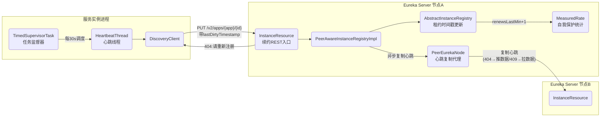
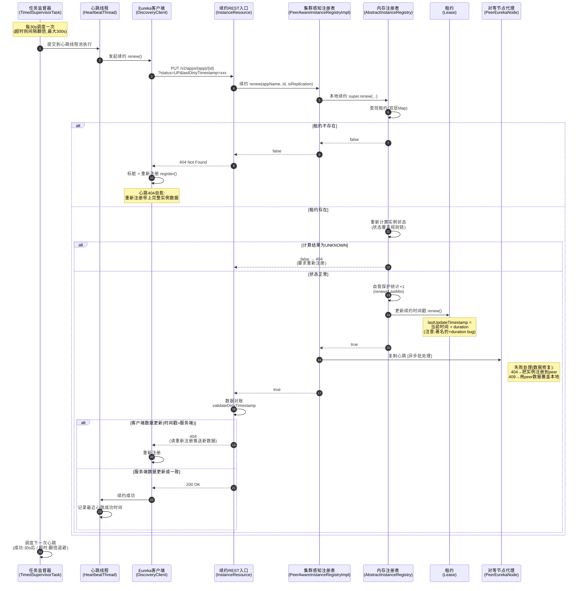
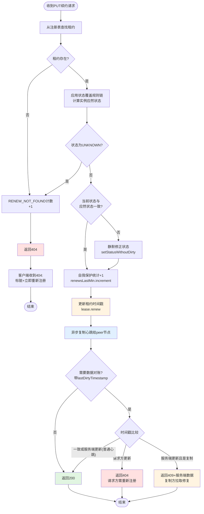
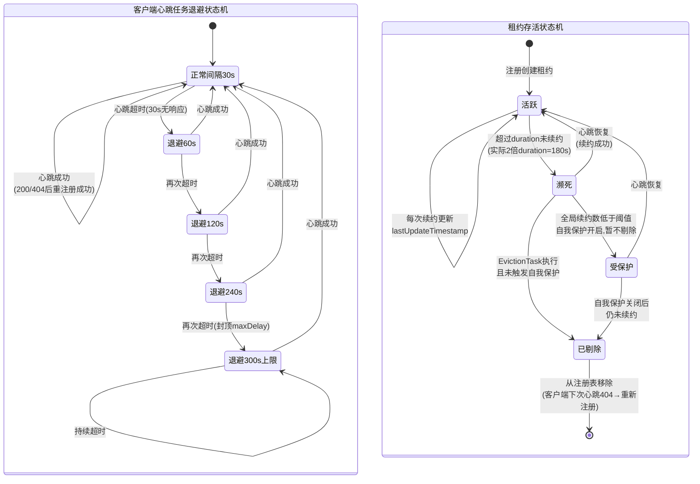
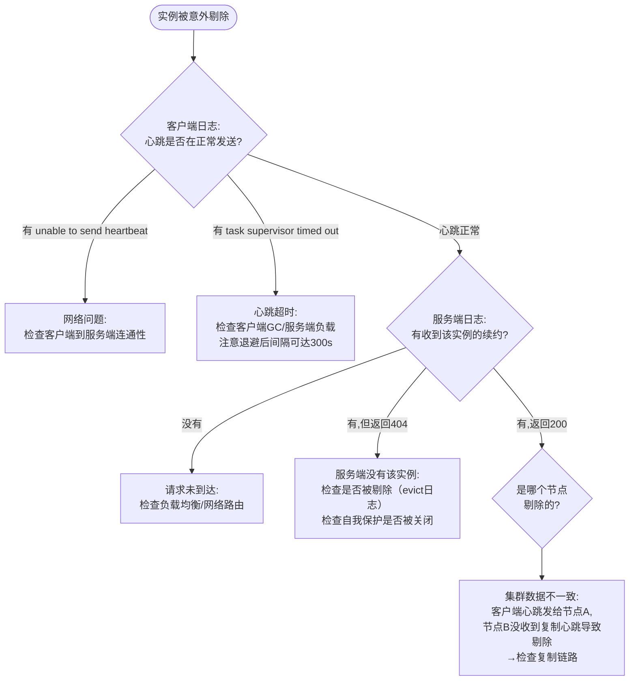

# 心跳续约流程（DiscoveryClient#renew → InstanceResource#renewLease → AbstractInstanceRegistry#renew）

## 文档说明

本文档分析 Eureka **心跳续约**全链路的业务功能、设计决策、状态流转、质量属性与异常处理。链路覆盖：

- 客户端发起：`com.netflix.discovery.DiscoveryClient#renew` 及其调度器 `TimedSupervisorTask` / `HeartbeatThread`
- 服务端入口：`com.netflix.eureka.resources.InstanceResource#renewLease`
- 注册表续约：`com.netflix.eureka.registry.AbstractInstanceRegistry#renew`
- 数据对账：`InstanceResource#validateDirtyTimestamp`
- 集群复制与修复：`PeerEurekaNode#heartbeat` / `syncInstancesIfTimestampDiffers`

---

## 零、TL;DR

> **一句话摘要**：客户端每 30s 向服务端发送 PUT 心跳维持租约不过期；心跳同时承担集群数据"对账"职责——通过 404/409 响应码触发数据双向修复，是 Eureka 最终一致性的核心机制。

- **复杂度域**：Complex（跨系统、数据对账与双向修复、指数退避、异步批处理复制）
- **业务入口**：
  - 客户端定时任务 `HeartbeatThread`（TimedSupervisorTask 调度，默认 30s）
  - 服务端 REST 接口 `PUT /v2/apps/{appName}/{instanceId}`
- **关键依赖**：内存注册表（租约时间戳更新）、自我保护统计（renewsLastMin）、对等节点（心跳复制）
- **关键风险点**：
  1. 心跳连续失败超过租约时长（默认 90s，实际因 bug 是 180s）后实例被剔除，流量损失
  2. 网络抖动触发 TimedSupervisorTask 指数退避后，心跳间隔最大可达 300s，远超租约时长——退避期间实例可能被误剔除

## 一、业务上下文

### 1.1 业务定义

心跳续约回答的是注册中心的核心问题：**"哪些实例还活着？"**

Eureka 不主动探测实例健康（没有服务端主动的 ping/healthcheck），而是采用**客户端主动上报**模型：实例每 30s 发一次心跳证明自己活着，服务端只负责记账（更新租约时间戳）和清算（剔除超时未续约的实例）。这种设计把健康检测的成本分摊到每个客户端，服务端只做 O(1) 的时间戳更新，支撑大规模集群。

心跳在 Eureka 中还承担了第二职责：**数据对账**。每次心跳都携带实例数据的版本号（lastDirtyTimestamp），服务端比对版本发现不一致时，通过特殊响应码（404/409）触发数据修复。这使得任何历史的数据丢失（如复制失败）都能在分钟级内自愈。

### 1.2 业务术语表（DDD Ubiquitous Language）

| 术语 | 含义 | 对应代码符号 |
|------|------|--------------|
| 心跳/续约 | 客户端周期性上报存活的动作 | `renew` / `Heartbeat` |
| 租约时间戳 | 租约的最近续约时间，过期判定的依据 | `Lease.lastUpdateTimestamp` |
| 数据对账 | 通过比较 lastDirtyTimestamp 发现数据不一致 | `validateDirtyTimestamp` |
| 数据修复 | 不一致时通过重新注册/回拉数据恢复一致 | `register(info)` / `syncInstancesIfTimestampDiffers` |
| 自我保护统计 | 最近一分钟全局续约次数,用于判断是否进入自我保护 | `renewsLastMin`（MeasuredRate） |
| 指数退避 | 心跳超时后,下次心跳间隔翻倍 | `TimedSupervisorTask.delay` |
| 重新注册 | 心跳404后客户端把完整实例数据再次注册 | `REREGISTER_COUNTER` |

### 1.3 领域定位（DDD）

- **聚合根**：`Lease<InstanceInfo>`（续约操作的对象是租约,不是实例本身）
- **领域事件**：无显式事件。续约不进入 recentlyChangedQueue（增量队列），不失效缓存——这是与注册的本质区别
- **业务不变量**：
  1. 只有注册表中存在的租约才能被续约（不存在 → 404 → 触发重新注册）
  2. 续约必须累加到自我保护统计中（renewsLastMin），否则自我保护误判
  3. 心跳复制的数据修复必须以 lastDirtyTimestamp 大者为准
- **服务分类**：
  - `HeartbeatThread` / `TimedSupervisorTask`：Application Service（客户端调度）
  - `AbstractInstanceRegistry.renew`：Domain Service（租约管理）
  - `PeerEurekaNode.heartbeat`：Infrastructure Service（集群复制）

### 1.4 触发方式

| 触发场景 | 入口方法/类 | 说明 |
|----------|-------------|------|
| 客户端定时心跳 | `HeartbeatThread.run()`（每 30s） | 主路径 |
| 集群心跳复制 | `PeerEurekaNode.heartbeat()` → 对端 `renewLease()` | 请求头 `x-netflix-discovery-replication: true` |
| 连接预热 | `PeerEurekaNode.heartbeat(primeConnection=true)` | 启动时建立 HTTP 连接,不关心结果 |

### 1.5 核心实现类

| 类名 | 职责 |
|------|------|
| `TimedSupervisorTask` | 定时任务监督器：自调度+超时监督+指数退避 |
| `HeartbeatThread` | 心跳线程：调用 renew() 并记录成功时间戳 |
| `DiscoveryClient` | 客户端门面：发起心跳 HTTP 调用,404 时重新注册 |
| `InstanceResource` | 服务端 REST 入口：续约+数据对账 |
| `PeerAwareInstanceRegistryImpl` | 集群感知续约：本地续约+心跳复制 |
| `AbstractInstanceRegistry` | 租约时间戳更新+自我保护统计 |
| `Lease` | 租约模型：lastUpdateTimestamp 的载体 |
| `PeerEurekaNode` | 心跳复制+失败时的双向数据修复 |
| `MeasuredRate` | 滑动窗口计数器：统计最近一分钟续约数 |

## 二、系统协作（C4 视角）

### 2.1 系统上下文图（C4-Context）



### 2.2 关键参与方

| 参与方 | 类型 | 与本流程的关系 |
|--------|------|----------------|
| HeartbeatThread | 模块（客户端） | 心跳发起方 |
| TimedSupervisorTask | 模块（客户端） | 心跳调度与故障退避 |
| Eureka Server 节点A | 系统 | 续约处理、对账、发起心跳复制 |
| Eureka Server 节点B/C | 系统 | 心跳复制接收方,对账参与方 |
| EvictionTask（剔除任务） | 模块（服务端） | 续约的"对手方"：续约不及时实例就被它剔除 |
| 自我保护机制 | 模块（服务端） | 续约数的消费方：续约骤降时停止剔除 |

## 三、关键设计决策（ADR）

| 决策点 | 备选方案 | 当前选择 | 理由 | Trade-off / 风险 |
|--------|----------|----------|------|------------------|
| 健康检测模型 | 服务端主动探测 / 客户端主动上报 | **客户端上报（心跳）** | 服务端只做 O(1) 时间戳更新,可支撑数万实例;探测逻辑下放到客户端(可对接自定义HealthCheck) | 实例进程活着但服务不可用时,心跳仍正常(需配合客户端健康检查) |
| 续约的并发控制 | 加锁 / 无锁 | **无锁**（不同于注册的读锁） | 续约只更新单个租约的 volatile 时间戳,天然线程安全;高频操作(全集群每秒可达数千次)必须最轻量 | 续约与注册/剔除之间存在理论上的竞态(影响可忽略) |
| 续约失败的恢复 | 服务端自动注册 / 客户端重新注册 | **404 让客户端重新注册** | 服务端没有完整的实例数据(心跳只带ID),只有客户端有;借客户端之手恢复数据 | 多一次往返;客户端必须正确处理404 |
| 心跳的附加职责 | 纯保活 / 保活+数据对账 | **保活+数据对账**（lastDirtyTimestamp 比对） | 复用每30s一次的心跳流量做数据巡检,无需额外的对账任务;任何数据丢失分钟级自愈 | 对账逻辑复杂(404/409双向修复);时间戳依赖时钟 |
| 心跳调度方式 | 固定频率(scheduleAtFixedRate) / 自调度+退避 | **TimedSupervisorTask 自调度+指数退避** | 网络故障时心跳必然超时,固定频率会堆积大量待执行任务;退避降低无效请求 | 退避最大间隔(300s)远超租约时长(90s),网络恢复前实例可能被剔除 |
| 心跳复制任务的时效 | 永久重试 / 过期丢弃 | **过期丢弃**（expiryTime = 当前+30s） | 积压超过一个心跳周期的复制任务没有意义,下次心跳会替代它 | 无(下次心跳天然兜底) |
| 复制心跳发现 peer 缺数据 | 忽略 / 推送数据 | **404 时把实例注册到 peer** | 主动修复 peer 的数据缺失,不等客户端下次直连 peer | 修复流量放大(每个心跳复制都可能触发注册) |
| 复制心跳发现 peer 数据更新 | 忽略 / 拉取数据 | **409 时用 peer 数据覆盖本地** | "数据新者赢"的最终一致策略 | 依赖时钟同步;覆盖是整体替换非字段合并 |

## 四、核心流程

### 4.1 主流程时序图



### 4.2 业务流程图（服务端续约视角）



### 4.3 状态流转图

心跳涉及两个状态机：客户端心跳任务的退避状态机 + 租约的存活状态机。



### 4.4 关键步骤说明

**步骤 1-2（客户端调度）**：`TimedSupervisorTask.run()`（TimedSupervisorTask.java:70）把 `HeartbeatThread` 提交到心跳线程池，限时等待 30s。超时则下次调度间隔翻倍：

```java
// 超时:下次调度间隔翻倍(指数退避),但不超过 maxDelay 上限
long currentDelay = delay.get();
long newDelay = Math.min(maxDelay, currentDelay * 2);
delay.compareAndSet(currentDelay, newDelay);
```

**步骤 3-4（发起心跳）**：`DiscoveryClient.renew()`（DiscoveryClient.java:920）发起 PUT 请求，参数携带实例状态和 `lastDirtyTimestamp`。

**步骤 5-9（服务端续约）**：`AbstractInstanceRegistry.renew()`（AbstractInstanceRegistry.java:384）：查租约 → 算状态 → 统计 → 更新时间戳。注意续约**不加锁、不失效缓存、不进增量队列**——这是它与注册在实现上的三大区别。

**步骤 10-11（404 自愈）**：客户端收到 404 后（DiscoveryClient.java:920 renew 方法内）：

```java
if (httpResponse.getStatusCode() == Status.NOT_FOUND.getStatusCode()) {
    REREGISTER_COUNTER.increment();
    long timestamp = instanceInfo.setIsDirtyWithTime();   // 标脏
    boolean success = register();                          // 立即重新注册
    if (success) {
        instanceInfo.unsetIsDirty(timestamp);              // 成功后清除脏标记
    }
    return success;
}
```

**步骤 14-15（自我保护统计与租约更新）**：`renewsLastMin.increment()`（AbstractInstanceRegistry.java:424）把本次续约计入滑动窗口统计；`Lease.renew()` 更新时间戳（Lease.java:77，注意 +duration bug）。

**步骤 16-17（心跳复制与修复）**：`PeerEurekaNode.heartbeat()`（PeerEurekaNode.java:207）提交批处理任务，其 `handleFailure` 实现了双向数据修复：peer 返回 404 → `register(info)` 推数据；peer 返回 409 → `syncInstancesIfTimestampDiffers()`（PeerEurekaNode.java:380）拉数据。

**步骤 18-22（数据对账）**：`validateDirtyTimestamp()`（InstanceResource.java:314）的三种结果见 4.2 流程图右下角分支。

## 五、前置校验

### 5.1 校验规则

续约入口几乎没有参数校验（与注册的 7 项校验形成对比）——因为续约只需要 URL 路径中的 appName 和 instanceId，请求体为空。唯一的"校验"是租约存在性检查：

```java
// AbstractInstanceRegistry.renew() 中
if (leaseToRenew == null) {
    RENEW_NOT_FOUND.increment(isReplication);
    logger.warn("DS: Registry: lease doesn't exist, registering resource: {} - {}", appName, id);
    return false;   // → REST层返回404
}
```

以及状态合法性检查：

```java
// 计算结果为 UNKNOWN：通常是覆盖状态被删除后规则链无法决策 → 要求客户端重新注册
if (overriddenInstanceStatus == InstanceStatus.UNKNOWN) {
    RENEW_NOT_FOUND.increment(isReplication);
    return false;   // → REST层返回404
}
```

### 5.2 校验规则汇总

| 校验项 | 字段条件 | HTTP状态码 | 提示信息 | 对应业务不变量 |
|--------|----------|-----------|----------|----------------|
| 租约存在性 | registry 中能找到 appName+id 的租约 | 404 | Not Found (Renew) | 只有注册过的实例才能续约 |
| 状态可决策 | 状态覆盖规则链计算结果非 UNKNOWN | 404 | Instance status UNKNOWN | 状态必须明确才能对外提供服务 |
| 数据版本一致 | lastDirtyTimestamp 与服务端一致 | 404（请求方新）/ 409（服务端新且为复制） | Time to sync | 数据以版本新者为准 |

## 六、外部系统交互

### 6.1 客户端 → 服务端（心跳请求）

- **触发条件**：每 30s 定时（TimedSupervisorTask 调度）
- **交互内容**：PUT /v2/apps/{appName}/{instanceId}?status={status}&lastDirtyTimestamp={ts}，无请求体
- **成功判断**：HTTP 200
- **失败处理**：
  - 404 → 立即标脏并重新注册（自愈）
  - 网络异常 → 返回 false，等下个心跳周期；连续超时触发指数退避
- **是否可逆**：N/A（幂等）
- **是否需补偿**：不需要，下次心跳天然兜底

### 6.2 服务端 → Peer 节点（心跳复制）

- **触发条件**：本地续约成功且非复制请求
- **交互内容**：批量复制请求中的 Heartbeat 任务（带实例当前数据 + 覆盖状态）
- **成功判断**：批量响应中对应条目为 200
- **失败处理**（这是集群数据自愈的核心）：
  - peer 返回 404（peer 没有该实例）→ **推数据**：调用 `register(info)` 把实例注册到 peer
  - peer 返回 409（peer 数据版本更新）→ **拉数据**：用 peer 返回的 InstanceInfo 覆盖本地
  - 任务过期（积压超过 30s）→ 丢弃，下次心跳复制替代
- **是否可逆**：否
- **是否需补偿**：自带补偿（404/409 修复机制）

## 七、质量属性（NFR）

| 维度 | 具体要求 / 现状 | 代码支撑 |
|------|----------------|----------|
| **性能** | 续约是全系统最高频操作（N个实例 × 每30s一次）；服务端处理为 O(1)：两次 Map.get + volatile 写 + 计数器；无锁、无缓存操作、无队列操作 | AbstractInstanceRegistry.renew()（:384）全程无锁 |
| **并发** | 租约时间戳为 volatile（保证剔除任务可见性）；renewsLastMin 用 AtomicLong；无互斥锁 | Lease.lastUpdateTimestamp（volatile）、MeasuredRate（AtomicLong） |
| **可用性** | 心跳失败不影响实例继续提供服务（只影响"被发现"）；404 自愈机制保证服务端数据丢失后分钟级恢复；指数退避防止网络故障时请求堆积 | renew() 404分支（DiscoveryClient.java:920）、TimedSupervisorTask 退避 |
| **一致性** | 心跳是集群最终一致性的"巡检员"：每30s一轮的对账+双向修复；时间戳冲突以新者为准 | validateDirtyTimestamp（:314）、heartbeat.handleFailure（:207） |
| **可观测性** | RENEW/RENEW_NOT_FOUND 计数器、renewsLastMin 滑动窗口、客户端 REREGISTER_COUNTER、心跳成功时间戳监控、TimedSupervisorTask 四类计数器（成功/超时/拒绝/异常） | EurekaMonitors、HeartbeatStalenessMonitor、Servo Counter |
| **安全性** | 与注册相同：无认证，信任网络边界 | - |

## 八、异常与失败模式

### 8.1 错误码完整对照表

| HTTP状态码 | 错误信息 | 触发条件 | 处理方式 |
|-----------|----------|----------|----------|
| 200 | OK | 续约成功且数据版本一致 | 正常 |
| 404 | Not Found (Renew) | 租约不存在 / 状态UNKNOWN | 客户端立即重新注册 |
| 404 | Time to sync（对账触发） | 请求方 lastDirtyTimestamp > 服务端 | 请求方重新注册推送新数据 |
| 409 | Conflict + 服务端InstanceInfo | 服务端 lastDirtyTimestamp > 请求方，且为复制请求 | 复制方用响应数据覆盖自己 |
| 客户端异常 | was unable to send heartbeat! | 网络异常/超时 | 等下个心跳周期；连续失败触发退避 |

### 8.2 失败模式分析（FMEA）

| 步骤 | 可能失败 | 数据一致性影响 | 是否可重入 | 补偿/恢复手段 |
|------|---------|----------------|------------|----------------|
| 客户端发送心跳 | 网络超时 | 服务端租约未更新,实例趋向"濒死" | 是 | 下个周期重试;连续失败90s(实际180s)后被剔除,剔除后客户端心跳404→重新注册 |
| 心跳超时触发退避 | 退避间隔(最大300s)超过租约时长 | 网络恢复前实例被剔除,流量损失 | - | 网络恢复后第一次心跳404→立即重新注册(分钟级恢复) |
| 服务端查找租约 | 租约不存在(服务端重启/已被剔除) | 实例不可被发现 | 是 | 404→客户端重新注册(自愈核心路径) |
| 状态规则计算 | 覆盖状态被删除→UNKNOWN | 实例状态不确定 | 是 | 404→重新注册时重新计算状态 |
| 自我保护统计 | - | 统计偏低会误触发自我保护 | - | 统计是滑动窗口,1分钟后自动校正 |
| 心跳复制到peer | peer宕机/网络分区 | peer的租约未更新→peer可能误剔除该实例 | 是 | peer恢复后:本节点心跳复制404→把实例注册过去 |
| 数据对账 | 时钟偏移导致时间戳比较错误 | 错误的数据被保留 | - | 无自动修复;依赖NTP时钟同步(运维要求) |

### 8.3 客户端心跳 vs 复制心跳的异常策略差异

- **客户端心跳失败（404）**：客户端自己重新注册——数据源头在客户端
- **复制心跳失败（404）**：复制方把数据**推**给 peer——因为 peer 上缺数据，数据源头在复制方
- **复制心跳冲突（409）**：复制方从 peer **拉**数据——因为 peer 数据更新，数据源头在 peer
- 三种修复方向不同，但原则一致：**谁的数据新（lastDirtyTimestamp 大），谁就是数据源头**

## 九、影响半径与依赖矩阵

### 9.1 fan-in（谁调用续约）

| 调用方 | 业务场景 | 频率 | 改动需协调? |
|--------|----------|------|-------------|
| Jersey 路由 → InstanceResource.renewLease() | 客户端心跳/复制心跳 | 极高（N实例×2次/分钟） | 是（REST契约） |
| PeerAwareInstanceRegistryImpl.renew() | REST入口调用 | 同上 | 是 |
| AbstractInstanceRegistry.renew()（被super调用） | 本地续约 | 同上 | 是 |

> fan-in 扫描证据：
> ```
> grep -rn "registry.renew(\|\.renew(appName" eureka-core/src/main/java
> grep -rn "renew()" eureka-client/src/main/java/com/netflix/discovery/DiscoveryClient.java
> ```

### 9.2 fan-out（续约依赖谁）

| 被调用方 | 依赖类型 | 失败时影响 |
|----------|----------|------------|
| registry（双层Map） | 内存数据结构 | 续约功能不可用 |
| InstanceStatusOverrideRule 规则链 | 内存计算 | 状态修正错误 |
| renewsLastMin（MeasuredRate） | 内存计数器 | 自我保护统计失真 |
| Lease.renew() | 内存写 | 租约时间戳未更新→实例被误剔除 |
| PeerEurekaNode.heartbeat() | HTTP（异步批处理） | 集群数据巡检失效 |

### 9.3 契约兼容性

- **lastDirtyTimestamp 参数**：数据对账的核心，客户端不传则服务端跳过对账（兼容旧客户端）
- **404 语义**：客户端硬编码"404 = 需要重新注册"，服务端不能把 404 用于其他语义
- **409 响应体**：必须是完整的 InstanceInfo，复制方靠它修复数据

## 十、测试与可观测性

### 10.1 测试用例矩阵

| 场景 | 类型 | 单测/集成 | Mock 依赖 |
|------|------|-----------|-----------|
| 正常续约成功 | 正常 | 单测 | registry |
| 续约不存在的实例返回404 | 异常 | 单测 | registry |
| 客户端收到404后重新注册 | 异常 | 单测 | EurekaHttpClient |
| 覆盖状态被删除后续约返回404 | 边界 | 单测 | overriddenInstanceStatusMap |
| 续约时状态修正（覆盖状态生效） | 边界 | 单测 | - |
| lastDirtyTimestamp 客户端新→404 | 对账 | 单测 | - |
| lastDirtyTimestamp 服务端新+复制→409 | 对账 | 单测 | - |
| 心跳复制404→自动注册到peer | 集群修复 | 集成 | SimpleEurekaHttpServer |
| 心跳复制409→用peer数据覆盖本地 | 集群修复 | 集成 | 同上 |
| 心跳超时触发指数退避 | 异常 | 单测 | ThreadPoolExecutor |
| 续约计入自我保护统计 | 正常 | 单测 | MeasuredRate |

### 10.2 可观测性

**关键日志关键字**（用于线上 grep）：

```
# 客户端侧
grep "Heartbeat status" <client.log>                  # 心跳响应码
grep "Re-registering apps" <client.log>               # 404自愈触发
grep "was unable to send heartbeat" <client.log>      # 心跳网络失败
grep "task supervisor timed out" <client.log>         # 心跳超时(退避触发)

# 服务端侧
grep "Not Found (Renew)" <server.log>                 # 续约404
grep "lease doesn't exist" <server.log>               # 租约不存在
grep "Time to sync" <server.log>                      # 数据对账触发
grep "Peer wants us to take the instance information" <server.log>  # 409数据回拉
```

**监控指标**：

- **容量水位类**：
  - `numOfRenewsInLastMin`（最近一分钟续约总数）vs `numOfRenewsPerMinThreshold`（自我保护阈值）——两者的差距是集群健康度的直接体现
  - 心跳线程池活跃数（threadPoolUsed Gauge）
- **异常计数类**：
  - `eurekaServer.RENEW_NOT_FOUND`（续约404次数，飙升说明服务端丢数据或客户端配置错）
  - 客户端 `REREGISTER_COUNTER`（重新注册次数）
  - TimedSupervisorTask 的 timeouts/rejectedExecutions/throwables 计数器
- **补偿/重试类**：
  - 心跳复制404触发的注册数（日志统计）← **集群一致性健康度核心指标**
  - 心跳复制409触发的数据回拉数（日志统计）

**链路追踪**：与注册流程相同，无 TraceID 透传（技术债）。

## 十一、代码位置索引

> 行号基于添加中文注释后的当前代码。

### 11.1 主链路方法

| 方法 | 文件:行号 | 说明 |
|------|----------|------|
| `TimedSupervisorTask.run()` | TimedSupervisorTask.java:70 | 心跳调度：超时监督+指数退避 |
| `HeartbeatThread.run()` | DiscoveryClient.java:1497 | 心跳线程入口 |
| `DiscoveryClient.renew()` | DiscoveryClient.java:920 | 客户端发起心跳+404自愈 |
| 心跳任务创建 | DiscoveryClient.java:1364 | initScheduledTasks 中创建心跳定时任务 |
| `InstanceResource.renewLease()` | InstanceResource.java:110 | 服务端续约REST入口 |
| `InstanceResource.validateDirtyTimestamp()` | InstanceResource.java:314 | 数据对账核心 |
| `PeerAwareInstanceRegistryImpl.renew()` | PeerAwareInstanceRegistryImpl.java:434 | 本地续约+心跳复制 |
| `AbstractInstanceRegistry.renew()` | AbstractInstanceRegistry.java:384 | 租约时间戳更新+自我保护统计 |
| `Lease.renew()` | Lease.java:77 | 租约时间戳更新（含+duration bug） |
| `PeerEurekaNode.heartbeat()` | PeerEurekaNode.java:207 | 心跳复制+双向数据修复 |
| `PeerEurekaNode.syncInstancesIfTimestampDiffers()` | PeerEurekaNode.java:380 | 409后用peer数据覆盖本地 |

### 11.2 依赖服务

| 服务类 | 接口方法 | 说明 |
|--------|----------|------|
| `MeasuredRate` | `increment()` / `getCount()` | 滑动窗口统计最近一分钟续约数 |
| `InstanceStatusOverrideRule` | `apply(...)` | 续约时重新计算实例状态 |
| `EurekaHttpClient` | `sendHeartBeat(...)` | 客户端心跳HTTP调用 |
| `TaskDispatcher` | `process(...)` | 心跳复制批处理 |

### 11.3 相关枚举与常量

| 枚举/常量 | 位置 | 值/含义 |
|-----------|------|---------|
| `Action.Heartbeat` | PeerAwareInstanceRegistryImpl.java | 复制动作类型 |
| `InstanceStatus.UNKNOWN` | InstanceInfo.java | 状态无法决策→要求重新注册 |
| `RENEW` / `RENEW_NOT_FOUND` | EurekaMonitors | 续约监控计数器 |

### 11.4 关键容量/阈值常量

| 常量名 | 取值 | 位置 | 取值依据/约束来源 |
|--------|------|------|-------------------|
| 心跳间隔 renewalIntervalInSecs | 30s | LeaseInfo（客户端配置） | 业界通用心跳频率,平衡实时性与开销 |
| 租约时长 durationInSecs | 90s | Lease.DEFAULT_DURATION_IN_SECS（Lease.java:44） | 3倍心跳间隔,容忍2次心跳丢失 |
| 实际过期时间 | 180s（2×duration） | Lease.renew() 的 +duration bug | 官方不修复的历史bug |
| 心跳超时时间 | 30s（=心跳间隔） | TimedSupervisorTask 构造参数 | 单次心跳最长等待时间 |
| `expBackOffBound` | 10 | DefaultEurekaClientConfig | 退避上限倍数：30s×10=300s |
| 心跳线程池大小 | 5 | DefaultEurekaClientConfig（heartbeatExecutorThreadPoolSize） | 心跳是轻量操作,小池足够 |
| renewsLastMin 统计窗口 | 60s | MeasuredRate 构造参数（1000×60×1） | 自我保护以"每分钟"为统计单位 |
| 心跳复制任务过期时间 | 当前+30s | PeerEurekaNode.getLeaseRenewalOf() | 积压超过一个心跳周期的任务无意义 |

## 十二、技术债与演化

- **退避上限与租约时长的矛盾**：TimedSupervisorTask 退避最大 300s，远超实际过期时间 180s。长时间网络故障恢复后，实例需要等到下一次心跳（最长 300s 后）才能通过 404 自愈重新注册——这段时间实例不可被发现。建议：退避上限不应超过租约时长的一半
- **Lease.renew() 的 +duration bug**：续约时间戳被多加了一个 duration，导致实际剔除时间是配置的 2 倍。理解自我保护和剔除行为时必须考虑（官方明确不修复）
- **状态修正不标脏**：续约时发现状态不一致用 `setStatusWithoutDirty` 静默修正，这意味着修正不会触发客户端重新注册同步——客户端与服务端的状态可能长期不一致，直到下次实例信息变更
- **对账依赖时钟**：lastDirtyTimestamp 是各节点本地时钟生成的，时钟偏移会导致对账方向错误（旧数据覆盖新数据）。生产环境必须保证 NTP 同步

## 十三、常见问题与排查

### 13.1 典型失败场景

1. **服务端日志大量 "Not Found (Renew)"**
   - 错误信息：`Not Found (Renew): {appName} - {instanceId}`
   - 原因：① 服务端重启后注册表为空，所有客户端的心跳都404 ② 实例被剔除后客户端还在发心跳 ③ 集群节点间数据不一致
   - 解决：观察是否伴随 `Re-registering apps` 日志（自愈中），1-2 分钟后应自动恢复；持续出现则检查集群复制

2. **实例频繁被剔除又重新注册（"抖动"）**
   - 错误信息：客户端反复出现 `Re-registering apps`
   - 原因：① 网络不稳定导致心跳间歇性失败 ② GC 停顿导致心跳超时 ③ 心跳线程池打满
   - 解决：检查客户端 GC 日志和网络质量；查看 TimedSupervisorTask 的 timeouts 计数；考虑调大租约时长

3. **集群节点间实例数长期不一致**
   - 错误信息：各节点 Dashboard 显示的实例数不同
   - 原因：心跳复制的修复机制失效（批处理队列满/复制线程池满）
   - 解决：检查 `Cannot replicate information` 日志；检查复制队列水位（maxElementsInPeerReplicationPool=10000）；必要时重启实例数少的节点触发 syncUp

### 13.2 排查决策图



### 13.3 关键日志关键字

见 10.2 可观测性章节。

## 十四、文档元信息

- **文档版本**：v1.0
- **最后更新**：2026-06-01
- **复杂度域**：Complex
- **负责模块**：eureka-client（心跳发起）、eureka-core（续约处理与复制）
- **归属团队 / 维护人**：学习文档（个人源码学习用途）
- **相关类**：`DiscoveryClient.java`, `TimedSupervisorTask.java`, `InstanceResource.java`, `PeerAwareInstanceRegistryImpl.java`, `AbstractInstanceRegistry.java`, `Lease.java`, `PeerEurekaNode.java`, `MeasuredRate.java`
- **关联文档**：[01.服务注册流程](01.服务注册流程.md)（404自愈会触发注册流程）
