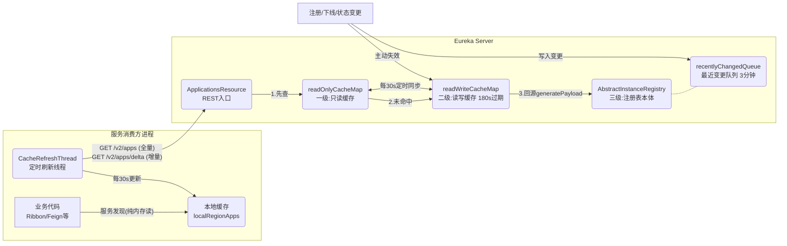
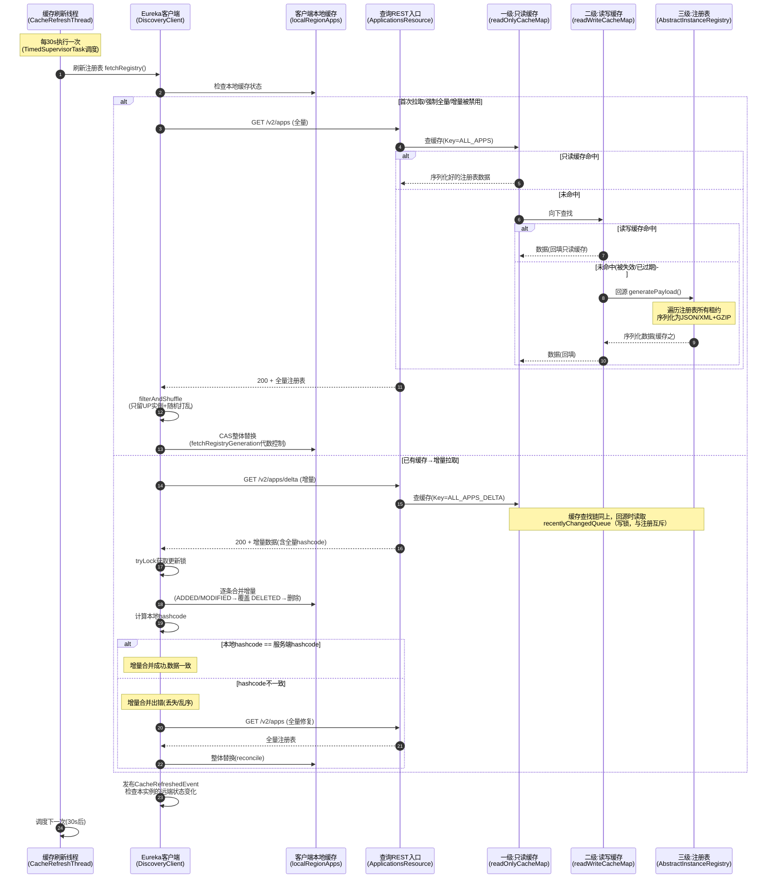
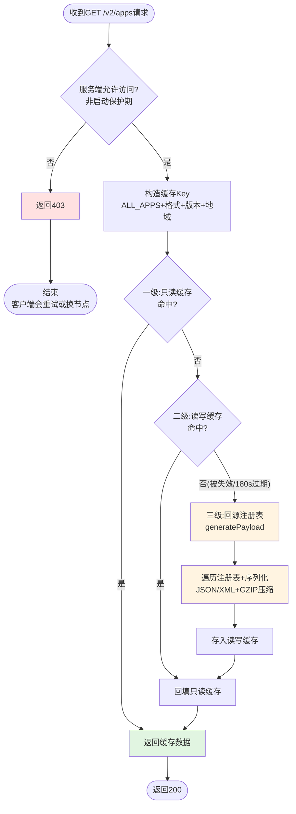
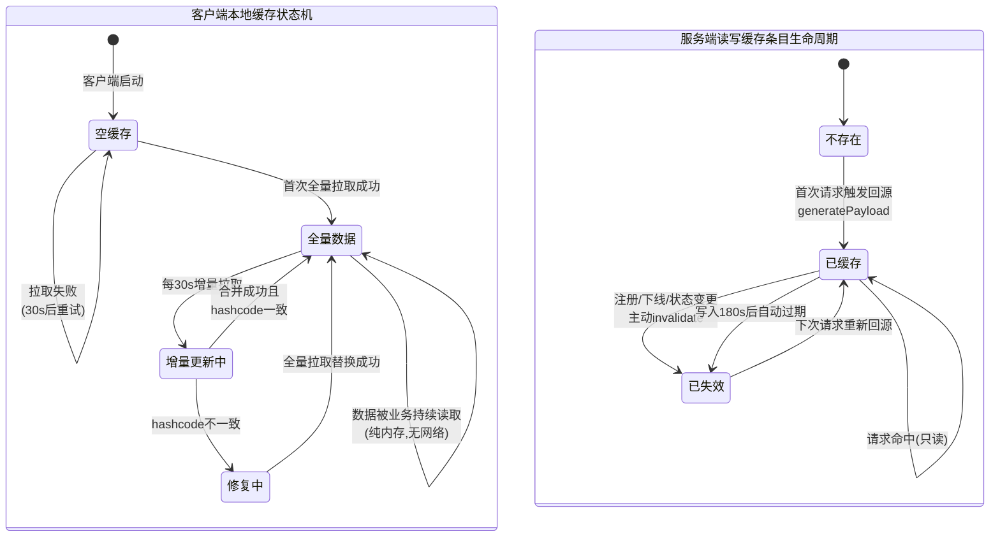
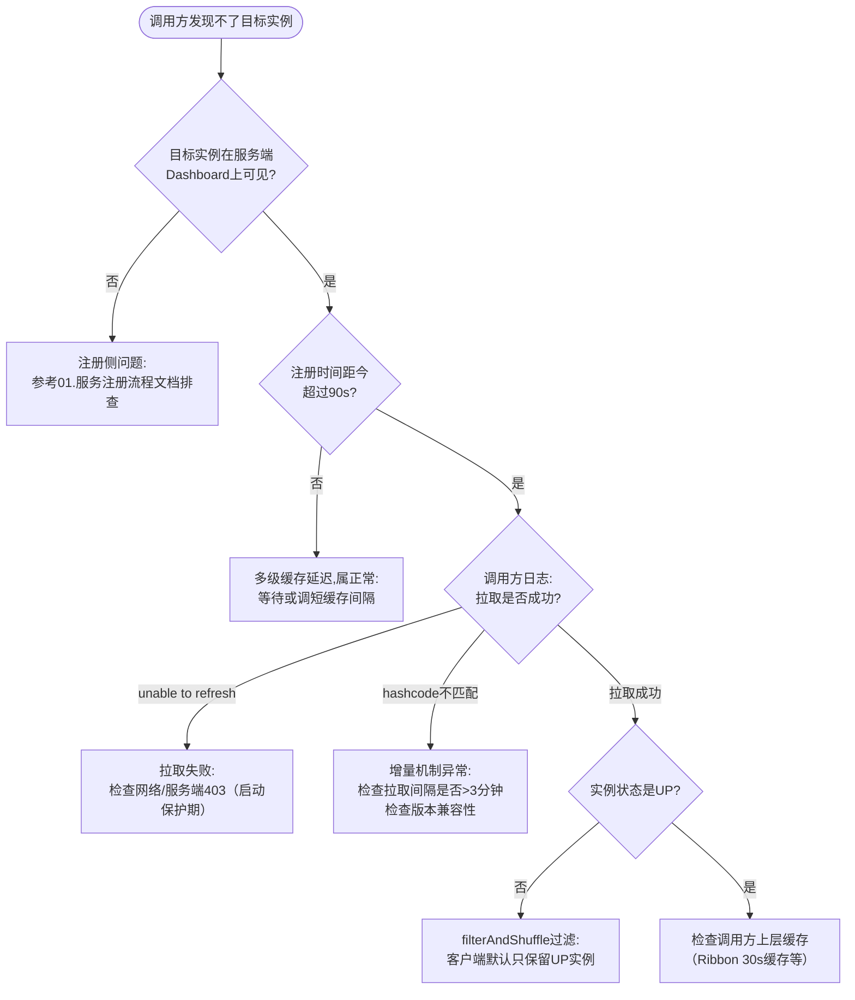

# 拉取注册表流程（DiscoveryClient#fetchRegistry → ApplicationsResource → ResponseCacheImpl）

## 文档说明

本文档分析 Eureka **拉取注册表（服务发现）**全链路的业务功能、设计决策、状态流转、质量属性与异常处理。链路覆盖：

- 客户端发起：`com.netflix.discovery.DiscoveryClient#fetchRegistry`（全量 `getAndStoreFullRegistry` / 增量 `getAndUpdateDelta`）
- 服务端入口：`com.netflix.eureka.resources.ApplicationsResource#getContainers`（全量）/ `#getContainerDifferential`（增量）
- 三级缓存：`com.netflix.eureka.registry.ResponseCacheImpl`
- 增量数据源：`AbstractInstanceRegistry#getApplicationDeltas`（recentlyChangedQueue）

---

## 零、TL;DR

> **一句话摘要**：客户端每 30s 从服务端拉取注册表到本地缓存（首次全量、之后增量+hashcode校验+全量兜底）；服务端用三级缓存（注册表→读写缓存→只读缓存）应对海量读请求，序列化结果全局共享。

- **复杂度域**：Complex（三级缓存、全量/增量双模式、hashcode 一致性校验、多线程 CAS 并发控制）
- **业务入口**：
  - 客户端定时任务 `CacheRefreshThread`（TimedSupervisorTask 调度，默认 30s）
  - 服务端 REST 接口 `GET /v2/apps`（全量）/ `GET /v2/apps/delta`（增量）
- **关键依赖**：ResponseCache 三级缓存、recentlyChangedQueue（增量数据源）、本地缓存 localRegionApps
- **关键风险点**：
  1. 多级缓存叠加导致新实例的可见延迟最长约 90s（注册→读写缓存失效→只读缓存30s同步→客户端30s拉取→Ribbon等上层缓存30s）
  2. 增量队列只保留 3 分钟，客户端拉取间隔若超过 3 分钟会持续触发 hashcode 不一致 → 频繁全量拉取

## 一、业务上下文

### 1.1 业务定义

拉取注册表是服务发现的"读路径"：服务消费方需要知道"应用 X 现在有哪些可用实例（IP/端口）"，才能发起调用。

Eureka 的读路径设计目标是支撑**读远多于写**的场景（成千上万个客户端，每个 30s 拉一次）。两个核心手段：

1. **客户端本地缓存**：客户端把整个注册表拉到本地内存，业务调用 `getInstancesByVipAddress()` 时完全不发网络请求——服务发现的运行时开销为零，且注册中心宕机不影响已缓存的调用关系
2. **服务端多级缓存 + 增量传输**：服务端把序列化结果缓存共享（避免重复序列化），并用增量传输减少网络流量

### 1.2 业务术语表（DDD Ubiquitous Language）

| 术语 | 含义 | 对应代码符号 |
|------|------|--------------|
| 全量拉取 | 拉取服务端完整注册表，整体替换本地缓存 | `getAndStoreFullRegistry` |
| 增量拉取 | 只拉取最近 3 分钟的变更记录，合并到本地缓存 | `getAndUpdateDelta` |
| 最近变更队列 | 服务端保存增量数据的队列（注册/下线/状态变更） | `recentlyChangedQueue` |
| 一致性 hashcode | 注册表内容的指纹（按状态统计实例数），用于校验增量合并正确性 | `appsHashCode` / `getReconcileHashCode` |
| 只读缓存 | 一级缓存,30s 定时同步,客户端请求默认读这里 | `readOnlyCacheMap` |
| 读写缓存 | 二级缓存,Guava LoadingCache,注册时被主动失效 | `readWriteCacheMap` |
| 缓存回源 | 缓存未命中时从注册表生成序列化数据 | `generatePayload` |
| 拉取代数 | 客户端并发拉取的版本控制（CAS） | `fetchRegistryGeneration` |
| 过滤打乱 | 只保留 UP 实例并随机排序（客户端负载均衡） | `filterAndShuffle` |

### 1.3 领域定位（DDD）

- **聚合根**：`Applications`（应用集合，含一致性 hashcode 的整体快照）
- **领域事件**：`CacheRefreshedEvent`（客户端缓存刷新后发布，业务可监听）
- **业务不变量**：
  1. 客户端本地缓存的 hashcode 必须与服务端一致（不一致触发全量修复）
  2. 增量队列中的条目保留 3 分钟后被清理（保留时间 > 客户端拉取间隔，保证增量不丢）
  3. 同一时刻只有一个线程能更新本地缓存（CAS 代数控制）
- **服务分类**：
  - `CacheRefreshThread` / `fetchRegistry`：Application Service（客户端）
  - `ResponseCacheImpl`：Infrastructure Service（服务端缓存）
  - `getApplicationDeltas`：Domain Service（增量快照生成）

### 1.4 触发方式

| 触发场景 | 入口方法/类 | 说明 |
|----------|-------------|------|
| 客户端定时刷新 | `CacheRefreshThread.run()`（每 30s） | 主路径,首次全量后续增量 |
| 客户端启动 | `DiscoveryClient` 构造函数 → `fetchRegistry(false)` | 启动时立即拉一次全量 |
| 增量校验失败 | `reconcileAndLogDifference()` | hashcode 不一致触发全量修复 |
| 远程 Region 配置变更 | `refreshRegistry()` 检测到变更 | 强制全量拉取 |
| 服务端节点启动 | `PeerAwareInstanceRegistryImpl.syncUp()` | 节点间全量同步（特殊调用方） |

### 1.5 核心实现类

| 类名 | 职责 |
|------|------|
| `CacheRefreshThread` / `refreshRegistry` | 客户端定时刷新调度 |
| `DiscoveryClient.fetchRegistry` | 全量/增量模式选择 |
| `getAndStoreFullRegistry` / `getAndUpdateDelta` | 全量拉取 / 增量拉取+校验 |
| `updateDelta` | 增量合并（ADDED/MODIFIED/DELETED） |
| `ApplicationsResource` | 服务端 REST 入口（全量+增量） |
| `ResponseCacheImpl` | 三级缓存实现 |
| `AbstractInstanceRegistry.getApplications/getApplicationDeltas` | 缓存回源数据生成 |
| `Applications` | 注册表数据模型（含 hashcode 计算） |

## 二、系统协作（C4 视角）

### 2.1 系统上下文图（C4-Context）



### 2.2 关键参与方

| 参与方 | 类型 | 与本流程的关系 |
|--------|------|----------------|
| 业务代码（Ribbon/Feign） | 模块 | 本地缓存的最终消费方 |
| CacheRefreshThread | 模块（客户端） | 拉取的发起方 |
| ResponseCacheImpl | 模块（服务端） | 读请求的主要承接方（>99%请求不触达注册表） |
| recentlyChangedQueue | 数据结构 | 增量数据的唯一来源 |
| 注册/下线/剔除流程 | 其他流程 | 写路径：失效缓存+写入变更队列,是本流程数据新鲜度的源头 |

## 三、关键设计决策（ADR）

| 决策点 | 备选方案 | 当前选择 | 理由 | Trade-off / 风险 |
|--------|----------|----------|------|------------------|
| 服务发现模式 | 每次调用查询注册中心 / 客户端全量缓存 | **客户端全量缓存** | 服务发现零运行时开销;注册中心宕机不影响存量调用(AP核心体现) | 客户端内存占用(大集群注册表可达数十MB);数据延迟 |
| 数据传输模式 | 永远全量 / 增量+全量兜底 | **首次全量,之后增量,hashcode校验失败回退全量** | 增量(通常几KB)比全量(可能数MB)节省 99% 流量 | 增量机制复杂;依赖队列保留时间与拉取间隔的配合 |
| 服务端读优化 | 每次请求遍历注册表序列化 / 缓存序列化结果 | **三级缓存,缓存序列化+压缩结果** | 序列化是 CPU 密集操作,N 个客户端的请求只需序列化 1 次 | 缓存层级多,数据延迟叠加;缓存与注册表可能短暂不一致 |
| 只读缓存的更新方式 | 写时同步更新 / 定时批量同步 | **30s 定时同步**（shouldUseReadOnlyResponseCache=true） | 读路径完全无锁无竞争,极致读性能 | 30s 的额外延迟;Spring Cloud 等场景常建议关闭此层 |
| 增量数据结构 | 操作日志(log) / 变更实例快照队列 | **变更实例快照队列**（含完整InstanceInfo） | 客户端合并逻辑简单(直接覆盖);天然幂等 | 同一实例多次变更会重复出现;数据量比纯日志大 |
| 增量正确性保障 | 序列号严格校验 / hashcode 校验+全量兜底 | **hashcode 校验 + 全量兜底** | 实现简单;任何形式的增量错乱(丢失/重复/乱序)都能被发现并修复 | 校验失败的代价是一次全量拉取;hashcode 计算需要遍历 |
| 客户端并发拉取控制 | synchronized / CAS 代数 + tryLock | **CAS 代数（fetchRegistryGeneration）+ tryLock** | 并发拉取时只有一个生效,失败方直接放弃(无等待) | 放弃的拉取浪费了一次网络请求 |
| 实例顺序 | 服务端排序 / 客户端随机打乱 | **客户端 filterAndShuffle 随机打乱** | 避免所有客户端按同一顺序调用,天然负载均衡 | 无 |

## 四、核心流程

### 4.1 主流程时序图



### 4.2 业务流程图（服务端缓存读取视角）



### 4.3 状态流转图

拉取流程的核心状态机是**客户端本地缓存的数据状态**与**缓存条目的生命周期**。



### 4.4 关键步骤说明

**步骤 1-3（客户端模式选择）**：`fetchRegistry()`（DiscoveryClient.java:1035）判断走全量还是增量。6 个走全量的条件中最常见的是"本地缓存为空"（首次拉取）。

**步骤 4-14（全量拉取与三级缓存）**：服务端 `getContainers()`（ApplicationsResource.java:125）构造缓存 Key 后调用 `responseCache.get(cacheKey)`，缓存查找链见 `getValue()`（ResponseCacheImpl.java:370）：

```java
if (useReadOnlyCache) {
    final Value currentPayload = readOnlyCacheMap.get(key);
    if (currentPayload != null) {
        payload = currentPayload;
    } else {
        // 只读缓存未命中 → 读读写缓存（可能触发从注册表生成数据）→ 回填只读缓存
        payload = readWriteCacheMap.get(key);
        readOnlyCacheMap.put(key, payload);
    }
}
```

**步骤 15-16（客户端存储全量）**：`getAndStoreFullRegistry()`（DiscoveryClient.java:1146）用 CAS 代数防止并发覆盖：

```java
} else if (fetchRegistryGeneration.compareAndSet(currentUpdateGeneration, currentUpdateGeneration + 1)) {
    // CAS 成功才写入：filterAndShuffle 会过滤掉非 UP 实例（可配置）并随机打乱顺序（负载均衡）
    localRegionApps.set(this.filterAndShuffle(apps));
}
```

**步骤 17-22（增量拉取与合并）**：`getAndUpdateDelta()`（DiscoveryClient.java:1191）拉取增量后逐条合并（`updateDelta()`，DiscoveryClient.java:1303），按 ActionType 处理：ADDED/MODIFIED → 覆盖实例；DELETED → 删除实例。

**步骤 23-27（hashcode 一致性校验）**：增量合并后计算本地 hashcode 与服务端带来的 `appsHashCode` 比较。hashcode 的格式形如 `UP_10_DOWN_2_`（按状态统计实例数）：

```java
// 【一致性校验】本地 hashcode 与服务端 hashcode 不一致 → 增量合并出错 → 全量拉取修复
if (!reconcileHashCode.equals(delta.getAppsHashCode()) || clientConfig.shouldLogDeltaDiff()) {
    reconcileAndLogDifference(delta, reconcileHashCode);  // this makes a remoteCall
}
```

**服务端增量生成**：`getApplicationDeltas()`（AbstractInstanceRegistry.java:919）加**写锁**遍历 recentlyChangedQueue——这正是注册用"读锁"的原因：注册之间可并发，但注册与增量快照生成必须互斥，否则增量数据与 hashcode 可能不一致。

## 五、前置校验

### 5.1 校验规则

拉取是只读操作，校验极少。服务端唯一的拒绝条件是"启动保护期"：

```java
// 服务端启动初期(从 peer 同步注册表失败后的保护期内)拒绝提供注册表查询,返回 403
if (!registry.shouldAllowAccess(isRemoteRegionRequested)) {
    return Response.status(Status.FORBIDDEN).build();
}
```

`shouldAllowAccess` 的逻辑：服务端启动时会从 peer 节点同步注册表（syncUp），若同步失败（拿到 0 个实例），则在 `waitTimeInMsWhenSyncEmpty`（默认 5 分钟）内拒绝查询请求——避免把"空注册表"返回给客户端导致全部服务被判定为下线。

增量接口额外多一个条件：服务端配置禁用增量时返回 403，客户端回退全量。

### 5.2 校验规则汇总

| 校验项 | 字段条件 | HTTP状态码 | 提示信息 | 对应业务不变量 |
|--------|----------|-----------|----------|----------------|
| 启动保护期检查 | 距启动时间 > waitTimeInMsWhenSyncEmpty 或 syncUp 成功 | 403 | （无响应体） | 不能把空/不完整的注册表当作正确数据返回 |
| 增量功能开关 | serverConfig.shouldDisableDelta() == false | 403 | （无响应体） | 增量被禁用时强制客户端走全量 |

## 六、外部系统交互

### 6.1 客户端 → 服务端（全量拉取）

- **触发条件**：首次启动 / 增量校验失败 / 增量被禁用 / 远程Region变更
- **交互内容**：GET /v2/apps，Accept: application/json，Accept-Encoding: gzip
- **成功判断**：HTTP 200 + 响应体非空
- **失败处理**：返回 false，30s 后下个周期重试；连续失败时本地缓存保持旧数据（stale 但可用）
- **是否可逆**：N/A（只读）
- **是否需补偿**：不需要

### 6.2 客户端 → 服务端（增量拉取）

- **触发条件**：本地已有缓存的常规刷新（每 30s）
- **交互内容**：GET /v2/apps/delta
- **成功判断**：HTTP 200 + 合并后 hashcode 一致
- **失败处理**：
  - 返回 403/null → 立即回退全量拉取
  - hashcode 不一致 → 立即发起全量拉取修复（reconcile）
- **是否需补偿**：自带补偿（全量兜底）

## 七、质量属性（NFR）

| 维度 | 具体要求 / 现状 | 代码支撑 |
|------|----------------|----------|
| **性能** | 服务发现运行时零网络开销（纯本地内存读）；服务端 >99% 请求命中缓存,只读缓存读取无锁；序列化结果全局共享,GZIP 减少 ~80% 传输量 | localRegionApps（AtomicReference）、readOnlyCacheMap（ConcurrentHashMap） |
| **并发** | 客户端：CAS 代数 + tryLock 保证单线程更新；服务端：只读缓存无锁读,读写缓存 Guava 内部分段锁,增量生成加写锁 | fetchRegistryGeneration、fetchRegistryUpdateLock、write.lock() |
| **可用性** | 注册中心完全宕机时,客户端本地缓存仍可用(存量调用不受影响)；单节点 403 时客户端自动重试下一个节点 | 本地缓存独立于网络;EurekaHttpClient 的重试机制 |
| **一致性** | 最终一致,多级延迟叠加：注册生效→读写缓存失效(即时)→只读缓存(≤30s)→客户端拉取(≤30s)≈60s,再叠加 Ribbon 等上层缓存(≤30s)约 90s;增量错乱由 hashcode 校验+全量兜底修复 | 见 4.3 状态图 |
| **可观测性** | 客户端:FETCH_REGISTRY_TIMER、RECONCILE_HASH_CODES_MISMATCH 计数、registrySize、lastSuccessfulRegistryFetchTimestamp;服务端:GET_ALL/GET_ALL_DELTA 计数、缓存命中情况、序列化耗时计时器 | EurekaMonitors、Servo Timer |
| **安全性** | 与其他接口相同：无认证；GZIP 解压炸弹风险由 Jersey 框架处理 | - |

## 八、异常与失败模式

### 8.1 错误码完整对照表

| HTTP状态码 | 错误信息 | 触发条件 | 处理方式 |
|-----------|----------|----------|----------|
| 200 | - | 正常返回（全量或增量） | 正常 |
| 403 | （无响应体） | 服务端启动保护期 / 增量被禁用 | 客户端：增量403→回退全量；全量403→重试其他节点 |
| 客户端侧 | was unable to refresh its cache! | 网络异常/超时/解析失败 | 保持本地旧数据,30s后重试 |
| 客户端侧 | Reconcile hashcodes do not match | 增量合并后数据不一致 | 立即全量拉取修复 + RECONCILE_HASH_CODES_MISMATCH 计数 |
| 客户端侧 | Cannot acquire update lock | 并发更新冲突 | 放弃本次更新（另一线程在更新） |

### 8.2 失败模式分析（FMEA）

| 步骤 | 可能失败 | 数据一致性影响 | 是否可重入 | 补偿/恢复手段 |
|------|---------|----------------|------------|----------------|
| 客户端发起拉取 | 网络超时/服务端宕机 | 本地缓存变旧(stale) | 是 | 30s后重试;本地旧数据仍可用(AP);超时触发指数退避 |
| 服务端缓存回源 | 注册表遍历/序列化异常 | 该缓存Key无数据 | 是 | 下次请求重新回源;异常被捕获记录日志 |
| 增量拉取 | 客户端拉取间隔>3分钟(队列保留期) | 增量缺失→hashcode不一致 | 是 | 自动触发全量修复 |
| 增量合并 | 并发更新冲突(tryLock失败) | 本次增量未应用 | 是 | 放弃本次,下个周期重新拉取 |
| hashcode校验 | 校验本身计算错误(理论) | 误触发全量 | - | 全量拉取是安全操作,只是多消耗流量 |
| 只读缓存同步 | 同步任务异常 | 只读缓存数据滞后超过30s | - | 异常被捕获,下个30s周期重试 |
| 客户端处理全量数据 | OOM(注册表过大) | 客户端崩溃 | - | 调大堆内存;启用压缩;考虑单VIP订阅模式 |

### 8.3 全量 vs 增量的异常策略差异

- **全量拉取失败**：保持本地旧数据，无数据修复手段（旧数据继续服务），等下个周期
- **增量拉取失败**：立即回退全量（增量失败说明可能有数据缺口，必须全量修复）
- 设计原则：**宁可多拉（全量），不能拉错（增量错乱）**

## 九、影响半径与依赖矩阵

### 9.1 fan-in（谁调用拉取）

| 调用方 | 业务场景 | 频率 | 改动需协调? |
|--------|----------|------|-------------|
| CacheRefreshThread → refreshRegistry → fetchRegistry | 定时刷新 | 每客户端30s一次 | 是 |
| DiscoveryClient 构造函数 → fetchRegistry | 启动拉取 | 每客户端启动一次 | 是 |
| Jersey路由 → ApplicationsResource | 客户端/复制节点查询 | 极高 | 是（REST契约） |
| PeerAwareInstanceRegistryImpl.syncUp → eurekaClient.getApplications | 节点启动同步 | 节点启动时 | 是 |
| RemoteRegionRegistry | 跨Region查询 | 低 | 否 |

> fan-in 扫描证据：
> ```
> grep -rn "fetchRegistry(" eureka-client/src/main/java
> grep -rn "responseCache.get\|responseCache.getGZIP" eureka-core/src/main/java
> grep -rn "getApplicationDeltas\|getApplicationsFromMultipleRegions" eureka-core/src/main/java
> ```

### 9.2 fan-out（拉取依赖谁）

| 被调用方 | 依赖类型 | 失败时影响 |
|----------|----------|------------|
| EurekaHttpClient.getApplications/getDelta | HTTP | 拉取失败,本地数据变旧 |
| readOnlyCacheMap / readWriteCacheMap | 内存缓存 | 缓存失效则回源,性能下降 |
| AbstractInstanceRegistry.getApplications/getApplicationDeltas | 内存遍历+锁 | 回源失败该Key无数据 |
| recentlyChangedQueue | 内存队列 | 增量数据缺失 |
| ServerCodecs（序列化） | CPU计算 | 序列化失败缓存无数据 |
| localRegionApps（AtomicReference） | 内存 | 客户端服务发现不可用 |

### 9.3 契约兼容性

- **Applications 的 JSON/XML schema**：客户端与服务端的核心数据契约
- **appsHashCode 算法**：`状态_数量_` 拼接格式（如 `UP_10_DOWN_2_`），客户端与服务端必须用相同算法，否则增量校验永远失败 → 每次都全量
- **ActionType 语义**：ADDED/MODIFIED/DELETED 三种动作的处理逻辑是增量合并的契约
- **403 语义**：客户端把 403 理解为"暂时不可用"而非"无权限"

## 十、测试与可观测性

### 10.1 测试用例矩阵

| 场景 | 类型 | 单测/集成 | Mock 依赖 |
|------|------|-----------|-----------|
| 首次全量拉取并存储 | 正常 | 单测 | EurekaHttpClient |
| 增量拉取并正确合并(ADDED/MODIFIED/DELETED) | 正常 | 单测 | 同上 |
| 增量hashcode不一致触发全量修复 | 异常 | 单测 | 同上 |
| 增量返回null回退全量 | 异常 | 单测 | 同上 |
| 并发拉取只有一个生效(CAS) | 并发 | 单测 | - |
| 服务端只读缓存命中/未命中/回填 | 正常 | 单测 | registry |
| 注册后缓存被失效,下次拉取拿到新数据 | 集成 | 集成 | - |
| 只读缓存30s定时同步 | 正常 | 单测(时间Mock) | - |
| 启动保护期返回403 | 边界 | 单测 | registry |
| filterAndShuffle只保留UP实例 | 正常 | 单测 | - |

### 10.2 可观测性

**关键日志关键字**（用于线上 grep）：

```
# 客户端侧
grep "Getting all instance registry info" <client.log>      # 全量拉取
grep "Got delta update" <client.log>                          # 增量拉取
grep "Reconcile hashcodes do not match" <client.log>          # hashcode校验失败(关键!)
grep "was unable to refresh its cache" <client.log>           # 拉取失败
grep "Cannot acquire update lock" <client.log>                # 并发冲突

# 服务端侧
grep "Updating the client cache from response cache" <server.log>  # 只读缓存同步
grep "Invalidating the response cache key" <server.log>            # 缓存失效(注册/下线触发)
```

**监控指标**：

- **容量水位类**：
  - `responseCacheSize`（读写缓存条目数）
  - 客户端 `registrySize`（本地缓存的应用数）
  - 增量队列长度（recentlyChangedQueue.size，debug日志）
- **异常计数类**：
  - `RECONCILE_HASH_CODES_MISMATCH`（hashcode 校验失败次数）← **增量机制健康度核心指标**，持续增长说明增量机制失效
  - `GET_ALL_CACHE_MISS` / `GET_ALL_CACHE_MISS_DELTA`（缓存未命中即回源次数）
  - 客户端拉取失败日志计数
- **补偿/重试类**：
  - reconcile 触发的全量拉取次数（等于 RECONCILE_HASH_CODES_MISMATCH）
  - `lastSuccessfulRegistryFetchTimestamp` 距今时长（超过数分钟说明客户端拉取持续失败）

**链路追踪**：无 TraceID 透传（与其他流程一致，技术债）。

## 十一、代码位置索引

> 行号基于添加中文注释后的当前代码。

### 11.1 主链路方法

| 方法 | 文件:行号 | 说明 |
|------|----------|------|
| `CacheRefreshThread.run()` | DiscoveryClient.java:1572 | 定时刷新线程入口 |
| `DiscoveryClient.refreshRegistry()` | DiscoveryClient.java:1579 | 刷新调度（含远程Region变更检测） |
| `DiscoveryClient.fetchRegistry()` | DiscoveryClient.java:1035 | 全量/增量模式选择 |
| `DiscoveryClient.getAndStoreFullRegistry()` | DiscoveryClient.java:1146 | 全量拉取+CAS存储 |
| `DiscoveryClient.getAndUpdateDelta()` | DiscoveryClient.java:1191 | 增量拉取+合并+hashcode校验 |
| `DiscoveryClient.updateDelta()` | DiscoveryClient.java:1303 | 增量逐条合并 |
| `DiscoveryClient.reconcileAndLogDifference()` | DiscoveryClient.java:1265 附近 | hashcode不一致时的全量修复 |
| 缓存刷新任务创建 | DiscoveryClient.java:1370 | initScheduledTasks 中创建 |
| `ApplicationsResource.getContainers()` | ApplicationsResource.java:125 | 全量拉取REST入口 |
| `ApplicationsResource.getContainerDifferential()` | ApplicationsResource.java:214 | 增量拉取REST入口 |
| `ResponseCacheImpl.getValue()` | ResponseCacheImpl.java:370 | 三级缓存查找链（只读→读写→registry回源） |
| `ResponseCacheImpl.getCacheUpdateTask()` | ResponseCacheImpl.java:181 | 只读缓存30s定时同步 |
| `ResponseCacheImpl.generatePayload()` | ResponseCacheImpl.java:435 | 缓存回源（从注册表生成） |
| `ResponseCacheImpl.invalidate()` | ResponseCacheImpl.java:268 附近 | 缓存主动失效（注册/下线调用） |
| `AbstractInstanceRegistry.getApplicationDeltas()` | AbstractInstanceRegistry.java:919 | 增量数据生成（写锁） |
| `AbstractInstanceRegistry.getApplications()` | AbstractInstanceRegistry.java:733 | 全量数据生成 |

### 11.2 依赖服务

| 服务类 | 接口方法 | 说明 |
|--------|----------|------|
| `EurekaHttpClient` | `getApplications()` / `getDelta()` | 客户端查询传输层 |
| `ServerCodecs` | `getEncoder(...)` | 服务端序列化（JSON/XML） |
| `Applications` | `getReconcileHashCode()` / `populateInstanceCountMap()` | hashcode 计算 |
| `InstanceRegionChecker` | `getInstanceRegion(...)` | 增量合并时判断实例所属Region |

### 11.3 相关枚举与常量

| 枚举/常量 | 位置 | 值/含义 |
|-----------|------|---------|
| `ALL_APPS` | ResponseCacheImpl | 全量缓存Key名 |
| `ALL_APPS_DELTA` | ResponseCacheImpl | 增量缓存Key名 |
| `ActionType` | InstanceInfo | ADDED / MODIFIED / DELETED |
| `KeyType` | Key | JSON / XML |
| `EurekaAccept` | appinfo | full / compact（精简模式） |

### 11.4 关键容量/阈值常量

| 常量名 | 取值 | 位置 | 取值依据/约束来源 |
|--------|------|------|-------------------|
| 客户端拉取间隔 registryFetchIntervalSeconds | 30s | DefaultEurekaClientConfig.java:98 | 与心跳间隔一致,平衡实时性与开销 |
| 只读缓存同步间隔 responseCacheUpdateIntervalMs | 30s | DefaultEurekaServerConfig.java:351 | 与客户端拉取间隔同量级 |
| 读写缓存自动过期 responseCacheAutoExpirationInSeconds | 180s | DefaultEurekaServerConfig.java:345 | 即使失效逻辑有遗漏,3分钟后也会过期重建（兜底） |
| 增量队列保留时间 retentionTimeInMSInDeltaQueue | 3分钟 | DefaultEurekaServerConfig.java:302 | 必须 > 客户端拉取间隔(30s),留足安全余量 |
| 增量队列清理间隔 deltaRetentionTimerIntervalInMs | 30s | DefaultEurekaServerConfig.java:309 | 清理过期增量条目的频率 |
| 缓存初始容量 initialCapacityOfResponseCache | 1000 | DefaultEurekaServerConfig.java:708 | 缓存Key数量级（应用数×格式×版本） |
| 只读缓存开关 shouldUseReadOnlyResponseCache | true | DefaultEurekaServerConfig.java:357 | 默认开启;需要更高实时性时可关闭 |
| 启动保护期 waitTimeInMsWhenSyncEmpty | 5分钟 | DefaultEurekaServerConfig | syncUp失败后拒绝服务的时长 |

## 十二、技术债与演化

- **多级缓存延迟叠加**：注册到全网可见的最坏延迟 = 读写缓存失效(0) + 只读缓存同步(30s) + 客户端拉取(30s) + Ribbon缓存(30s) ≈ 90s。对发布和扩容场景过慢。Spring Cloud 社区常见做法是关闭 readOnlyCacheMap（`shouldUseReadOnlyResponseCache=false`）并调短各刷新间隔
- **增量响应中的 hashcode 计算开销**：每次生成增量数据都要遍历全量注册表计算 hashcode（getApplicationDeltas 内部调用 getApplications），大集群下增量接口的成本并不低
- **写锁横跨远程调用**：getApplicationDeltas 的写锁范围内包含对 RemoteRegionRegistry 的调用（跨Region场景），远程慢会长时间阻塞注册操作
- **filterAndShuffle 的副作用**：默认只保留 UP 实例（shouldFilterOnlyUpInstances=true），意味着客户端本地缓存中看不到 DOWN/STARTING 的实例——调试"为什么实例不在列表里"时容易困惑

## 十三、常见问题与排查

### 13.1 典型失败场景

1. **新注册的实例迟迟无法被调用方发现**
   - 现象：实例已注册成功（Dashboard可见），但调用方一直调不到
   - 原因：多级缓存延迟叠加（最长约90s）；或调用方本地缓存刷新失败
   - 解决：检查调用方日志中 `was unable to refresh its cache`；确认延迟在 90s 内属正常；需要更快可见性则调整缓存配置

2. **客户端日志频繁出现 hashcode 不匹配**
   - 现象：`Reconcile hashcodes do not match` 频繁出现，伴随大量全量拉取
   - 原因：① 客户端拉取间隔被调大超过3分钟（增量队列保留期） ② 客户端与服务端版本不兼容（hashcode算法不一致） ③ 服务端增量队列异常
   - 解决：确认 registryFetchIntervalSeconds < 180s；统一客户端与服务端版本

3. **客户端启动后 getApplications() 返回空**
   - 现象：服务发现返回空列表，但服务端注册表有数据
   - 原因：① 服务端处于启动保护期（403） ② shouldFetchRegistry=false ③ filterAndShuffle 过滤掉了所有非UP实例
   - 解决：检查服务端启动日志（syncUp是否成功）；检查实例状态是否为UP

### 13.2 排查决策图



### 13.3 关键日志关键字

见 10.2 可观测性章节。

## 十四、文档元信息

- **文档版本**：v1.0
- **最后更新**：2026-06-01
- **复杂度域**：Complex
- **负责模块**：eureka-client（拉取与本地缓存）、eureka-core（REST入口与三级缓存）
- **归属团队 / 维护人**：学习文档（个人源码学习用途）
- **相关类**：`DiscoveryClient.java`, `ApplicationsResource.java`, `ResponseCacheImpl.java`, `AbstractInstanceRegistry.java`, `Applications.java`
- **关联文档**：[01.服务注册流程](01.服务注册流程.md)（注册触发缓存失效）、[02.心跳续约流程](02.心跳续约流程.md)
