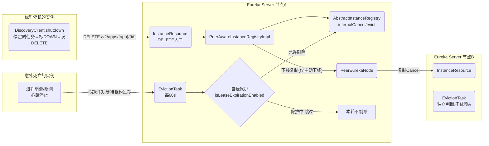
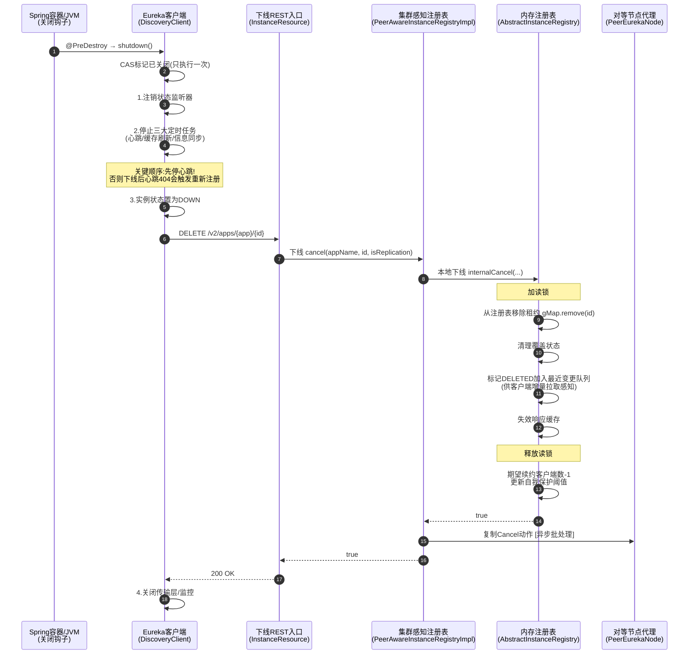
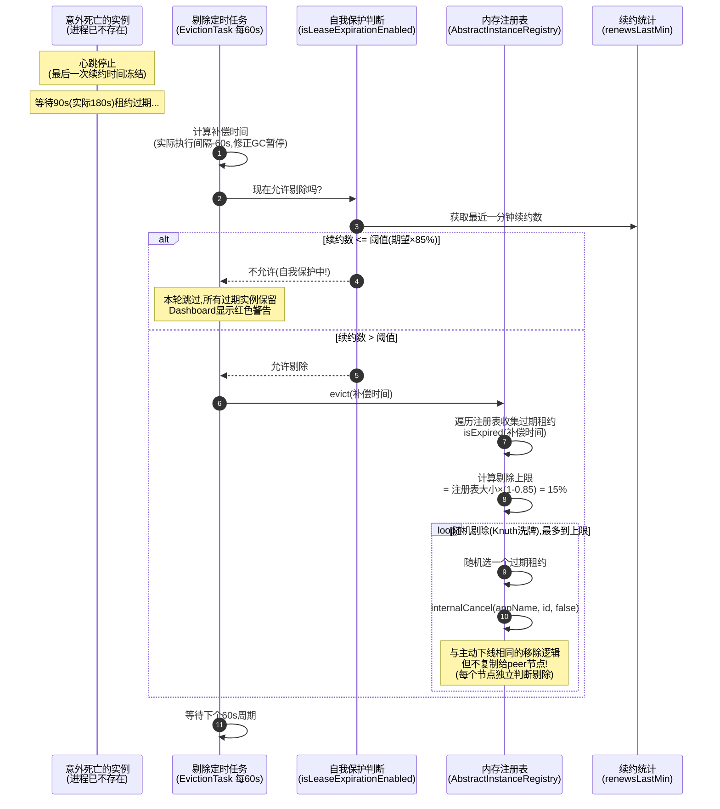
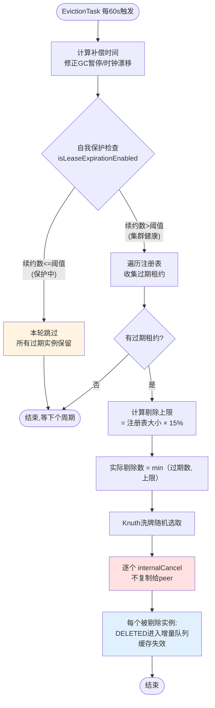
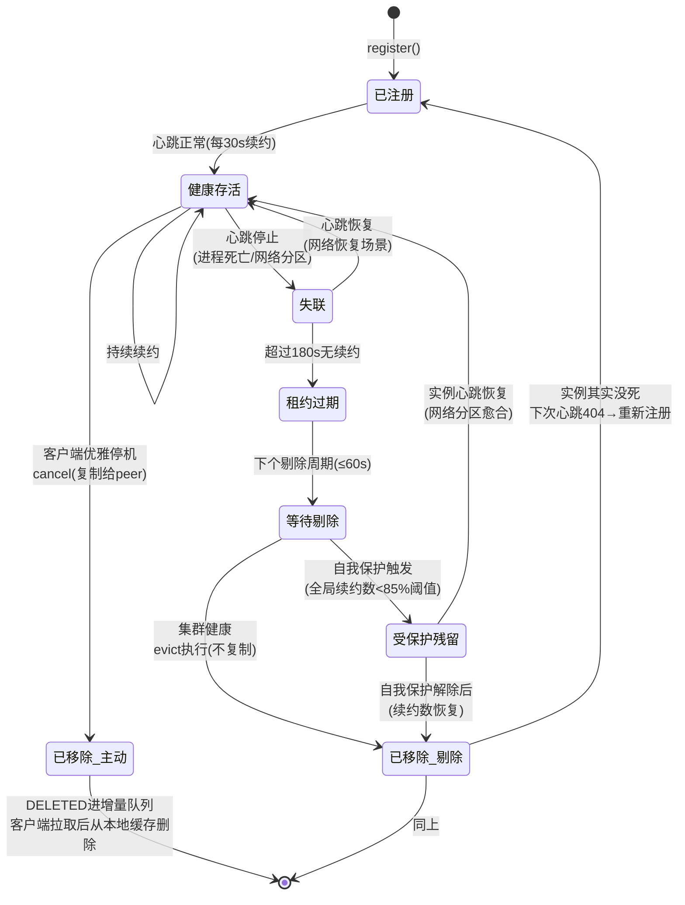

# 服务下线与剔除流程（cancel / evict / 自我保护）

## 文档说明

本文档分析 Eureka **实例退出注册表的两条路径**的业务功能、设计决策、状态流转、质量属性与异常处理：

- **主动下线（cancel）**：客户端优雅停机 `DiscoveryClient#shutdown` → `unregister` → 服务端 `InstanceResource#cancelLease` → `PeerAwareInstanceRegistryImpl#cancel` → 复制给 peer
- **被动剔除（evict）**：服务端定时任务 `EvictionTask`（60s） → `AbstractInstanceRegistry#evict` → 三层保护下批量剔除过期实例（不复制）
- **自我保护机制**：`isLeaseExpirationEnabled` / `updateRenewalThreshold` —— 剔除的"刹车系统"

---

## 零、TL;DR

> **一句话摘要**：实例退出注册表有两条路径——客户端优雅停机时主动发 DELETE 下线（会复制给集群）；客户端异常死亡时由服务端剔除任务每 60s 清理过期租约（不复制、受自我保护约束、单次最多剔除 15%、随机分散）。

- **复杂度域**：Complex（双路径、自我保护状态机、三层剔除保护、补偿时间、复制策略差异）
- **业务入口**：
  - 主动下线：客户端 `shutdown()`（@PreDestroy）/ 服务端 `DELETE /v2/apps/{appName}/{id}`
  - 被动剔除：服务端 `EvictionTask` 定时任务（每 60s）
- **关键依赖**：租约过期判定（Lease.isExpired）、自我保护统计（renewsLastMin vs 阈值）、最近变更队列（DELETED 记录）
- **关键风险点**：
  1. 自我保护触发后**所有**过期实例都不会被剔除，调用方会持续拿到已死实例的地址（需配合客户端重试/熔断）
  2. 剔除不复制 + 各节点独立判断 → 集群中各节点剔除时机不同步，短暂的视图不一致是常态

## 一、业务上下文

### 1.1 业务定义

注册表中的数据必须反映现实：实例死了，注册表里就不该再有它。但"死亡"有两种形态：

1. **优雅死亡**：进程被正常关闭（kill -15 / 容器滚动更新），客户端有机会说"再见"——主动下线，数据立即、确定地被清理
2. **意外死亡**：进程崩溃、OOM、机器断电、网络隔离——客户端来不及说再见，只能靠服务端"发现它很久没心跳了"来推断死亡——被动剔除

被动剔除的根本难题：**无法区分"实例死了"和"网络断了"**。Eureka 的答案是自我保护机制——当大面积实例同时"失联"时，宁可信其活（保留数据），不可信其死（剔除数据）。这是 CAP 中选择 AP 的最直接体现。

### 1.2 业务术语表（DDD Ubiquitous Language）

| 术语 | 含义 | 对应代码符号 |
|------|------|--------------|
| 主动下线 | 客户端优雅停机时主动发送的注销请求 | `cancel` / `unregister` |
| 被动剔除 | 服务端清理超时未续约实例的动作 | `evict` / `EXPIRED` |
| 租约过期 | 超过 duration（90s,实际180s）未续约 | `Lease.isExpired()` |
| 自我保护 | 续约数骤降时停止剔除的保护机制 | `isLeaseExpirationEnabled` |
| 续约阈值 | 触发自我保护的续约数下限（期望值的85%） | `numberOfRenewsPerMinThreshold` |
| 期望客户端数 | 理论上应该发心跳的客户端数量（注册+1/下线-1/15分钟校准） | `expectedNumberOfClientsSendingRenews` |
| 剔除上限 | 单次剔除任务最多剔除的实例数（注册表的15%） | `evictionLimit` |
| 补偿时间 | GC暂停/时钟漂移的修正量,加到过期判定上 | `compensationTimeMs` |

### 1.3 领域定位（DDD）

- **聚合根**：`Lease<InstanceInfo>`（下线/剔除操作的都是租约）
- **领域事件**：实例移除后写入 `recentlyChangedQueue`（ActionType=DELETED），客户端通过增量拉取感知实例消失
- **业务不变量**：
  1. 主动下线必须复制给 peer；被动剔除必须不复制（否则破坏 peer 的自我保护统计）
  2. 单次剔除数量不得超过 注册表大小 × (1 - renewalPercentThreshold)
  3. 自我保护触发期间，过期实例继续保留在注册表中
- **服务分类**：
  - `DiscoveryClient.shutdown`：Application Service（客户端）
  - `AbstractInstanceRegistry.evict / internalCancel`：Domain Service（核心领域逻辑）
  - `EvictionTask`：Infrastructure Service（调度）

### 1.4 触发方式

| 触发场景 | 入口方法/类 | 说明 |
|----------|-------------|------|
| 客户端优雅停机 | `DiscoveryClient.shutdown()`（@PreDestroy） | 主动下线主路径 |
| 运维API强制下线 | `DELETE /v2/apps/{app}/{id}` 直接调用 | 同上,人工触发 |
| 集群下线复制 | `PeerEurekaNode.cancel()` → 对端 cancelLease | 请求头标记复制 |
| 服务端定时剔除 | `EvictionTask.run()`（每60s） | 被动剔除唯一路径 |

### 1.5 核心实现类

| 类名 | 职责 |
|------|------|
| `DiscoveryClient` | shutdown 优雅停机编排 + unregister 发送 DELETE |
| `InstanceResource` | 下线 REST 入口 |
| `PeerAwareInstanceRegistryImpl` | 集群感知下线（复制）+ 自我保护判断 + 阈值校准 |
| `AbstractInstanceRegistry` | internalCancel（移除租约）+ evict（批量剔除）+ EvictionTask |
| `Lease` | 过期判定 isExpired |

## 二、系统协作（C4 视角）

### 2.1 系统上下文图（C4-Context）



### 2.2 关键参与方

| 参与方 | 类型 | 与本流程的关系 |
|--------|------|----------------|
| 优雅停机的客户端 | 系统 | 主动下线发起方 |
| 意外死亡的客户端 | 系统 | 被动剔除的对象（无任何动作） |
| EvictionTask | 模块（服务端） | 被动剔除执行者 |
| 自我保护机制 | 模块（服务端） | 剔除的"刹车" |
| 续约流程 | 其他流程 | 续约统计是自我保护判断的数据来源 |
| 服务消费方 | 系统 | 下线/剔除的最终受益方（不再调用已死实例） |

## 三、关键设计决策（ADR）

| 决策点 | 备选方案 | 当前选择 | 理由 | Trade-off / 风险 |
|--------|----------|----------|------|------------------|
| 死亡检测模型 | 服务端主动探测 / 租约超时推断 | **租约超时推断**（90s,实际180s无心跳） | 与心跳机制天然配合,服务端零探测成本 | 检测延迟长（最长3分钟+剔除周期1分钟）;无法区分网络分区与真实死亡 |
| 剔除是否复制 | 复制给peer / 各节点独立剔除 | **不复制**（evict调internalCancel而非cancel） | 若剔除被复制,peer会把它当作"主动下线"统计,导致peer的expectedNumberOfClients下降→自我保护阈值下降→该触发保护时不触发 | 各节点剔除时机不同步,集群视图短暂不一致 |
| 大面积失联的处理 | 全部剔除 / 自我保护(停止剔除) | **自我保护**（续约数<85%阈值时停止剔除） | 大面积失联更可能是网络问题;保留数据让调用方自己重试,好过清空注册表导致全局调用关系崩塌 | 真实的大面积宕机时,死实例信息会残留,调用方持续拿到无效地址 |
| 单次剔除数量 | 一次剔除全部过期 / 限制上限 | **上限=注册表×15%**,分批渐进 | 给自我保护留出反应时间:第一批剔除后续约统计下降,下一轮保护可能就触发了 | 大量实例真实死亡时,完全清理需要多个周期(每分钟15%) |
| 剔除顺序 | 按顺序 / 随机(Knuth洗牌) | **随机剔除** | 避免把单个应用的实例一次性全剔光(顺序剔除时同应用实例相邻) | 无 |
| GC暂停的影响 | 忽略 / 补偿时间机制 | **补偿时间**（实际间隔-配置间隔） | 服务端Full GC期间所有实例都无法续约,不补偿会大面积误剔除 | 补偿只覆盖服务端暂停,不覆盖客户端暂停 |
| 阈值校准方向 | 双向校准 / 只升不降 | **只升不降**（实例数>期望×85%才更新） | 实例数下降时若跟着降阈值,自我保护就永远不会触发(阈值随实际值下降) | 大量实例长期下线后,阈值偏高,自我保护过于敏感;需15分钟周期+实例恢复才校准 |
| 优雅停机时序 | 先下线再停任务 / 先停任务再下线 | **先停定时任务,再标DOWN,最后发DELETE** | 若先下线,心跳任务还在跑,下一次心跳404会触发重新注册,实例"复活" | 无 |

## 四、核心流程

### 4.1 主流程时序图

**场景一：主动下线（优雅停机）**



**场景二：被动剔除（实例意外死亡）**



### 4.2 业务流程图（剔除任务完整决策）



### 4.3 状态流转图

实例在注册表中的完整生命周期（涵盖注册/续约/下线/剔除/自我保护）：



### 4.4 关键步骤说明

**主动下线步骤 2-5（停机顺序）**：`shutdown()`（DiscoveryClient.java:972）的顺序至关重要——先停定时任务再下线。如果顺序反了，下线后心跳线程还活着，下次心跳收到 404 会自动重新注册，实例"诈尸"。

**主动下线步骤 9-14（移除租约）**：`internalCancel()`（AbstractInstanceRegistry.java:330）：

```java
// 【真正的移除动作】从内层 Map 中删除该实例的租约
if (gMap != null) {
    leaseToCancel = gMap.remove(id);
}
...
// 标记动作类型为 DELETED 并加入最近变更队列 ——
// 客户端增量拉取时会收到该 DELETED 记录，从而把实例从本地缓存中删除
instanceInfo.setActionType(ActionType.DELETED);
recentlyChangedQueue.add(new RecentlyChangedItem(leaseToCancel));
```

**主动下线步骤 15-16（统计调整）**：期望续约客户端数 -1 并更新阈值——这是主动下线与被动剔除的关键区别（剔除不调整这个计数，调整工作留给 15 分钟一次的校准任务）。

**被动剔除步骤 4-7（自我保护检查）**：`isLeaseExpirationEnabled()`（PeerAwareInstanceRegistryImpl.java:507）：

```java
// 阈值>0 且 实际续约数>阈值 → 集群健康，允许剔除
// 实际续约数<=阈值 → 触发自我保护，禁止剔除（Dashboard 上会显示红色警告）
return numberOfRenewsPerMinThreshold > 0 && getNumOfRenewsInLastMin() > numberOfRenewsPerMinThreshold;
```

**被动剔除步骤 9-12（三层保护下的剔除）**：`evict()`（AbstractInstanceRegistry.java:650）的三层保护：自我保护（第一层）→ 数量上限 15%（第二层）→ 随机分散（第三层）。

**被动剔除步骤 11（不复制的原因）**：剔除调用 `internalCancel(appName, id, false)` 而非 `cancel()`——如果剔除被复制给 peer，peer 会把它当作"主动下线"，导致 peer 的 `expectedNumberOfClientsSendingRenews` 减 1，阈值跟着下降，最终 peer 的自我保护在该触发时不触发。

## 五、前置校验

### 5.1 校验规则

下线和剔除的校验都很简单——核心是"实例存在性"：

```java
// internalCancel 中:实例本来就不存在 → 下线失败（REST 层返回 404）
if (leaseToCancel == null) {
    CANCEL_NOT_FOUND.increment(isReplication);
    logger.warn("DS: Registry: cancel failed because Lease is not registered for: {}/{}", appName, id);
    return false;
}
```

剔除前的"校验"是自我保护检查（详见 4.2 流程图），这是业务规则而非参数校验。

### 5.2 校验规则汇总

| 校验项 | 字段条件 | HTTP状态码 | 提示信息 | 对应业务不变量 |
|--------|----------|-----------|----------|----------------|
| 实例存在性（下线） | registry 中存在该租约 | 404 | Not Found (Cancel) | 不存在的实例无法下线 |
| 自我保护检查（剔除） | 续约数 > 阈值 | -（内部跳过） | lease expiration is currently disabled | 网络分区时不剔除 |
| 剔除数量上限 | 单次 ≤ 注册表×15% | -（内部限制） | Evicting N items | 渐进式剔除 |

## 六、外部系统交互

### 6.1 客户端 → 服务端（主动下线）

- **触发条件**：优雅停机（@PreDestroy / shutdown hook）
- **交互内容**：DELETE /v2/apps/{appName}/{instanceId}
- **成功判断**：HTTP 200
- **失败处理**：仅记录日志，**不重试**（进程马上要退出了）；失败的后果是该实例要等服务端剔除（最长约 4 分钟后）
- **是否可逆**：是（重新注册即可）
- **是否需补偿**：失败后由服务端剔除机制兜底

### 6.2 服务端 → Peer 节点（下线复制，仅主动下线）

- **触发条件**：本地下线成功且非复制请求
- **交互内容**：批量复制请求中的 Cancel 任务
- **失败处理**：peer 返回 404 时仅记录日志（说明 peer 上本来就没有，目标已达成）
- **是否需补偿**：不需要——即使复制失败，peer 上的该实例租约也会因为收不到心跳而被 peer 自己的剔除任务清理

### 6.3 被动剔除（无外部交互）

剔除是纯本地操作：不通知客户端（客户端通过拉取增量发现自己被剔除——表现为心跳 404）、不通知 peer（各节点独立剔除）。

## 七、质量属性（NFR）

| 维度 | 具体要求 / 现状 | 代码支撑 |
|------|----------------|----------|
| **性能** | 下线为 O(1) Map 移除;剔除任务 O(N) 遍历全表（N=实例总数）,每60s一次,大集群（万级实例）下耗时毫秒级 | internalCancel（:330）、evict 遍历（:650） |
| **并发** | 下线与注册共用读锁（可并发）;剔除上限/自我保护统计用 synchronized(lock);剔除任务单线程定时执行（无并发剔除） | read.lock()、synchronized (lock)、单线程 Timer |
| **可用性** | 自我保护宁可保留死数据也不误删活数据;剔除分批渐进,单轮最多影响15%;下线失败由剔除兜底 | isLeaseExpirationEnabled、evictionLimit |
| **一致性** | 主动下线通过复制同步给集群（秒级）;被动剔除各节点独立（分钟级窗口内不一致是设计预期）;客户端感知延迟=增量拉取周期 | replicateToPeers(Cancel)、剔除不复制 |
| **可观测性** | CANCEL/CANCEL_NOT_FOUND/EXPIRED 计数器、recentCanceledQueue（Dashboard）、自我保护状态指标、剔除日志 | EurekaMonitors、isLeaseExpirationEnabledMetric |
| **安全性** | DELETE 接口无认证——任何能访问网络的人都可以下线任意实例（重大安全考量,依赖网络隔离） | - |

## 八、异常与失败模式

### 8.1 错误码完整对照表

| HTTP状态码 | 错误信息 | 触发条件 | 处理方式 |
|-----------|----------|----------|----------|
| 200 | OK | 下线成功 | 正常 |
| 404 | Not Found (Cancel) | 实例不存在（已被剔除/从未注册/重复下线） | 客户端忽略（目标已达成） |
| 500 | Error (cancel) | 下线过程抛异常 | 客户端记录日志,由服务端剔除兜底 |
| -（日志） | lease expiration is currently disabled | 自我保护触发,跳过剔除 | 检查集群健康度,确认是否网络问题 |
| -（日志） | DS: Registry: expired lease for {app}/{id} | 实例被剔除 | 正常（实例确实死了）或排查误剔除 |

### 8.2 失败模式分析（FMEA）

| 步骤 | 可能失败 | 数据一致性影响 | 是否可重入 | 补偿/恢复手段 |
|------|---------|----------------|------------|----------------|
| 客户端发送下线请求 | 网络异常/进程被强杀来不及发送 | 死实例残留在注册表 | 否（进程已退出） | 服务端剔除兜底（最长约4分钟后清理） |
| 下线复制到peer | peer宕机 | peer上残留该实例 | - | peer自己的剔除任务兜底 |
| 剔除任务执行 | 自我保护误触发（统计偏差） | 死实例长期残留 | 是 | 15分钟阈值校准;调用方重试+熔断兜底 |
| 剔除任务执行 | 服务端Full GC导致任务延迟 | 可能误剔除（实例没机会续约） | - | 补偿时间机制修正 |
| 自我保护期间 | 真实的大面积宕机 | 大量死实例残留,调用方持续调用失败 | - | 无自动恢复;需人工关闭自我保护或等实例恢复 |
| 实例被误剔除 | 网络抖动导致心跳丢失但实例活着 | 实例不可被发现 | 是 | 实例下次心跳404→立即重新注册（分钟级自愈） |
| 阈值校准 | eurekaClient.getApplications()失败 | 阈值未更新 | 是 | 15分钟后下次校准重试 |

### 8.3 主动下线 vs 被动剔除的策略差异总结

| 维度 | 主动下线（cancel） | 被动剔除（evict） |
|------|-------------------|-------------------|
| 触发方 | 客户端 | 服务端定时任务 |
| 复制给peer | ✅ 是 | ❌ 否（独立判断） |
| 调整期望客户端数 | ✅ 立即-1 | ❌ 否（留给15分钟校准） |
| 受自我保护约束 | ❌ 否（明确意图,无条件执行） | ✅ 是 |
| 数量限制 | 无 | 单次≤15% |
| 时效性 | 立即 | 最长约4分钟（180s过期+60s周期） |

## 九、影响半径与依赖矩阵

### 9.1 fan-in（谁调用下线/剔除）

| 调用方 | 业务场景 | 频率 | 改动需协调? |
|--------|----------|------|-------------|
| Jersey路由 → InstanceResource.cancelLease | 客户端优雅停机/复制 | 低（实例重启时） | 是（REST契约） |
| DiscoveryClient.shutdown → unregister | 客户端停机 | 低 | 是 |
| EvictionTask.run → evict | 定时剔除 | 每60s | 否（内部） |
| evict → internalCancel | 剔除执行 | 每60s×N个过期实例 | 否（内部） |
| PeerAwareInstanceRegistryImpl.cancel → super.cancel → internalCancel | 下线链路 | 低 | 否（内部） |

> fan-in 扫描证据：
> ```
> grep -rn "registry.cancel(\|\.cancel(appName" eureka-core/src/main/java
> grep -rn "internalCancel(" eureka-core/src/main/java
> grep -rn "unregister()\|shutdown()" eureka-client/src/main/java/com/netflix/discovery/DiscoveryClient.java
> ```

### 9.2 fan-out（下线/剔除依赖谁）

| 被调用方 | 依赖类型 | 失败时影响 |
|----------|----------|------------|
| registry（双层Map）.remove | 内存操作 | 移除失败实例残留 |
| recentlyChangedQueue | 内存队列 | 客户端无法通过增量感知实例消失 |
| ResponseCache.invalidate | 内存缓存 | 客户端拉到的数据中实例还在（最长180s） |
| renewsLastMin / numberOfRenewsPerMinThreshold | 统计 | 自我保护判断失真 |
| PeerEurekaNode.cancel（仅主动下线） | HTTP异步 | peer残留,由peer剔除兜底 |
| eurekaClient.getApplications（阈值校准） | HTTP | 校准失败,阈值过期 |

### 9.3 契约兼容性

- **DELETE 的 404 语义**：客户端把 404 当作"下线成功"（幂等性），服务端不能改变这个语义
- **剔除不复制约定**：这是隐式契约——如果某个版本改成剔除也复制，混合部署时老节点的自我保护会被破坏
- **DELETED ActionType**：客户端增量合并依赖这个标记删除本地实例

## 十、测试与可观测性

### 10.1 测试用例矩阵

| 场景 | 类型 | 单测/集成 | Mock 依赖 |
|------|------|-----------|-----------|
| 正常下线存在的实例 | 正常 | 单测 | registry |
| 下线不存在的实例返回404 | 异常 | 单测 | registry |
| 下线后期望客户端数-1且阈值更新 | 正常 | 单测 | - |
| 下线后DELETED进入增量队列 | 正常 | 单测 | - |
| 剔除过期实例 | 正常 | 单测 | 时间Mock |
| 自我保护触发时跳过剔除 | 边界 | 单测 | renewsLastMin Mock |
| 剔除数量不超过15%上限 | 边界 | 单测 | - |
| 剔除随机分散到多个应用 | 正常 | 单测 | - |
| 补偿时间修正GC暂停 | 边界 | 单测 | getCurrentTimeNano Mock |
| 剔除不复制给peer | 正常 | 单测 | PeerEurekaNodes |
| 优雅停机完整流程（停任务→DOWN→DELETE） | 集成 | 集成 | - |
| 现有测试参考 | - | - | `eureka-core/src/test/java/.../InstanceRegistryTest.java`、`AbstractInstanceRegistryTest.java` |

### 10.2 可观测性

**关键日志关键字**（用于线上 grep）：

```
# 客户端侧
grep "Shutting down DiscoveryClient" <client.log>     # 优雅停机开始
grep "Unregistering" <client.log>                      # 发送下线请求
grep "deregister  status" <client.log>                 # 下线结果

# 服务端侧
grep "Cancelled instance" <server.log>                 # 下线成功
grep "Not Found (Cancel)" <server.log>                 # 下线404
grep "Running the evict task" <server.log>             # 剔除任务执行
grep "expired lease for" <server.log>                  # 实例被剔除(关键!)
grep "Evicting .* items" <server.log>                  # 单轮剔除数量
grep "lease expiration is currently disabled" <server.log>  # 自我保护触发(关键!)
```

**监控指标**：

- **容量水位类**：
  - `numOfRenewsInLastMin` vs `numOfRenewsPerMinThreshold`（自我保护水位，最核心指标）
  - `localRegistrySize`（注册表大小，骤降说明大量剔除/下线）
- **异常计数类**：
  - `eurekaServer.EXPIRED`（剔除总数）← 持续增长需排查是真实死亡还是网络问题
  - `eurekaServer.CANCEL` / `CANCEL_NOT_FOUND`（下线计数）
  - `isLeaseExpirationEnabled`（Gauge：0=保护中/1=正常）← **告警必配**
  - `isSelfPreservationModeEnabled`（自我保护开关状态）
- **补偿/重试类**：
  - 剔除任务的补偿时间（日志中 compensationTime，频繁>0 说明服务端 GC 压力大）
  - 被剔除后重新注册的实例数（误剔除的修复量）

**链路追踪**：无（与其他流程一致）。

## 十一、代码位置索引

> 行号基于添加中文注释后的当前代码。

### 11.1 主链路方法

| 方法 | 文件:行号 | 说明 |
|------|----------|------|
| `DiscoveryClient.shutdown()` | DiscoveryClient.java:972 | 客户端优雅停机编排 |
| `DiscoveryClient.unregister()` | DiscoveryClient.java:1011 | 发送DELETE下线请求 |
| `InstanceResource.cancelLease()` | InstanceResource.java:291 | 下线REST入口 |
| `PeerAwareInstanceRegistryImpl.cancel()` | PeerAwareInstanceRegistryImpl.java:391 | 本地下线+复制 |
| `AbstractInstanceRegistry.cancel()` | AbstractInstanceRegistry.java:316 | 转调internalCancel |
| `AbstractInstanceRegistry.internalCancel()` | AbstractInstanceRegistry.java:330 | 移除租约核心逻辑 |
| `AbstractInstanceRegistry.evict(long)` | AbstractInstanceRegistry.java:650 | 剔除核心（三层保护） |
| `AbstractInstanceRegistry.EvictionTask` | AbstractInstanceRegistry.java:1334 | 剔除定时任务 |
| `EvictionTask.getCompensationTimeMs()` | AbstractInstanceRegistry.java:1360 | 补偿时间计算 |
| `PeerAwareInstanceRegistryImpl.isLeaseExpirationEnabled()` | PeerAwareInstanceRegistryImpl.java:507 | 自我保护核心判断 |
| `PeerAwareInstanceRegistryImpl.scheduleRenewalThresholdUpdateTask()` | PeerAwareInstanceRegistryImpl.java:197 | 阈值校准定时任务 |
| `PeerAwareInstanceRegistryImpl.updateRenewalThreshold()` | PeerAwareInstanceRegistryImpl.java:565 | 阈值校准逻辑 |
| `AbstractInstanceRegistry.updateRenewsPerMinThreshold()` | AbstractInstanceRegistry.java:1276 附近 | 阈值计算公式 |
| `Lease.isExpired(long)` | Lease.java:132 | 过期判定 |
| `Lease.cancel()` | Lease.java:86 | 下线时间戳标记 |

### 11.2 依赖服务

| 服务类 | 接口方法 | 说明 |
|--------|----------|------|
| `ResponseCache` | `invalidate(...)` | 下线/剔除后失效缓存 |
| `PeerEurekaNode` | `cancel(appName, id)` | 下线复制（仅主动下线） |
| `MeasuredRate` | `getCount()` | 自我保护判断的数据来源 |
| `EurekaClient` | `getApplications()` | 阈值校准的数据来源 |

### 11.3 相关枚举与常量

| 枚举/常量 | 位置 | 值/含义 |
|-----------|------|---------|
| `ActionType.DELETED` | InstanceInfo | 实例移除的增量标记 |
| `Action.Cancel` | PeerAwareInstanceRegistryImpl | 下线复制动作类型 |
| `CANCEL` / `CANCEL_NOT_FOUND` / `EXPIRED` | EurekaMonitors | 监控计数器 |
| `InstanceStatus.DOWN` | InstanceInfo | 优雅停机时先标记的状态 |

### 11.4 关键容量/阈值常量

| 常量名 | 取值 | 位置 | 取值依据/约束来源 |
|--------|------|------|-------------------|
| 剔除任务间隔 evictionIntervalTimerInMs | 60s | DefaultEurekaServerConfig.java:316 | 剔除时效性与扫描开销的平衡 |
| 自我保护阈值 renewalPercentThreshold | 0.85 | DefaultEurekaServerConfig.java:241 | 容忍15%的实例失联不触发保护 |
| 自我保护开关 shouldEnableSelfPreservation | true | DefaultEurekaServerConfig | 生产建议开启;测试环境常关闭 |
| 阈值校准间隔 renewalThresholdUpdateIntervalMs | 15分钟 | DefaultEurekaServerConfig.java:221 | 基数偏差的修正周期 |
| 单次剔除上限 | 注册表大小×15% | evict() 内计算（1-0.85） | 与自我保护阈值联动,渐进式剔除 |
| 租约过期时间 | 90s（实际180s） | Lease.DEFAULT_DURATION_IN_SECS + renew bug | 见02.心跳续约文档 |
| 下线时是否注销 shouldUnregisterOnShutdown | true | DefaultEurekaClientConfig | 蓝绿发布场景可配置为false |

## 十二、技术债与演化

- **实例不可用感知延迟过长**：意外死亡的实例从死亡到从所有客户端缓存中消失，最长需要 180s（租约过期）+ 60s（剔除周期）+ 30s（只读缓存）+ 30s（客户端拉取）≈ **5 分钟**。期间调用方会持续调用死实例。生产环境必须配合客户端侧的故障处理（Ribbon 重试、Hystrix 熔断）
- **自我保护的"全有或全无"**：保护触发后**所有**过期实例都不剔除（包括真死的），没有"部分剔除确定死亡的实例"的能力。Eureka 2.x 曾计划改进但项目已停止
- **DELETE 接口无鉴权**：任何能访问 Eureka 端口的人都可以下线任意实例，存在恶意下线风险
- **强杀进程（kill -9）无下线**：只有优雅停机才会主动下线；强杀场景完全依赖 5 分钟的剔除兜底——发布系统应优先使用 SIGTERM 并预留停机时间
- **expectedNumberOfClientsSendingRenews 的语义混乱**：注册+1、主动下线-1、剔除不变、15分钟全量校准——四种修改路径使得这个值在动荡期间不可靠

## 十三、常见问题与排查

### 13.1 典型失败场景

1. **实例已经死了，但调用方还在调它（最常见）**
   - 现象：调用持续报连接超时/拒绝
   - 原因：感知延迟链条（最长约5分钟）尚未走完；或自我保护触发导致死实例不被剔除
   - 解决：检查 Dashboard 是否显示自我保护警告（红字）；确认调用方配置了重试/熔断；缩短各级缓存与心跳间隔

2. **Dashboard 显示红色自我保护警告**
   - 现象：`EMERGENCY! EUREKA MAY BE INCORRECTLY CLAIMING INSTANCES ARE UP WHEN THEY'RE NOT`
   - 原因：最近一分钟续约数低于阈值的85%——可能是网络分区、大量实例同时重启、或 Eureka 自身网络问题
   - 解决：① 确认是否真实网络故障 ② 大量实例正常缩容后未恢复（阈值校准滞后）→ 等15分钟校准 ③ 测试环境实例少导致统计敏感 → 关闭自我保护

3. **实例反复被剔除又重新注册（与续约文档场景2相关）**
   - 现象：服务端反复出现 expired lease 和 Registered instance 日志
   - 原因：客户端心跳不稳定（GC/网络）；客户端与服务端时钟偏移过大
   - 解决：排查客户端 GC；检查 NTP 同步；确认心跳线程池没有打满

### 13.2 排查决策图

```mermaid
flowchart TD
    P([死实例残留 / 活实例被剔除]) --> Q1{哪种问题?}
    Q1 -- 死实例残留 --> Q2{Dashboard有<br/>自我保护红色警告?}
    Q2 -- 是 --> A1[自我保护中,死实例不会被剔除:<br/>排查为何续约数骤降<br/>必要时临时关闭自我保护]
    Q2 -- 否 --> Q3{死亡时间<br/>超过5分钟?}
    Q3 -- 否 --> A2[感知延迟未走完,属正常:<br/>180s过期+60s剔除+缓存延迟]
    Q3 -- 是 --> A3[异常:检查EvictionTask日志<br/>是否正常执行/是否被异常中断]
    Q1 -- 活实例被剔除 --> Q4{客户端日志:<br/>心跳是否正常发送?}
    Q4 -- 否 --> A4[客户端问题:<br/>GC暂停/线程池满/网络<br/>参考02.心跳续约文档]
    Q4 -- 是 --> A5[服务端问题:<br/>检查服务端GC(补偿时间日志)<br/>检查时钟同步(NTP)]
```

### 13.3 关键日志关键字

见 10.2 可观测性章节。

## 十四、文档元信息

- **文档版本**：v1.0
- **最后更新**：2026-06-01
- **复杂度域**：Complex
- **负责模块**：eureka-client（优雅停机）、eureka-core（下线处理与剔除任务）
- **归属团队 / 维护人**：学习文档（个人源码学习用途）
- **相关类**：`DiscoveryClient.java`, `InstanceResource.java`, `PeerAwareInstanceRegistryImpl.java`, `AbstractInstanceRegistry.java`, `Lease.java`
- **关联文档**：[01.服务注册流程](01.服务注册流程.md)（误剔除后的重新注册）、[02.心跳续约流程](02.心跳续约流程.md)（续约统计是自我保护的数据来源）、[03.拉取注册表流程](03.拉取注册表流程.md)（DELETED增量记录的消费）
