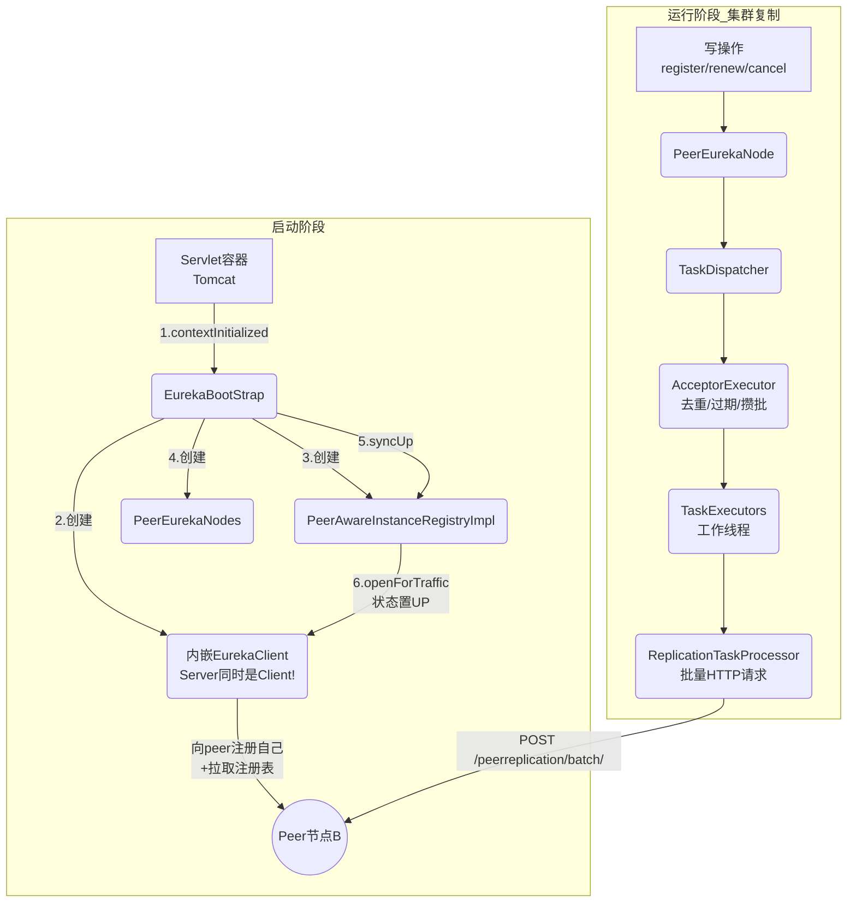
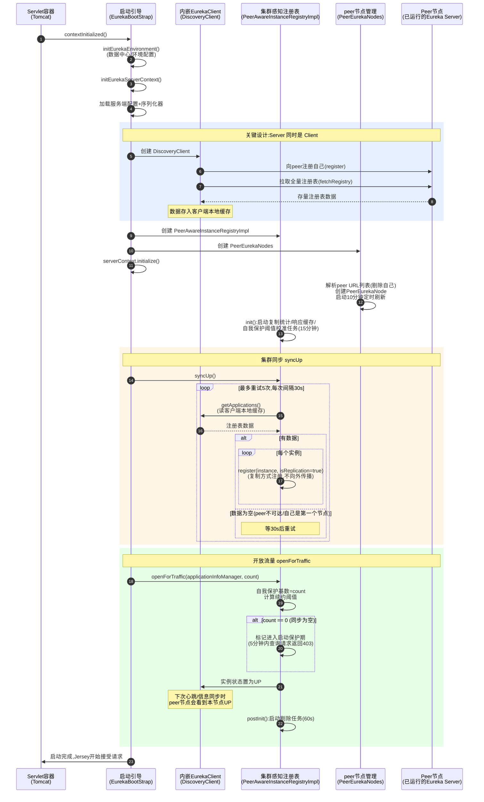
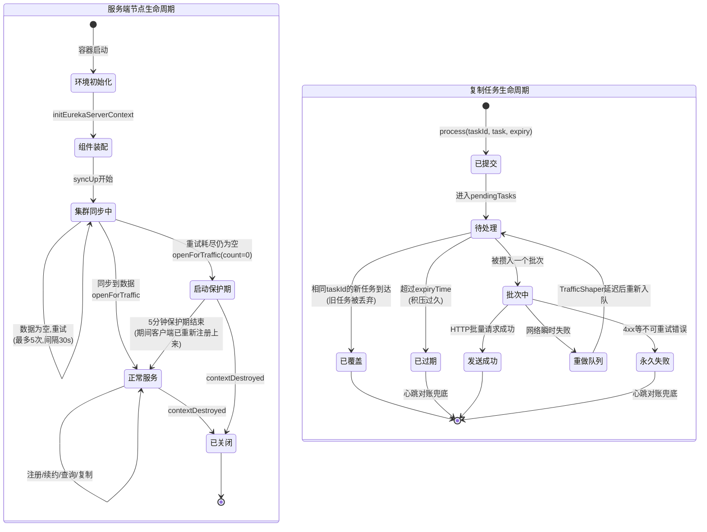

# 服务端启动与集群同步流程（EurekaBootStrap → syncUp → openForTraffic + 批处理复制框架）

## 文档说明

本文档分析 Eureka **服务端启动全流程与集群协作基础设施**的业务功能、设计决策、状态流转、质量属性与异常处理。链路覆盖：

- 启动入口：`com.netflix.eureka.EurekaBootStrap#contextInitialized` → `initEurekaServerContext`
- 集群同步：`PeerAwareInstanceRegistryImpl#syncUp`（从 peer 拉取存量数据）
- 开放流量：`PeerAwareInstanceRegistryImpl#openForTraffic` / `shouldAllowAccess`（启动保护期）
- peer 节点管理：`com.netflix.eureka.cluster.PeerEurekaNodes`（动态增减节点）
- 复制基础设施：`com.netflix.eureka.util.batcher.*`（批处理框架：去重/合并/攒批/重试）

---

## 零、TL;DR

> **一句话摘要**：Eureka Server 以 war 包部署，启动时按"配置→内嵌客户端→注册表→peer管理器→从peer同步存量数据→开放流量"的顺序装配；其核心设计是"每个 Server 同时也是 Client"，集群间复制通过批处理框架（去重+攒批+异步）实现高吞吐。

- **复杂度域**：Complex（多组件装配顺序依赖、集群同步重试、启动保护期状态机、三层队列批处理框架）
- **业务入口**：
  - Servlet 容器启动 → web.xml 中注册的 `EurekaBootStrap`（ServletContextListener）
  - 复制任务提交 → `TaskDispatcher.process()`（批处理框架入口）
- **关键依赖**：内嵌 EurekaClient（Server 间互相发现的基础）、PeerEurekaNodes、批处理三层队列
- **关键风险点**：
  1. 集群第一个启动的节点 syncUp 必然为空 → 进入 5 分钟启动保护期，期间查询请求全部 403
  2. 批处理框架的去重会丢弃同一实例的旧任务——依赖"心跳兜底修复"的前提，单独看复制不保证送达

## 一、业务上下文

### 1.1 业务定义

Eureka Server 的启动不只是"把进程拉起来"，它要解决一个分布式系统的经典问题：**新节点如何加入一个有状态的集群？**

Eureka 的答案分三步：
1. **以客户端身份加入**：每个 Server 内嵌一个 EurekaClient，像普通微服务一样向 peer 节点注册自己、拉取注册表——集群成员间的互相发现复用了服务发现本身的能力（自举设计）
2. **同步存量数据**（syncUp）：把内嵌客户端拉到的注册表逐条"复制注册"进自己的注册表
3. **保护性开放**（openForTraffic + 启动保护期）：同步成功才正常服务；同步失败（空数据）则进入 5 分钟保护期拒绝查询，防止把空注册表扩散给客户端

集群运行期间的写操作（注册/续约/下线）通过**批处理复制框架**在节点间传播，框架的核心价值是把高频小请求（每实例每 30s 一次心跳复制）合并成低频批量请求。

### 1.2 业务术语表（DDD Ubiquitous Language）

| 术语 | 含义 | 对应代码符号 |
|------|------|--------------|
| 内嵌客户端 | Server 内部持有的 EurekaClient,以客户端身份与 peer 交互 | `eurekaClient`（EurekaBootStrap/PeerAwareInstanceRegistryImpl） |
| 集群同步 | 启动时从 peer 节点复制存量注册表 | `syncUp` |
| 开放流量 | 同步完成后正式对外服务 | `openForTraffic` |
| 启动保护期 | 同步为空时拒绝查询的时间窗口（5分钟） | `peerInstancesTransferEmptyOnStartup` + `waitTimeInMsWhenSyncEmpty` |
| peer 节点 | 集群中除自己外的其他 Eureka Server | `PeerEurekaNode` / `PeerEurekaNodes` |
| 批处理分发器 | 复制任务的接收/去重/攒批/分发组件 | `TaskDispatcher` / `AcceptorExecutor` |
| 任务去重 | 相同 taskId 的任务只保留最新版本 | `pendingTasks`（Map语义覆盖） |
| 流量整形 | 网络异常时延迟任务投递 | `TrafficShaper` |

### 1.3 领域定位（DDD）

- **聚合根**：`EurekaServerContext`（服务端所有组件的容器）
- **领域事件**：无显式事件；启动完成的标志是实例状态变为 UP
- **业务不变量**：
  1. 必须先 syncUp 再 openForTraffic（数据就绪才能服务）
  2. 启动保护期内不对外提供查询（宁可拒绝服务，不返回空数据）
  3. 复制任务的 taskId 相同则新任务覆盖旧任务（最新数据优先）
- **服务分类**：
  - `EurekaBootStrap`：Application Service（装配编排）
  - `PeerAwareInstanceRegistryImpl.syncUp/openForTraffic`：Domain Service
  - `PeerEurekaNodes` / 批处理框架：Infrastructure Service

### 1.4 触发方式

| 触发场景 | 入口方法/类 | 说明 |
|----------|-------------|------|
| Servlet 容器启动 | `EurekaBootStrap.contextInitialized()` | web.xml 注册的监听器 |
| 容器关闭 | `EurekaBootStrap.contextDestroyed()` | 清理资源 |
| peer 列表定时刷新 | `PeerEurekaNodes` 定时任务（每10分钟） | 动态调整集群拓扑 |
| 复制任务提交 | `PeerEurekaNode.register/heartbeat/cancel` → `batchingDispatcher.process()` | 写操作触发 |

### 1.5 核心实现类

| 类名 | 职责 |
|------|------|
| `EurekaBootStrap` | 启动装配编排（8步初始化） |
| `DefaultEurekaServerContext` | 组件容器,initialize() 触发各组件启动 |
| `PeerAwareInstanceRegistryImpl` | syncUp / openForTraffic / shouldAllowAccess |
| `PeerEurekaNodes` | peer 列表解析与动态更新 |
| `PeerEurekaNode` | 单个 peer 的复制通道（持有批处理分发器） |
| `TaskDispatcher` / `TaskDispatchers` | 批处理框架对外接口 |
| `AcceptorExecutor` | 任务接收/去重/过期/攒批的调度中枢 |
| `TaskExecutors` | 批量任务的工作线程池 |
| `ReplicationTaskProcessor` | 把一批任务转成一个 HTTP 批量请求 |
| `TrafficShaper` | 网络异常时的投递延迟控制 |

## 二、系统协作（C4 视角）

### 2.1 系统上下文图（C4-Context）



### 2.2 关键参与方

| 参与方 | 类型 | 与本流程的关系 |
|--------|------|----------------|
| Servlet 容器（Tomcat） | 系统 | 启动的触发者与宿主 |
| 内嵌 EurekaClient | 模块 | Server 间互相发现的桥梁 |
| Peer 节点 | 系统 | syncUp 的数据来源、复制的目标 |
| 普通 Eureka 客户端 | 系统 | 启动保护期的保护对象（防止拉到空数据） |
| 批处理框架 | 模块 | 所有复制流量的必经之路 |

## 三、关键设计决策（ADR）

| 决策点 | 备选方案 | 当前选择 | 理由 | Trade-off / 风险 |
|--------|----------|----------|------|------------------|
| 集群成员发现 | 独立的成员协议(gossip/raft) / 复用服务发现 | **Server内嵌Client,复用服务发现** | 自举设计,无需额外协议;集群拓扑与服务注册表统一管理 | Server的可用性依赖内嵌Client正常工作;概念上容易混淆 |
| 存量数据同步方式 | 专用同步协议/快照传输 / 复用客户端拉取+复制注册 | **复用拉取:遍历内嵌Client缓存逐条register** | 实现极简,零额外协议 | 大注册表(万级实例)逐条注册较慢;同步期间的增量变更可能丢失(靠心跳修复) |
| 同步失败的处理 | 启动失败退出 / 空数据照常服务 / 保护期拒绝查询 | **5分钟保护期拒绝查询(403)** | 空注册表扩散给客户端=所有服务"消失",灾难性;拒绝查询让客户端继续用旧缓存 | 集群第一个节点必然经历5分钟保护期(可配置缩短) |
| 自我保护基数初始化 | 从0开始累计 / 用syncUp数量初始化 | **expectedNumberOfClients = syncUp count** | 启动即有合理的保护阈值,避免启动初期保护误判 | syncUp不完整时基数偏低 |
| 复制请求模式 | 每操作一个HTTP请求 / 批处理合并 | **批处理(250个/批,500ms窗口)** | 万级实例集群中,逐条复制的HTTP开销不可承受;批处理减少95%+请求数 | 复制延迟增加(最多500ms);框架复杂度高 |
| 复制任务去重 | 不去重 / 按taskId去重保留最新 | **去重(pendingTasks Map覆盖)** | 同一实例500ms内的多次心跳只需复制最后一次,减少无效流量 | "每个操作都送达"无法保证→依赖心跳对账兜底 |
| peer列表管理 | 启动时固定 / 定时刷新 | **每10分钟重新解析** | 支持DNS模式下动态扩缩容Eureka集群 | 拓扑变更最长10分钟才生效 |
| 启动顺序 | 先开放流量再同步 / 先同步再开放 | **严格先syncUp再openForTraffic** | 数据就绪才能服务 | 启动时间变长(同步重试最长5次×30s) |

## 四、核心流程

### 4.1 主流程时序图



### 4.2 业务流程图（批处理复制框架的任务流转）

```mermaid
flowchart TD
    START([写操作发生<br/>register/renew/cancel]) --> SUBMIT[PeerEurekaNode.xxx<br/>提交复制任务]
    SUBMIT --> ACCEPT[acceptorQueue<br/>接收队列]
    ACCEPT --> ATHREAD{调度线程<br/>acceptorThread}
    ATHREAD --> DEDUP[去重:相同taskId<br/>新任务覆盖旧任务<br/>pendingTasks Map]
    DEDUP --> EXPIRE{任务过期?<br/>超过expiryTime}
    EXPIRE -- 是 --> DROP[丢弃<br/>expiredTasks计数]
    EXPIRE -- 否 --> BATCH[攒批:<br/>250个 或 500ms窗口]
    BATCH --> BQUEUE[batchWorkQueue<br/>批量工作队列]
    BQUEUE --> WORKER[工作线程<br/>TaskExecutors]
    WORKER --> HTTP[ReplicationTaskProcessor<br/>一批任务→一个HTTP请求<br/>POST /peerreplication/batch/]
    HTTP --> RESULT{执行结果}
    RESULT -- 成功 --> DONE([完成])
    RESULT -- "网络瞬时失败" --> REPROCESS[reprocessQueue<br/>重做队列]
    REPROCESS --> SHAPER[TrafficShaper<br/>延迟投递(拥塞控制)]
    SHAPER --> ATHREAD
    RESULT -- "永久失败(400等)" --> FAIL([放弃<br/>记录日志])
    DROP --> NOTE[心跳对账机制兜底:<br/>下次心跳复制发现数据缺失<br/>会触发重新注册]

    style DEDUP fill:#fff4e1
    style BATCH fill:#fff4e1
    style DROP fill:#ffe1e1
    style HTTP fill:#e1f0ff
    style DONE fill:#e1f5e1
```

### 4.3 状态流转图



### 4.4 关键步骤说明

**步骤 5-9（Server 即 Client）**：`initEurekaServerContext()`（EurekaBootStrap.java:162）创建 `DiscoveryClient` 时，这个客户端会做普通客户端做的所有事：注册自己（向 peer）、心跳、拉取注册表。集群成员的互相发现就这样"免费"获得了。

**步骤 16-23（syncUp 重试逻辑）**：`syncUp()`（PeerAwareInstanceRegistryImpl.java:219）：

```java
// 重试条件：还有重试次数 且 尚未同步到任何实例
for (int i = 0; ((i < serverConfig.getRegistrySyncRetries()) && (count == 0)); i++) {
    if (i > 0) {
        Thread.sleep(serverConfig.getRegistrySyncRetryWaitMs());   // 30s
    }
    // 从内嵌 EurekaClient 的本地缓存读取注册表（它已经从 peer 拉取过）
    Applications apps = eurekaClient.getApplications();
    ...
    register(instance, instance.getLeaseInfo().getDurationInSecs(), true);  // 复制方式注册
```

**步骤 24-29（openForTraffic）**：`openForTraffic()`（PeerAwareInstanceRegistryImpl.java:259）的核心是状态置 UP——在此之前，本节点在 peer 的注册表中状态是 STARTING，客户端不会把流量发过来。

**批处理框架（4.2 流程图）**：三层队列的设计（AcceptorExecutor.java:59）：
- `acceptorQueue`：接收新任务（无界，快速返回）
- `pendingTasks` + `processingOrder`：去重池（Map 语义天然覆盖旧任务）
- `batchWorkQueue` / `singleItemWorkQueue`：攒好批的任务等待工作线程拉取

任务去重的业务含义：同一实例在 500ms 窗口内的两次心跳复制，只有最后一次会被发送——前一次被"覆盖"。这正是复制"尽力而为"语义的来源，可靠性由心跳对账（02文档）兜底。

## 五、前置校验

### 5.1 校验规则

启动流程的"校验"体现在装配顺序的强约束和失败处理上：

```java
// EurekaBootStrap.contextInitialized:启动失败直接抛异常让容器启动失败
// (fail-fast,不允许"半启动"状态对外服务)
} catch (Throwable e) {
    logger.error("Cannot bootstrap eureka server :", e);
    throw new RuntimeException("Cannot bootstrap eureka server :", e);
}
```

运行期对查询请求的保护（见 01/03 文档中已引用的 shouldAllowAccess）：

```java
// 启动同步为空 且 还在保护期内 → 拒绝访问
if (this.peerInstancesTransferEmptyOnStartup) {
    if (!(System.currentTimeMillis() > this.startupTime + serverConfig.getWaitTimeInMsWhenSyncEmpty())) {
        return false;
    }
}
```

### 5.2 校验规则汇总

| 校验项 | 字段条件 | 结果 | 对应业务不变量 |
|--------|----------|------|----------------|
| 启动完整性 | 任何初始化步骤抛异常 | 容器启动失败（fail-fast） | 不允许半启动状态 |
| 数据就绪性 | syncUp 为空 → 启动保护期 | 查询请求 403（5分钟） | 不返回空注册表 |
| peer URL 有效性 | 解析后剔除自己;空列表告警 | 单机模式（无复制） | 不向自己复制 |
| 复制任务时效 | 超过 expiryTime | 任务丢弃 | 过期数据不传播 |

## 六、外部系统交互

### 6.1 内嵌客户端 → Peer 节点（启动时）

- **触发条件**：DiscoveryClient 创建时（构造函数内）
- **交互内容**：注册自己（POST）+ 全量拉取（GET /v2/apps）
- **成功判断**：拉取到非空注册表
- **失败处理**：客户端内部重试多个 serviceUrl；全部失败则 syncUp 拿到空数据 → 启动保护期
- **是否需补偿**：保护期本身就是补偿机制

### 6.2 本节点 → Peer 节点（运行期批量复制）

- **触发条件**：写操作（注册/续约/下线/状态变更）发生且非复制请求
- **交互内容**：POST /peerreplication/batch/，请求体为任务列表（最多250个）
- **成功判断**：HTTP 200 + 批量响应中各任务的状态码
- **失败处理**：
  - 网络瞬时失败 → 整批进 reprocessQueue，TrafficShaper 延迟后重试
  - 单任务失败（404/409） → 触发该任务的 handleFailure（数据修复，见02文档）
  - 任务过期 → 丢弃（心跳对账兜底）
- **是否需补偿**：心跳对账机制全局兜底

## 七、质量属性（NFR）

| 维度 | 具体要求 / 现状 | 代码支撑 |
|------|----------------|----------|
| **性能** | 批处理把复制请求数降低95%+（250:1合并比）;去重进一步消除冗余;启动时间主要消耗在syncUp(数据量大时分钟级) | AcceptorExecutor 攒批、pendingTasks 去重 |
| **并发** | 批处理框架单调度线程+多工作线程(20),无锁队列衔接;syncUp 单线程顺序执行 | acceptorThread、TaskExecutors(20线程) |
| **可用性** | 启动保护期防止空数据扩散;peer不可达不阻塞启动(重试后照常启动);复制失败不影响本地操作 | shouldAllowAccess、syncUp重试 |
| **一致性** | 复制是最终一致:任务可能被去重/过期/失败丢弃,由心跳对账兜底修复;启动同步的数据可能滞后(同步期间的变更靠后续心跳补) | 批处理"尽力而为"+心跳修复 |
| **可观测性** | 批处理框架8个监控指标(接收/重放/过期/覆盖/队列溢出等);启动各阶段日志;peer节点列表变更日志 | AcceptorExecutor @Monitor 注解 |
| **安全性** | 复制接口(/peerreplication)无认证,与其他接口一致依赖网络隔离 | - |

## 八、异常与失败模式

### 8.1 错误码完整对照表

| 状态/错误 | 错误信息 | 触发条件 | 处理方式 |
|-----------|----------|----------|----------|
| 容器启动失败 | Cannot bootstrap eureka server | 任何初始化步骤异常 | 修复配置后重启 |
| 403 | （查询接口） | 启动保护期 | 客户端重试其他节点/等待保护期结束 |
| 日志告警 | The replica size seems to be empty | peer URL解析为空（单机/配置错误） | 检查 serviceUrl 配置 |
| 日志告警 | Cannot update the replica Nodes | peer列表定时刷新失败 | 检查DNS/配置 |
| 复制批量请求失败 | Network level connection to peer | peer不可达 | 整批重试（TrafficShaper延迟） |

### 8.2 失败模式分析（FMEA）

| 步骤 | 可能失败 | 数据一致性影响 | 是否可重入 | 补偿/恢复手段 |
|------|---------|----------------|------------|----------------|
| 内嵌客户端创建 | 所有peer不可达 | 拉取不到数据 | 是 | syncUp重试5次;最终空数据→保护期 |
| syncUp | peer数据不完整(peer自己也刚启动) | 同步到部分数据 | 是 | 客户端心跳404→重新注册补齐 |
| syncUp期间 | 集群中正在发生注册/下线 | 同步的数据瞬间过时 | - | 心跳对账分钟级修复 |
| openForTraffic | - | - | - | - |
| 批处理去重 | 同一实例的注册和下线在同窗口(注册被下线覆盖) | 该实例在peer上状态错误 | - | 心跳对账修复(404→重新注册) |
| 批量请求发送 | peer处理一半宕机 | 部分任务生效 | 是 | 整批重试(幂等);心跳兜底 |
| peer列表刷新 | DNS解析故障 | 拓扑变更不生效 | 是 | 10分钟后重试;旧列表继续工作 |
| 节点关闭 | 复制队列中还有未发送任务 | 任务丢失 | 否 | 心跳对账兜底 |

### 8.3 启动场景的差异分析

| 场景 | syncUp结果 | 后续行为 |
|------|-----------|----------|
| 加入已有集群 | 同步到全量数据 | 立即正常服务 |
| 集群第一个节点 | 空（重试5次耗尽） | 5分钟保护期 → 期间客户端注册上来 → 正常 |
| 所有peer暂时不可达 | 空 | 同上;peer恢复后通过心跳复制逐步对齐 |
| 单机部署（无peer配置） | 空（peer列表为空,快速结束） | 同上,5分钟保护期（可配置缩短） |

## 九、影响半径与依赖矩阵

### 9.1 fan-in（谁触发启动/复制框架）

| 调用方 | 业务场景 | 频率 | 改动需协调? |
|--------|----------|------|-------------|
| Servlet容器 → contextInitialized | 进程启动 | 一次 | 是（web.xml契约） |
| PeerEurekaNode.register/heartbeat/cancel/statusUpdate → batchingDispatcher.process | 写操作复制 | 极高 | 否（内部） |
| serverContext.initialize → peerEurekaNodes.start / registry.init | 启动装配 | 一次 | 否（内部） |

> fan-in 扫描证据：
> ```
> grep -rn "EurekaBootStrap" eureka-server/src/main/webapp/WEB-INF/web.xml
> grep -rn "batchingDispatcher.process\|nonBatchingDispatcher.process" eureka-core/src/main/java
> grep -rn "syncUp()\|openForTraffic(" eureka-core/src/main/java
> ```

### 9.2 fan-out（启动/复制依赖谁）

| 被调用方 | 依赖类型 | 失败时影响 |
|----------|----------|------------|
| DiscoveryClient（内嵌） | 模块 | 无法发现peer/无法同步数据 |
| ConfigurationManager（Archaius） | 配置框架 | 启动失败 |
| PeerEurekaNode → JerseyReplicationClient | HTTP | 复制不可用 |
| TaskDispatchers → AcceptorExecutor → TaskExecutors | 内存队列+线程池 | 复制不可用 |
| ServletContext | 容器 | 无法发布serverContext |

### 9.3 契约兼容性

- **web.xml 中的类名**：`com.netflix.eureka.EurekaBootStrap` 是部署契约，重命名/移包会导致所有现有部署失败
- **批量复制协议**：POST /peerreplication/batch/ 的请求体格式（ReplicationList JSON）是节点间契约，混合版本部署时必须兼容
- **serviceUrl 配置格式**：`eureka.serviceUrl.{zone}` 的解析规则影响集群组建

## 十、测试与可观测性

### 10.1 测试用例矩阵

| 场景 | 类型 | 单测/集成 | Mock 依赖 |
|------|------|-----------|-----------|
| syncUp成功同步peer数据 | 正常 | 单测 | eurekaClient |
| syncUp空数据重试5次 | 边界 | 单测 | eurekaClient(返回空) |
| openForTraffic设置保护基数和UP状态 | 正常 | 单测 | applicationInfoManager |
| 启动保护期内查询返回403 | 边界 | 单测 | 时间Mock |
| 保护期结束后正常服务 | 边界 | 单测 | 时间Mock |
| 批处理任务去重(相同taskId) | 正常 | 单测 | - |
| 批处理任务过期丢弃 | 边界 | 单测 | 时间Mock |
| 批处理攒批(250个/500ms) | 正常 | 单测 | - |
| 网络失败任务回流重做 | 异常 | 单测 | TaskProcessor Mock |
| peer列表动态增减 | 正常 | 单测 | - |
| 现有测试参考 | - | - | `eureka-core/src/test/java/.../cluster/`、`.../util/batcher/` |

### 10.2 可观测性

**关键日志关键字**（用于线上 grep）：

```
# 启动阶段
grep "Initialized server context" <server.log>            # 上下文初始化完成
grep "Got .* instances from neighboring DS node" <server.log>  # syncUp结果(关键!)
grep "Renew threshold is" <server.log>                     # 自我保护阈值初始化
grep "Changing status to UP" <server.log>                  # 开放流量
grep "Replica node URL" <server.log>                       # peer节点列表

# 运行阶段(复制框架)
grep "Cannot update the replica Nodes" <server.log>        # peer列表刷新失败
grep "Adding new peer nodes\|Removing no longer available peer nodes" <server.log>  # 拓扑变更
```

**监控指标**：

- **容量水位类**：
  - `eurekaServer.replication.acceptedTasks`（接收的复制任务数）
  - `eurekaServer.replication.queueOverflows`（队列溢出次数）← 复制积压的直接信号
  - 批处理批次大小分布（batchSizeMetric）
- **异常计数类**：
  - `eurekaServer.replication.expiredTasks`（过期丢弃的任务数）← **复制健康度核心**，持续增长说明复制能力跟不上写入速度
  - `eurekaServer.replication.overriddenTasks`（被新版本覆盖的任务数，正常现象）
- **补偿/重试类**：
  - `eurekaServer.replication.replayedTasks`（重做的任务数）← 网络质量信号

**链路追踪**：复制链路经过异步批处理线程，无 TraceID 透传（技术债，见各文档）。

## 十一、代码位置索引

> 行号基于添加中文注释后的当前代码。

### 11.1 主链路方法

| 方法 | 文件:行号 | 说明 |
|------|----------|------|
| `EurekaBootStrap.contextInitialized()` | EurekaBootStrap.java:116 | 启动总入口 |
| `EurekaBootStrap.initEurekaServerContext()` | EurekaBootStrap.java:162 | 8步装配流程 |
| `PeerAwareInstanceRegistryImpl.init()` | PeerAwareInstanceRegistryImpl.java:151 附近 | 注册表初始化（复制统计/缓存/校准任务） |
| `PeerAwareInstanceRegistryImpl.syncUp()` | PeerAwareInstanceRegistryImpl.java:219 | 集群同步（重试5次） |
| `PeerAwareInstanceRegistryImpl.openForTraffic()` | PeerAwareInstanceRegistryImpl.java:259 | 开放流量 |
| `PeerAwareInstanceRegistryImpl.shouldAllowAccess()` | PeerAwareInstanceRegistryImpl.java:368 | 启动保护期检查 |
| `PeerEurekaNodes.start()` | PeerEurekaNodes.java:80 | peer管理启动+定时刷新 |
| `PeerEurekaNodes.updatePeerEurekaNodes()` | PeerEurekaNodes.java:164 | peer列表差量更新 |
| `PeerEurekaNodes.resolvePeerUrls()` | PeerEurekaNodes.java:141 附近 | URL解析（剔除自己） |
| `AcceptorExecutor`（类） | AcceptorExecutor.java:59 | 批处理调度中枢 |
| `PeerEurekaNode` 构造函数 | PeerEurekaNode.java:90 附近 | 批处理分发器创建 |
| `web.xml` | eureka-server/src/main/webapp/WEB-INF/web.xml | 启动监听器注册 |

### 11.2 依赖服务

| 服务类 | 接口方法 | 说明 |
|--------|----------|------|
| `DiscoveryClient` | 构造函数 / `getApplications()` | Server的Client身份 |
| `TaskDispatchers` | `createBatchingTaskDispatcher(...)` | 批处理分发器工厂 |
| `ReplicationTaskProcessor` | `process(tasks)` | 批量任务→HTTP请求 |
| `ConfigurationManager` | Archaius配置加载 | 环境/数据中心配置 |

### 11.3 相关枚举与常量

| 枚举/常量 | 位置 | 值/含义 |
|-----------|------|---------|
| `EUREKA_DATACENTER` / `EUREKA_ENVIRONMENT` | EurekaBootStrap | 环境配置key |
| `ProcessingResult` | TaskProcessor | Success/Congestion/TransientError/PermanentError |
| `InstanceStatus.STARTING → UP` | 启动状态变迁 | openForTraffic前后 |

### 11.4 关键容量/阈值常量

| 常量名 | 取值 | 位置 | 取值依据/约束来源 |
|--------|------|------|-------------------|
| 同步重试次数 numberRegistrySyncRetries | 5 | DefaultEurekaServerConfig.java:401 | 容忍peer短暂不可用 |
| 同步重试间隔 registrySyncRetryWaitMs | 30s | DefaultEurekaServerConfig.java:407 | 给内嵌客户端下轮拉取留时间 |
| 启动保护期 waitTimeInMsWhenSyncEmpty | 5分钟 | DefaultEurekaServerConfig.java:266 | 给客户端重新注册留时间(心跳30s+重试) |
| peer列表刷新间隔 peerEurekaNodesUpdateIntervalMs | 10分钟 | DefaultEurekaServerConfig.java:214 | 集群拓扑变更频率低 |
| 批处理批次大小 BATCH_SIZE | 250 | PeerEurekaNode.java:68 | 单HTTP请求的任务数上限 |
| 批处理时间窗口 MAX_BATCHING_DELAY_MS | 500ms | PeerEurekaNode.java:63 | 复制延迟与合并率的平衡 |
| 复制队列上限 maxElementsInPeerReplicationPool | 10000 | DefaultEurekaServerConfig.java:413 | 积压上限,超出则丢弃 |
| 复制工作线程数 maxThreadsForPeerReplication | 20 | DefaultEurekaServerConfig.java:432 | 并发发送批量请求的线程数 |

## 十二、技术债与演化

- **启动保护期对单机/测试环境不友好**：单机部署必然经历 5 分钟保护期（除非显式调小 waitTimeInMsWhenSyncEmpty），新手常被"启动后 5 分钟内查不到数据"困扰
- **syncUp 的数据时效问题**：同步基于内嵌客户端的本地缓存，该缓存可能是 30s 前的数据；同步过程中集群发生的变更也不会被包含——启动完成后的几分钟内，本节点数据与集群存在偏差（靠心跳对账收敛）
- **批处理框架的复杂度**：三层队列+信号量+流量整形的设计精巧但难以理解和调试，issue 排查门槛高
- **Server即Client的耦合**：内嵌客户端故障（如配置错误导致无法拉取）会级联影响服务端的 syncUp 和阈值校准，故障边界不清晰
- **war包部署模式过时**：Servlet容器+war 的部署方式已被 Spring Boot 内嵌容器取代（Spring Cloud Netflix Eureka Server 用的是后者包装本代码）

## 十三、常见问题与排查

### 13.1 典型失败场景

1. **启动后 5 分钟内所有查询返回 403**
   - 现象：客户端报 `Forbidden`，Dashboard 也打不开应用列表
   - 原因：启动时 syncUp 为空（单机部署/集群其他节点不可达），进入启动保护期
   - 解决：单机/测试环境设置 `eureka.waitTimeInMsWhenSyncEmpty=0`；生产集群检查 serviceUrl 配置和 peer 连通性

2. **集群节点间实例数差距大且不收敛**
   - 现象：节点A显示100个实例，节点B只显示60个
   - 原因：① 复制队列溢出（queueOverflows指标） ② 复制任务大量过期（expiredTasks指标） ③ 节点B启动时syncUp不完整
   - 解决：检查复制监控指标；调大复制线程数/队列容量；重启实例数少的节点（重新syncUp）

3. **新加入的 Eureka 节点收不到复制流量**
   - 现象：新节点注册表只有主动注册到它的实例
   - 原因：老节点的 peer 列表还没刷新（最长10分钟），不知道新节点存在
   - 解决：等待10分钟自动刷新；或重启老节点；检查 serviceUrl/DNS 配置是否包含新节点

### 13.2 排查决策图

```mermaid
flowchart TD
    P([Eureka Server启动/集群异常]) --> Q1{问题类型?}
    Q1 -- 启动后查询403 --> Q2{日志: Got N instances<br/>from neighboring DS node?}
    Q2 -- "N=0" --> A1[启动保护期(5分钟):<br/>单机环境调小waitTimeInMsWhenSyncEmpty<br/>集群环境检查peer连通性]
    Q2 -- "N>0但仍403" --> A2[检查远程Region配置<br/>remoteRegionRegistry是否就绪]
    Q1 -- 集群数据不一致 --> Q3{复制监控指标}
    Q3 -- "queueOverflows>0" --> A3[复制队列溢出:<br/>调大maxElementsInPeerReplicationPool<br/>或增加复制线程]
    Q3 -- "expiredTasks持续增长" --> A4[复制能力不足:<br/>写入QPS超过复制吞吐<br/>增加复制线程/检查peer响应时间]
    Q3 -- 指标正常 --> A5[等心跳对账收敛(分钟级)<br/>或重启数据少的节点重新syncUp]
    Q1 -- 新节点收不到流量 --> A6[peer列表刷新延迟(最长10分钟):<br/>检查老节点的Replica node URL日志<br/>确认serviceUrl包含新节点]
```

### 13.3 关键日志关键字

见 10.2 可观测性章节。

## 十四、文档元信息

- **文档版本**：v1.0
- **最后更新**：2026-06-01
- **复杂度域**：Complex
- **负责模块**：eureka-core（启动/集群/批处理）、eureka-server（web.xml）
- **归属团队 / 维护人**：学习文档（个人源码学习用途）
- **相关类**：`EurekaBootStrap.java`, `PeerAwareInstanceRegistryImpl.java`, `PeerEurekaNodes.java`, `PeerEurekaNode.java`, `AcceptorExecutor.java`, `TaskDispatcher.java`, `TaskExecutors.java`
- **关联文档**：[01.服务注册流程](01.服务注册流程.md)、[02.心跳续约流程](02.心跳续约流程.md)（心跳对账是复制可靠性的兜底）、[03.拉取注册表流程](03.拉取注册表流程.md)（启动保护期影响查询）、[04.服务下线与剔除流程](04.服务下线与剔除流程.md)
