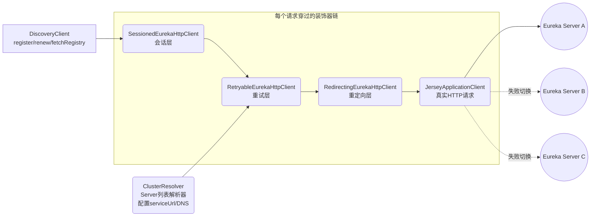
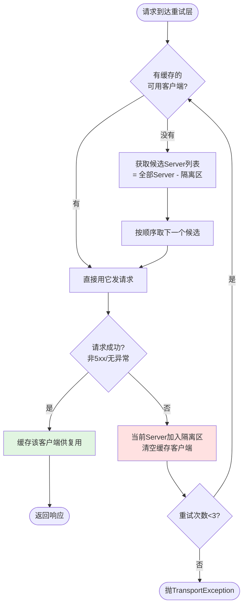

# 客户端传输层与故障转移（EurekaHttpClient 装饰器链）

## 文档说明

本文档分析 Eureka 客户端 HTTP 传输层的设计——`DiscoveryClient` 发出的每一个请求（注册/心跳/拉取）都要穿过一条**装饰器链**，链上每一层各司其职，共同实现客户端的高可用。

- 装饰器链组装：`com.netflix.discovery.shared.transport.EurekaHttpClients#canonicalClientFactory`
- 会话层：`decorator/SessionedEurekaHttpClient`
- 重试层：`decorator/RetryableEurekaHttpClient`
- 重定向层：`decorator/RedirectingEurekaHttpClient`
- 真实请求：`jersey/AbstractJerseyEurekaHttpClient`

---

## 零、TL;DR

> **一句话摘要**：客户端的每个 HTTP 请求穿过"会话层→重试层→重定向层→Jersey"四层装饰器；重试层实现"挂一台 Server 不影响客户端"（自动切换+隔离区），会话层实现"负载均匀"（定期强制换 Server）。

- **复杂度域**：Complicated（装饰器模式、故障转移策略、隔离区自愈）
- **业务入口**：`DiscoveryClient` 的 `eurekaTransport.registrationClient` / `queryClient`
- **关键风险点**：
  1. 重试 3 次全失败才抛异常——配置的 serviceUrl 少于 3 个时，单台故障可能直接耗尽重试
  2. 隔离区按"66% 阈值"自动清空——网络抖动时可能反复隔离/清空，加剧请求延迟

## 一、装饰器链全景



| 层 | 类 | 职责 | 关键参数 |
|----|-----|------|---------|
| 会话层 | `SessionedEurekaHttpClient` | 定期强制重建连接，防止粘连单台 Server | 会话时长默认 20 分钟 ±50% 随机 |
| 重试层 | `RetryableEurekaHttpClient` | 失败自动切换 Server + 坏节点隔离 | 重试 3 次；隔离清空阈值 66% |
| 重定向层 | `RedirectingEurekaHttpClient` | 跟随 HTTP 302 跳转 | 最多跟随 10 次 |
| 请求层 | `AbstractJerseyEurekaHttpClient` | 构造 REST 请求并发送 | 连接/读取超时等 |

**两个客户端实例**：`DiscoveryClient` 中有两条独立的装饰器链——
- `registrationClient`（注册/心跳/下线用）：基于 bootstrap 解析器（配置的 serviceUrl）
- `queryClient`（拉取注册表用）：可配置为基于已拉取的注册表来发现 Server（`useBootstrapResolverForQuery=false` 时）

## 二、核心机制详解

### 2.1 重试与故障转移（RetryableEurekaHttpClient.execute，:98 附近）



三个关键设计：

1. **客户端复用**（`delegate` 缓存）：成功过的客户端被缓存，后续请求直接复用——正常情况下重试层零开销，只有失败时才触发选择逻辑
2. **隔离区**（`quarantineSet`）：失败的 Server 被记住，下次选择候选时排除——避免反复撞墙
3. **隔离区自愈**（`getHostCandidates`，:175 附近）：隔离的 Server 数 ≥ 总数×66% 时清空隔离区——"大多数都坏了"更可能是自己的问题，重新给所有 Server 机会

### 2.2 会话机制（SessionedEurekaHttpClient.execute，:66 附近）

```java
// 会话过期（默认 20 分钟 ± 随机量）→ 关闭旧客户端，下面会重建
if (delay >= currentSessionDurationMs) {
    lastReconnectTimeStamp = now;
    // 重新随机化下次会话时长（防止所有客户端同时重连造成"重连风暴"）
    currentSessionDurationMs = randomizeSessionDuration(sessionDurationMs);
    TransportUtils.shutdown(eurekaHttpClientRef.getAndSet(null));
}
```

**为什么需要会话层**：重试层会缓存"成功的客户端"，这导致客户端一旦连上某台 Server 就永远用它。后果：
- 重启一台 Server，它的流量被其他 Server 分走后**永远回不来**
- 新扩容的 Server 接不到存量客户端的流量

会话层定期（20min±随机）强制丢弃缓存，让重试层重新选择 Server——本质是用**时间换均衡**。

### 2.3 Server 列表来源（ClusterResolver 体系）

```
配置文件 eureka.serviceUrl.{zone}  ──┐
                                      ├─→ ConfigClusterResolver → ZoneAffinityClusterResolver → AsyncResolver
DNS（eureka.shouldUseDns=true）    ──┘                              (同zone优先)              (后台定时刷新缓存)
```

- `ZoneAffinityClusterResolver`：把与客户端同 zone 的 Server 排在前面（就近访问）
- `AsyncResolver`：后台线程定时刷新 Server 列表，请求时直接读缓存（不阻塞）

## 三、关键代码位置

| 内容 | 位置 |
|------|------|
| 装饰器链组装 | EurekaHttpClients.java:73（canonicalClientFactory，已加中文注释） |
| 注册/查询两条链的创建 | EurekaHttpClients.java:51-71 |
| 重试循环 | RetryableEurekaHttpClient.java:105 附近（已加中文注释） |
| 隔离区管理 | RetryableEurekaHttpClient.java:175 附近（已加中文注释） |
| 默认重试次数(3) | RetryableEurekaHttpClient.java:61 |
| 会话过期重建 | SessionedEurekaHttpClient.java:66 附近（已加中文注释） |
| 会话随机化 | SessionedEurekaHttpClient.java:104 附近 |
| 302跟随上限(10) | RedirectingEurekaHttpClient.java:48 |
| Jersey 注册请求 | AbstractJerseyEurekaHttpClient.java:47（POST apps/{appName}） |
| Jersey 心跳请求 | AbstractJerseyEurekaHttpClient.java:90（PUT + lastDirtyTimestamp 参数） |
| 隔离清空阈值(66%) | EurekaTransportConfig.getRetryableClientQuarantineRefreshPercentage |
| 会话时长(20分钟) | EurekaTransportConfig.getSessionedClientReconnectIntervalSeconds |

## 四、面试常问

**Q：Eureka 客户端配置了 3 个 serviceUrl，挂了 1 个会怎样？**
A：请求该 Server 失败后，重试层把它加入隔离区并自动切换下一个，业务无感知（最多增加一次请求耗时）。它被隔离后，后续请求不会再选它；直到隔离区达到 66% 阈值被清空、或会话层 20 分钟重建时，才会重新尝试它。

**Q：为什么客户端流量会集中在某台 Eureka Server？**
A：重试层缓存成功的客户端导致"粘连"。会话层每 20±10 分钟强制重建一次来缓解。如果观察到长期不均，检查 `sessionedClientReconnectIntervalSeconds` 是否被调大。

**Q：客户端怎么知道有哪些 Eureka Server？**
A：两个来源——静态配置（serviceUrl）或 DNS（shouldUseDns=true）。解析结果带 zone 亲和性排序（同 zone 的 Server 优先），由 AsyncResolver 后台定时刷新。

## 五、文档元信息

- **文档版本**：v1.0 / **最后更新**：2026-06-01 / **复杂度域**：Complicated
- **相关类**：`EurekaHttpClients`, `SessionedEurekaHttpClient`, `RetryableEurekaHttpClient`, `RedirectingEurekaHttpClient`, `AbstractJerseyEurekaHttpClient`, `ClusterResolver`, `AsyncResolver`
- **关联文档**：[01.服务注册流程](01.服务注册流程.md)、[02.心跳续约流程](02.心跳续约流程.md)（它们的 HTTP 调用都走这条链）
