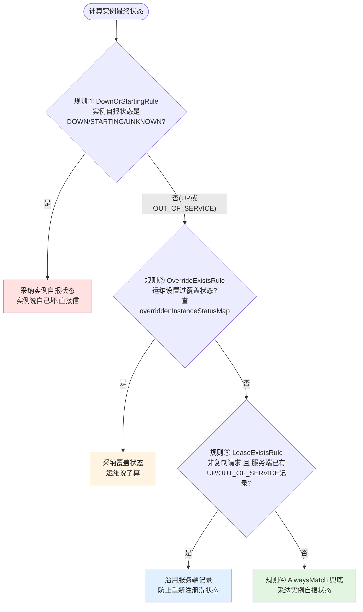

# 状态覆盖规则链（InstanceStatusOverrideRule）

## 文档说明

本文档分析 Eureka 服务端的**实例状态决策机制**——当"实例自报状态"、"运维设置的覆盖状态"、"服务端历史记录"三方冲突时，由规则链（责任链模式）决定实例的最终对外状态。

- 规则链组合器：`com.netflix.eureka.registry.rule.FirstMatchWinsCompositeRule`
- 四个规则：`DownOrStartingRule` / `OverrideExistsRule` / `LeaseExistsRule` / `AlwaysMatchInstanceStatusRule`
- 执行入口：`AbstractInstanceRegistry#getOverriddenInstanceStatus`（注册和续约时都会调用）

---

## 零、TL;DR

> **一句话摘要**：实例的最终状态由 4 条规则按优先级裁决——实例自报故障最可信（直接采纳）、运维覆盖第二（压制实例自报UP）、服务端历史记录第三（防止重新注册洗掉状态）、实例自报状态兜底。

- **复杂度域**：Simple~Complicated（每条规则极简，但组合语义和业务场景需要理解）
- **业务入口**：注册（`register`）和续约（`renew`）时都会执行规则链
- **关键风险点**：覆盖状态存储在 `overriddenInstanceStatusMap`（1 小时无访问过期），过期后 LeaseExistsRule 仍可能维持旧状态——状态恢复路径不唯一，排查时容易困惑

## 一、要解决的业务问题

一个实例的状态有三个"声音"：

| 声音来源 | 说什么 | 典型场景 |
|---------|--------|---------|
| 实例自己 | "我是 UP/DOWN/STARTING" | 健康检查结果、启动过程 |
| 运维人员 | "我把它设置为 OUT_OF_SERVICE" | 灰度摘流、故障隔离 |
| 服务端记录 | "我记录里它是 OUT_OF_SERVICE" | 历史状态 |

**冲突场景**：运维把实例摘流（OUT_OF_SERVICE）后，实例发心跳/重新注册时自报 UP——听谁的？
如果听实例的，运维的摘流操作就被"洗掉"了，灰度发布/故障隔离全部失效。

规则链的本质：**给三方声音排定优先级**。

## 二、规则链全景

### 2.1 标准规则链（非 AWS 环境）

组装位置：`PeerAwareInstanceRegistryImpl` 构造函数（:141，已加中文注释）

### 2.2 AWS 规则链（AwsInstanceRegistry）

在规则②和③之间多插一条 `AsgEnabledRule`：实例所属的 AWS 自动伸缩组（ASG）被禁用时，强制 OUT_OF_SERVICE（伸缩组级别的整体摘流）。

## 三、各规则详解（已全部加中文注释）

### 规则① DownOrStartingRule —— 非对称信任

| 实例自报 | 处理 | 原因 |
|---------|------|------|
| DOWN / STARTING / UNKNOWN | **直接采纳** | 实例说自己"坏"没有谎报动机，最可信 |
| UP | 不匹配，往下走 | 说自己"好"要验证：可能有运维覆盖压制着 |
| OUT_OF_SERVICE | 不匹配，往下走 | 同样需要确认 |

### 规则② OverrideExistsRule —— 运维意志

查 `overriddenInstanceStatusMap`（运维通过 `PUT /v2/apps/{app}/{id}/status?value=OUT_OF_SERVICE` 写入）。
存在覆盖 → 用覆盖状态。这就是**运维摘流后，实例无论怎么上报 UP 都恢复不了**的原因——直到运维 `DELETE .../status` 删除覆盖。

### 规则③ LeaseExistsRule —— 历史记录保护

仅对**非复制请求**生效：服务端已有 UP/OUT_OF_SERVICE 记录时沿用记录。
典型场景：覆盖状态因 1 小时过期被清理了，但租约里的状态还是 OUT_OF_SERVICE——实例重新注册自报 UP 时，这条规则维持 OUT_OF_SERVICE，防止"过期即恢复"的意外行为。

### 规则④ AlwaysMatchInstanceStatusRule —— 兜底

无条件采纳实例自报状态。全新注册的正常实例走到这里。

## 四、典型场景推演

| 场景 | 规则链走向 | 最终状态 |
|------|-----------|---------|
| 全新实例注册（自报UP） | ①不匹配→②无覆盖→③无租约→④兜底 | UP |
| 实例启动中注册（自报STARTING） | ①匹配 | STARTING |
| 运维摘流后实例发心跳（自报UP） | ①不匹配→②有覆盖 | OUT_OF_SERVICE（摘流维持） |
| 运维删除覆盖后实例发心跳 | ①不匹配→②无覆盖→③租约状态是OUT_OF_SERVICE | 仍是 OUT_OF_SERVICE！ |
| 上一行之后实例重新注册（带新dirty时间戳） | 同上，但注册会用 setStatusWithoutDirty 修正 | 取决于具体路径（见技术债） |
| 实例健康检查失败（自报DOWN心跳） | ①匹配 | DOWN |

**注意第 4 行的坑**：删除覆盖状态后，实例不会自动恢复 UP（被规则③拦住）。
正确的运维恢复操作是 `DELETE .../status`，它内部会把实例状态显式设置回 UP（statusUpdate 流程），而不是等实例自己心跳恢复。

## 五、关键代码位置

| 内容 | 位置 |
|------|------|
| 标准规则链组装 | PeerAwareInstanceRegistryImpl.java:141（已加中文注释） |
| AWS规则链组装 | AwsInstanceRegistry.java:61 |
| 规则链执行入口 | AbstractInstanceRegistry.getOverriddenInstanceStatus（已加中文注释） |
| 注册时执行 | AbstractInstanceRegistry.register 内（"Set the status based on the overridden status rules"） |
| 续约时执行 | AbstractInstanceRegistry.renew 内（UNKNOWN→404） |
| 责任链组合器 | FirstMatchWinsCompositeRule.java（已加中文注释） |
| 规则①故障优先 | DownOrStartingRule.java（已加中文注释） |
| 规则②运维覆盖 | OverrideExistsRule.java（已加中文注释） |
| 规则③租约保护 | LeaseExistsRule.java（已加中文注释） |
| 覆盖状态存储 | AbstractInstanceRegistry.overriddenInstanceStatusMap（1小时过期） |
| 运维设置覆盖的REST入口 | InstanceResource.statusUpdate（PUT .../status） |
| 运维删除覆盖的REST入口 | InstanceResource.deleteStatusUpdate（DELETE .../status） |

## 六、面试常问

**Q：运维把实例设置为 OUT_OF_SERVICE 后，实例心跳还在发，状态会被心跳改回 UP 吗？**
A：不会。心跳续约时会重新执行规则链，OverrideExistsRule 发现覆盖状态存在，会持续用 OUT_OF_SERVICE 压制实例自报的 UP。

**Q：覆盖状态什么时候消失？**
A：三种情况——运维显式 DELETE、实例被下线/剔除（internalCancel 会清理）、1 小时无访问自动过期（Guava expireAfterAccess）。

**Q：为什么删除覆盖状态后实例还是 OUT_OF_SERVICE？**
A：LeaseExistsRule 在保护服务端已有记录。正确做法是用 DELETE .../status 接口（它会显式把状态恢复为参数指定的值），而不是只删 map 条目。

## 七、文档元信息

- **文档版本**：v1.0 / **最后更新**：2026-06-01 / **复杂度域**：Complicated
- **相关类**：`FirstMatchWinsCompositeRule`, `DownOrStartingRule`, `OverrideExistsRule`, `LeaseExistsRule`, `AlwaysMatchInstanceStatusRule`, `AsgEnabledRule`, `StatusOverrideResult`
- **关联文档**：[01.服务注册流程](01.服务注册流程.md)、[02.心跳续约流程](02.心跳续约流程.md)（规则链在这两个流程中被执行）
