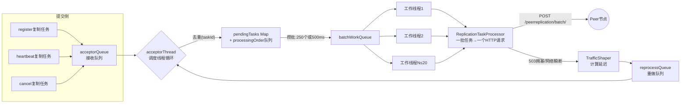

# 数据模型、序列化体系与批处理框架

## 文档说明

本文档覆盖三个横向基础设施主题，它们是前面所有流程文档的"地基"：

1. **数据模型**：`InstanceInfo` / `Applications` / `LeaseInfo` —— 被注册、被传输、被缓存的到底是什么
2. **序列化体系**：`converters/` 包 —— 这些数据怎么变成 JSON/XML 在网络上传输
3. **批处理框架**：`util/batcher/` 包 —— 集群复制的高性能基础设施（05 文档的深入版）

---

## 第一部分：数据模型

### 1.1 InstanceInfo 字段全景（appinfo/InstanceInfo.java）

| 分类 | 关键字段 | 说明 |
|------|---------|------|
| **标识** | `instanceId` / `appName` / `appGroupName` | 实例唯一ID（默认=hostname）、应用名（自动大写） |
| **网络** | `ipAddr` / `hostName` / `port`(7001) / `securePort`(7002) | 调用方实际连接的地址 |
| **寻址** | `vipAddress` / `secureVipAddress` | 逻辑地址（VIP），客户端按 VIP 查询实例列表 |
| **页面** | `homePageUrl` / `statusPageUrl` / `healthCheckUrl` | 运维页面地址（Dashboard 上的链接） |
| **状态** | `status` / `overriddenStatus` | 实例状态 + 运维覆盖状态（两个独立字段！） |
| **租约** | `leaseInfo` | 心跳间隔(30s)/租约时长(90s)/各时间戳 |
| **元数据** | `metadata` (Map) | 业务自定义键值对（灰度标签、版本号等） |
| **版本控制** | `lastDirtyTimestamp` / `lastUpdatedTimestamp` | 见 1.2，数据对账的核心 |
| **增量标记** | `actionType` | ADDED/MODIFIED/DELETED（增量拉取用） |
| **数据中心** | `dataCenterInfo` | Amazon（带AWS元数据）/ MyOwn |

### 1.2 两个时间戳的区别（面试高频）

| | lastDirtyTimestamp | lastUpdatedTimestamp |
|--|--------------------|--------------------|
| **谁设置** | 客户端（实例信息变更时 setIsDirty()） | 服务端（注册表写入时） |
| **含义** | 客户端数据的"版本号" | 服务端记录的"最后写入时间" |
| **用途** | 注册冲突解决、心跳对账（404/409判断） | 信息展示、调试 |
| **传输** | 随注册/心跳请求传给服务端 | 不回传 |

**脏标记机制**（InstanceInfo.java:1244 附近）：

```java
public synchronized void setIsDirty() {
    isInstanceInfoDirty = true;
    lastDirtyTimestamp = System.currentTimeMillis();   // 标脏即更新版本号
}
public synchronized void unsetIsDirty(long unsetDirtyTimestamp) {
    if (lastDirtyTimestamp <= unsetDirtyTimestamp) {   // 带版本检查的清除（CAS思想）
        isInstanceInfoDirty = false;
    } // else: 标脏发生在快照之后,保留脏标记,下个周期重新同步
}
```

### 1.3 Applications / Application 结构（shared/ 包）

```
Applications
├── appsHashCode: String                    ← 一致性指纹"UP_10_DOWN_2_"
├── versionDelta: Long                      ← 增量版本号
├── applications: List<Application>
├── appNameApplicationMap                   ← 按应用名索引
└── virtualHostNameAppMap                   ← 按VIP索引(含轮询计数器,负载均衡用)

Application
├── name: String
├── instances: Set<InstanceInfo>            ← 原始实例集合
├── instancesMap: Map<id, InstanceInfo>     ← 按实例ID索引
└── shuffledInstances: AtomicReference      ← 随机打乱后的列表(缓存)
```

**hashcode 算法**（Applications.java:319，一致性校验的核心）：

```java
// 按状态统计实例数,按状态名排序拼接: "状态_数量_状态_数量_"
public static String getReconcileHashCode(Map<String, AtomicInteger> instanceCountMap) {
    StringBuilder reconcileHashCode = new StringBuilder(75);
    for (Map.Entry<String, AtomicInteger> mapEntry : instanceCountMap.entrySet()) {
        reconcileHashCode.append(mapEntry.getKey()).append("_").append(mapEntry.getValue().get()).append("_");
    }
    return reconcileHashCode.toString();
}
// 例: 10个UP + 2个DOWN → "DOWN_2_UP_10_"（TreeMap保证顺序确定）
```

注意：hashcode 只对"各状态的实例数量"敏感，对实例内容不敏感——一个实例 IP 变了但状态没变，hashcode 不变。这是性能与精确性的折衷。

## 第二部分：序列化体系（converters/ 包）

### 2.1 两套序列化栈

| 栈 | 类 | 用途 |
|----|-----|------|
| **XStream**（旧） | `JsonXStream` / `XmlXStream` + `Auto` 注解 | 兼容老版本,Dashboard XML |
| **Jackson**（主力） | `EurekaJacksonCodec` + `jackson/` 包 | 客户端-服务端通信主力 |

### 2.2 Full vs Compact（MINI）模式

通过 HTTP 请求头 `X-Eureka-Accept: compact` 协商：

| | Full（默认） | Compact/MINI |
|--|-------------|--------------|
| metadata 字段 | 完整传输 | **完全省略** |
| 部分URL字段 | 传输 | 省略 |
| 数据量 | 100% | 约 25-35% |
| 适用场景 | 常规 | 超大集群带宽优化 |

实现位置：`InstanceInfoJsonBeanSerializer`（compactMode 标志控制是否写 metadata 字段）+ `CodecWrappers.resolveDecoder()`（按请求头路由到 JacksonJsonMini）。

### 2.3 缓存 Key 中的格式维度

回看 03 文档的 ResponseCache：缓存 Key = 实体 + 名称 + **格式(JSON/XML)** + 版本 + **精简模式(full/compact)** + 地域。
同一份注册表数据会被缓存多份序列化结果——这是用内存换 CPU 的设计（序列化只做一次）。

## 第三部分：批处理框架（util/batcher/ 包深入）

### 3.1 三层结构与数据流



### 3.2 调度线程的循环（AcceptorExecutor.AcceptorRunner.run，:196 附近）

每轮循环做四件事：
1. `drainInputQueues()`：把接收队列+重做队列的任务搬进 pendingTasks（**重做队列优先**，且用 Map put 实现 taskId 去重——新任务覆盖旧任务）
2. 检查 `trafficShaper.transmissionDelay()`：上次有拥塞/网络错误时延迟投递
3. `assignBatchWork()`：满足攒批条件（≥250 个 或 最老任务等了 500ms）就打包一批放入工作队列，**打包时丢弃已过期任务**（expiredTasks++）
4. 无任务时 sleep 10ms 防止空转

### 3.3 工作线程与结果处理（TaskExecutors.BatchWorkerRunnable，:172 附近）

```java
ProcessingResult result = processor.process(tasks);   // 一批任务 → 一个批量HTTP请求
switch (result) {
    case Success: break;
    case Congestion:        // 503 → peer过载
    case TransientError:    // 网络瞬断
        taskDispatcher.reprocess(holders, result);     // 整批回流重做队列
        break;
    case PermanentError:    // 4xx等 → 任务有问题,重试无意义
        logger.warn("Discarding {} tasks", holders.size());   // 丢弃(心跳对账兜底)
}
```

### 3.4 TrafficShaper 延迟策略（拥塞控制）

| 失败类型 | 延迟窗口 | 含义 |
|---------|---------|------|
| Congestion（503/读超时） | congestionRetryDelayMs（默认值见配置） | peer 处理不过来,等它喘口气 |
| TransientError（连接失败） | networkFailureRetryMs | 网络问题,稍等重试 |
| 上限 | MAX_DELAY = 30s | 不会无限退避 |

### 3.5 这套框架解决的本质问题

| 问题 | 解决手段 |
|------|---------|
| 复制请求量巨大（N实例×M节点×每30s） | 攒批：250个任务合成1个HTTP请求 |
| 同一实例短时间多次操作（先注册又心跳） | 去重：taskId 相同只保留最新 |
| peer 短暂不可用导致任务堆积 | 过期丢弃 + 心跳对账兜底 |
| peer 过载时雪上加霜 | TrafficShaper 拥塞退避 |
| 个别任务失败影响整批 | 批量响应逐个处理（每个任务独立的 statusCode 和 handleFailure） |

## 关键代码位置汇总

| 内容 | 位置 |
|------|------|
| InstanceInfo 字段定义 | InstanceInfo.java:92-156 |
| InstanceStatus 枚举 | InstanceInfo.java:317（UP/DOWN/STARTING/OUT_OF_SERVICE/UNKNOWN） |
| 脏标记三方法 | InstanceInfo.java:1244-1271（setIsDirty/setIsDirtyWithTime/unsetIsDirty） |
| hashcode 算法 | Applications.java:319（getReconcileHashCode） |
| 状态计数 | Applications.java:292（populateInstanceCountMap） |
| Jackson 编解码器 | EurekaJacksonCodec.java:142（构造）/208（readValue）/232（writeTo） |
| compact模式省略metadata | jackson/serializer/InstanceInfoJsonBeanSerializer.java:67 |
| 调度线程循环 | AcceptorExecutor.java:196（AcceptorRunner.run，类注释已加） |
| 任务去重 | AcceptorExecutor.java:277（appendTaskHolder） |
| 攒批逻辑 | AcceptorExecutor.java:308（assignBatchWork）/333（hasEnoughTasksForNextBatch） |
| 工作线程 | TaskExecutors.java:172（BatchWorkerRunnable） |
| 拥塞控制 | TrafficShaper.java:44（transmissionDelay） |
| 批量请求构造 | ReplicationTaskProcessor.java:76（process）/155（createReplicationListOf） |
| 批量响应处理 | ReplicationTaskProcessor.java:130（handleBatchResponse） |

## 文档元信息

- **文档版本**：v1.0 / **最后更新**：2026-06-01 / **复杂度域**：Complicated
- **关联文档**：[03.拉取注册表流程](03.拉取注册表流程.md)（hashcode/缓存格式）、[05.服务端启动与集群同步流程](05.服务端启动与集群同步流程.md)（批处理框架轮廓）
