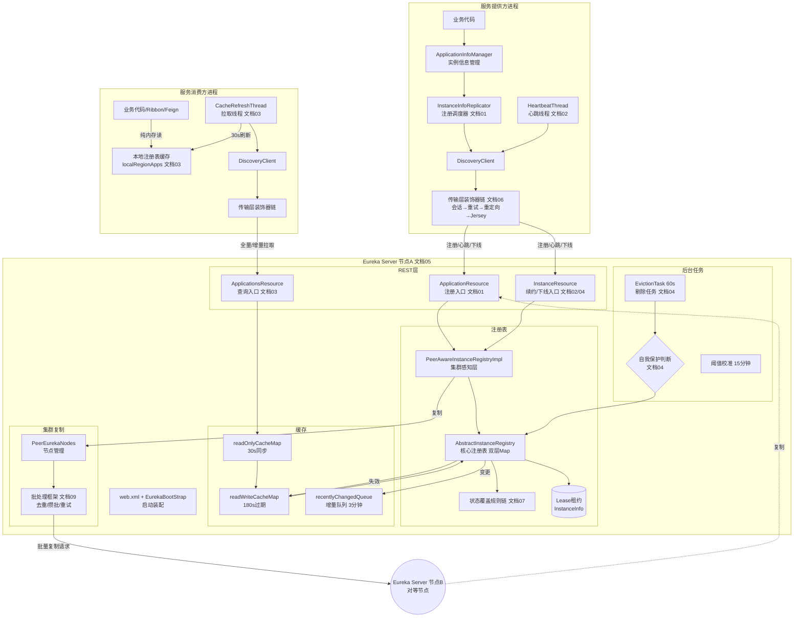
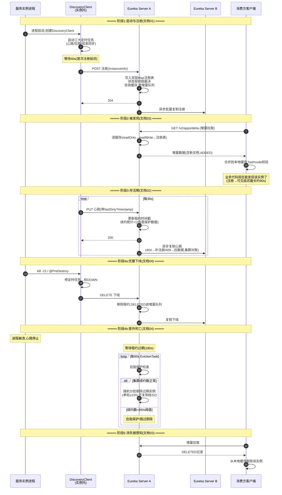
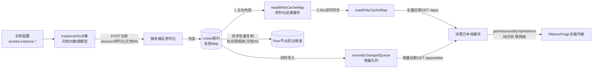

# Eureka 全景架构大图

## 文档说明

本文档把 01-09 文档的内容浓缩为几张"一图流"大图，用于复习回顾和向他人讲解。每张图都标注了对应的详细文档编号。

---

## 一、组件全景图（谁和谁说话）



## 二、实例完整生命周期时序（一个实例从生到死）



## 三、数据流向图（一份 InstanceInfo 的旅行）



## 四、定时任务全景表（系统的"心跳"）

| 任务 | 位置 | 默认间隔 | 职责 | 文档 |
|------|------|---------|------|------|
| HeartbeatThread | 客户端 | 30s | 续约保活 | 02 |
| CacheRefreshThread | 客户端 | 30s | 拉取注册表更新本地缓存 | 03 |
| InstanceInfoReplicator | 客户端 | 30s（首次延迟40s） | 检查脏标记→重新注册 | 01 |
| 只读缓存同步 | 服务端 | 30s | readWrite→readOnly 同步 | 03 |
| EvictionTask | 服务端 | 60s | 剔除过期实例 | 04 |
| DeltaRetentionTask | 服务端 | 30s | 清理增量队列中>3分钟的条目 | 03 |
| 自我保护阈值校准 | 服务端 | 15分钟 | 用实际实例数重算阈值 | 04 |
| Peer节点列表刷新 | 服务端 | 10分钟 | 解析serviceUrl/DNS更新集群拓扑 | 05 |
| 会话重建 | 客户端传输层 | 20分钟±随机 | 强制换Server防止粘连 | 06 |

## 五、关键时间链（回答"要多久"类问题）

```
新实例注册 → 消费方可调用:
  注册写入(0) → 读写缓存失效(0) → 只读缓存同步(≤30s) → 消费方拉取(≤30s) → Ribbon缓存(≤30s)
  = 最坏约 90s

实例正常下线 → 消费方不再调用:
  DELETE下线(0) → 缓存失效+增量队列(0) → 只读缓存(≤30s) → 消费方拉取(≤30s) → Ribbon(≤30s)
  = 最坏约 90s

实例意外死亡 → 消费方不再调用:
  最后心跳(0) → 租约过期(180s,因bug是2倍) → 剔除任务(≤60s) → 缓存链(≤90s)
  = 最坏约 5.5 分钟  ← 这是Eureka最大的短板

集群节点A收到注册 → 节点B可见:
  本地写入(0) → 批处理攒批(≤500ms) → HTTP复制(网络) → B写入(0)
  = 正常 <1s; 复制失败时靠下次心跳复制修复(≤30s)
```

## 文档元信息

- **文档版本**：v1.0 / **最后更新**：2026-06-01
- **用途**：复习索引/讲解材料,细节请进入对应编号的详细文档
