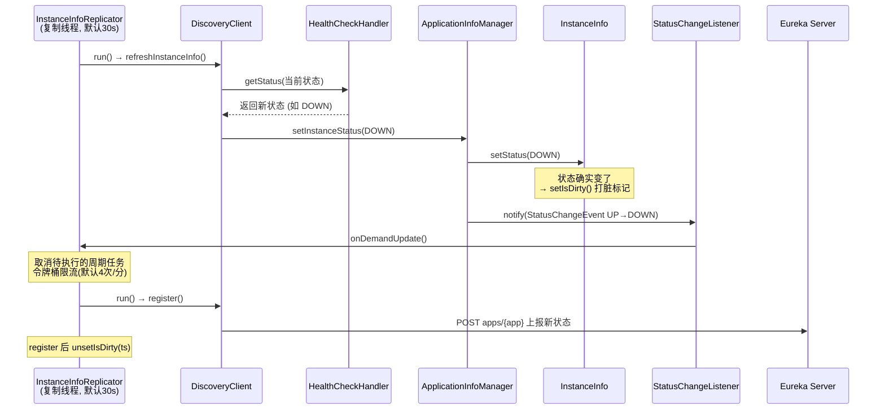

# 客户端健康检查机制（HealthCheckHandler）

## 文档说明

本文档分析 Eureka 客户端如何决定"我这个实例当前到底是 UP 还是 DOWN"——也就是上报给 Server 的 `InstanceStatus` 由谁、在何时、按什么契约算出来。这块逻辑是**可插拔**的：默认几乎什么都不做，但只要你注册一个 `HealthCheckHandler`，实例状态就能跟着应用真实健康度联动。Spring Cloud 的 `eureka.client.healthcheck.enabled=true` 就是往这里塞了一个桥接 Actuator Health 的实现。

- 健康检查契约：`com.netflix.appinfo.HealthCheckHandler#getStatus`
- 老式回调与桥接：`HealthCheckCallback` / `HealthCheckCallbackToHandlerBridge`
- 注册入口与调用点：`com.netflix.discovery.DiscoveryClient#registerHealthCheck` / `#refreshInstanceInfo`
- 增量上报联动：`InstanceInfoReplicator#onDemandUpdate`

---

## 零、TL;DR

> **一句话摘要**：实例上报给 Eureka 的状态不是固定 UP，而是每个复制周期由 `HealthCheckHandler.getStatus(currentStatus)` 算出来的；默认实现是个"原样返回"的空壳，注册自定义 handler 后状态才会跟应用真实健康度走，状态一变就通过脏标记 + `onDemandUpdate` 立刻增量上报。

- **复杂度域**：Complicated（可插拔契约 + 适配器桥接 + 脏标记联动）
- **业务入口**：`DiscoveryClient.refreshInstanceInfo()`（每个复制周期调一次）
- **关键风险点**：
  1. 不注册 handler 时，实例**永远是 UP**——哪怕数据库连不上、依赖全挂，Eureka 仍把流量打过来
  2. handler 抛异常会被兜底为 `DOWN`（refreshInstanceInfo 的 catch），写得不健壮的健康检查会导致实例"自杀"
  3. `STARTING` / `OUT_OF_SERVICE` 状态下健康检查被**短路跳过**，桥接实现尤其要注意

## 一、谁决定实例状态：getStatus 契约

`HealthCheckHandler` 整个接口只有一个方法（`HealthCheckHandler.java:8-12`）：

```java
public interface HealthCheckHandler {
    InstanceInfo.InstanceStatus getStatus(InstanceInfo.InstanceStatus currentStatus);
}
```

契约非常克制——传入"当前状态"，返回"应该上报的状态"。它不强制你从零判断，而是让你**基于当前状态做决策**（比如 STARTING 阶段先别急着判 UP）。

调用它的唯一地方是 `DiscoveryClient.refreshInstanceInfo()`（`DiscoveryClient.java:1512-1527`）：

```java
void refreshInstanceInfo() {
    applicationInfoManager.refreshDataCenterInfoIfRequired();
    applicationInfoManager.refreshLeaseInfoIfRequired();

    InstanceStatus status;
    try {
        status = getHealthCheckHandler().getStatus(instanceInfo.getStatus());  // :1518
    } catch (Exception e) {
        logger.warn("Exception from healthcheckHandler.getStatus, setting status to DOWN", e);
        status = InstanceStatus.DOWN;   // 健康检查抛异常 → 判定 DOWN
    }
    if (null != status) {
        applicationInfoManager.setInstanceStatus(status);  // 状态落地 → 可能触发脏标记
    }
}
```

注意两点：① handler 抛异常会被兜底成 `DOWN`；② 只有 `setInstanceStatus` 真正改变了状态，才会引发后续的增量上报（见第三节）。

### 默认实现是个空壳

如果你没注册任何 handler，`getHealthCheckHandler()`（`DiscoveryClient.java:1554-1571`）会兜底返回 `new HealthCheckCallbackToHandlerBridge(null)`——一个 callback 为 null 的桥接对象。它的 `getStatus` 直接原样返回 `currentStatus`（见 `HealthCheckCallbackToHandlerBridge.java:21-24`）。**这就是"裸 Eureka 实例永远是 UP"的根因**：没人真正去检查健康，状态就一直停在初始的 UP。

## 二、核心类一览

| 类 / 接口 | 角色 | 关键点 |
|----------|------|--------|
| `HealthCheckHandler` | 新版健康检查契约 | 唯一方法 `getStatus(currentStatus)`，可插拔 |
| `HealthCheckCallback` | 老版健康检查接口（`@Deprecated`） | 只能返回 `boolean isHealthy()`，表达力弱 |
| `HealthCheckCallbackToHandlerBridge` | 适配器：老接口 → 新接口 | 把 `boolean` 翻译成 UP/DOWN；callback 为 null 时退化为空壳 |
| `HealthCheckResource` | Jersey 健康检查端点 `/healthcheck` | 把当前 `InstanceStatus` 映射成 HTTP 状态码，供外部探活 |
| `DiscoveryClient` | 持有 handler、周期调用 getStatus | `healthCheckHandlerRef` / `registerHealthCheck` / `refreshInstanceInfo` |
| `InstanceInfoReplicator` | 复制器，状态变化的增量上报引擎 | `run()` 检查脏标记触发注册，`onDemandUpdate()` 按需立即上报 |
| `ApplicationInfoManager` | 状态落地 + 事件分发 | `setInstanceStatus` 改状态并通知监听器 |

## 三、老接口如何桥接到新接口

`HealthCheckCallback`（`HealthCheckCallback.java:43-54`）是 Netflix 早期设计，只能回答"健康/不健康"（`boolean isHealthy()`），无法表达 `OUT_OF_SERVICE`、`STARTING` 这种中间态。后来引入了表达力更强的 `HealthCheckHandler`，并用**适配器模式**让两套接口共存。

`HealthCheckCallbackToHandlerBridge.getStatus`（`HealthCheckCallbackToHandlerBridge.java:20-27`）的逻辑：

```java
public InstanceInfo.InstanceStatus getStatus(InstanceInfo.InstanceStatus currentStatus) {
    if (null == callback
            || InstanceInfo.InstanceStatus.STARTING == currentStatus
            || InstanceInfo.InstanceStatus.OUT_OF_SERVICE == currentStatus) {
        return currentStatus;   // 短路：不去问 callback，原样返回
    }
    return callback.isHealthy()
        ? InstanceInfo.InstanceStatus.UP
        : InstanceInfo.InstanceStatus.DOWN;
}
```

两个设计要点：

1. **短路保护**：`STARTING`（还没启动完）和 `OUT_OF_SERVICE`（人工/灰度下线）这两个状态下，绝不调用 callback——避免一个只会返回 true 的简单 callback 把"正在启动"或"已手动摘流"的实例错误地拉回 UP。
2. **退化为空壳**：`callback == null` 时直接返回 `currentStatus`，这正是默认无健康检查的行为。`registerHealthCheckCallback`（`DiscoveryClient.java:690-697`）也是用这个 bridge 把老回调包装成 handler 存进 `healthCheckHandlerRef`。

## 四、状态变化如何触发增量上报

健康检查的价值在于"状态一变，Server 马上知道"。这条链路串起了 handler、脏标记和复制器：



逐环拆解：

- **状态落地即打脏**：`setInstanceStatus → InstanceInfo.setStatus`（`InstanceInfo.java:1195-1199`）发现状态变化时调用 `setIsDirty()`。脏标记是复制器决定"要不要重新注册"的依据（`InstanceInfoReplicator.run`，`InstanceInfoReplicator.java:129-150`）。
- **事件驱动按需上报**：`setInstanceStatus` 同时通知所有 `StatusChangeListener`（`ApplicationInfoManager.java:167-183`）。`DiscoveryClient` 在 `initScheduledTasks` 注册的监听器（`DiscoveryClient.java:1422-1437`）收到事件后直接调 `instanceInfoReplicator.onDemandUpdate()`——不必等下一个 30s 周期。这受 `eureka.client.shouldOnDemandUpdateStatusChange`（默认 true）控制。
- **按需更新的限流与去重**：`onDemandUpdate`（`InstanceInfoReplicator.java:95-124`）内置令牌桶（默认每分钟 4 次），并会取消尚未执行的周期任务，防止状态抖动引发注册风暴。
- **注册即同步**：脏的实例由 `register()` 重新注册到 Server——Eureka 用"重新注册"来更新服务端的实例信息，再 `unsetIsDirty(ts)` 清脏。

另外，`registerHealthCheck`（`DiscoveryClient.java:700-711`）本身在注册新 handler 后也会**主动触发一次** `onDemandUpdate()`，确保新挂上的健康检查立刻生效，而不是等到下个周期。

## 五、关键设计点 / 坑

1. **不注册 = 永远 UP**：默认空壳 handler 让裸 Eureka 实例无视任何依赖故障。生产环境务必注册真实健康检查（Spring Cloud 用一个配置就搞定，见第六节）。
2. **getStatus 必须健壮**：refreshInstanceInfo 把任何异常都兜底成 `DOWN`（`DiscoveryClient.java:1519-1522`）。健康检查里调用外部依赖且不设超时，可能让实例因为一次抖动就被摘流。
3. **别让健康检查覆盖人工下线**：`STARTING`/`OUT_OF_SERVICE` 在桥接里被短路。自己实现 `HealthCheckHandler` 时也应尊重这两个状态，否则手动 `OUT_OF_SERVICE` 摘流会被下一次健康检查重新拉回 UP。
4. **HealthCheckResource 是被动探活端点**：`/healthcheck`（`HealthCheckResource.java:34-64`）把当前状态映射成 HTTP 码（UP→200、STARTING→204、OUT_OF_SERVICE→503、其它→500），它是"读"当前状态给外部 LB 看，**不参与**算状态，别和 `HealthCheckHandler` 混淆。

## 六、与 Spring Cloud 的连接

这是本机制离日常最近的落点。Spring Cloud Netflix 默认**不**启用基于 Actuator 的健康检查——实例状态保持 UP。当你设置：

```yaml
eureka:
  client:
    healthcheck:
      enabled: true
```

Spring Cloud 会装配一个 `EurekaHealthCheckHandler`（在 spring-cloud-netflix-eureka-client 里，不在本仓库），它实现 `com.netflix.appinfo.HealthCheckHandler`，在 `getStatus` 里聚合所有 Spring Boot Actuator 的 `HealthIndicator`，把 Actuator 的 `Status`（UP/DOWN/OUT_OF_SERVICE）映射成 Eureka 的 `InstanceStatus`，再通过 `DiscoveryClient.registerHealthCheck` 注册进 `healthCheckHandlerRef`。

效果对照：

| 现象 | 背后机制 |
|------|---------|
| 没开 healthcheck，DB 挂了但实例还是 UP | 默认空壳 bridge，`getStatus` 原样返回 UP |
| 开了 healthcheck，DB 挂了实例变 DOWN 被摘流 | `EurekaHealthCheckHandler` 聚合 Actuator → DOWN → 脏标记 → onDemandUpdate 上报 |
| 实例状态变化几乎实时反映到注册中心 | `StatusChangeListener → onDemandUpdate` 增量上报（非等 30s 周期） |

一句话：`healthcheck.enabled=true` 的本质，就是给 Eureka 客户端的 `HealthCheckHandler` 插槽塞了一个"Actuator Health → InstanceStatus"的适配器。

## 七、面试常问

**Q：Eureka 客户端上报的 UP/DOWN 到底由谁决定？默认行为是什么？**
A：由 `HealthCheckHandler.getStatus(currentStatus)` 决定，每个复制周期（默认 30s）在 `refreshInstanceInfo` 里调一次。默认未注册 handler 时是个空壳实现（callback 为 null 的 `HealthCheckCallbackToHandlerBridge`），原样返回当前状态，所以裸实例永远是 UP，与应用真实健康度无关。

**Q：为什么老的 HealthCheckCallback 还在，新代码却用 HealthCheckHandler？两者怎么共存？**
A：`HealthCheckCallback` 只能返回 boolean，无法表达 `OUT_OF_SERVICE`/`STARTING` 等中间态，已 `@Deprecated`。通过适配器 `HealthCheckCallbackToHandlerBridge` 把老回调桥接成新接口：true→UP、false→DOWN，且在 STARTING/OUT_OF_SERVICE 下短路不调用 callback，保证两套 API 平滑共存。

**Q：Spring Cloud 里 `eureka.client.healthcheck.enabled=true` 做了什么？为什么状态变化能近乎实时上报？**
A：它注册了一个把 Spring Boot Actuator Health 聚合并映射成 `InstanceStatus` 的 `HealthCheckHandler`。状态变化时 `ApplicationInfoManager.setInstanceStatus` 一方面给 `InstanceInfo` 打脏标记，另一方面触发 `StatusChangeListener` 调用 `InstanceInfoReplicator.onDemandUpdate()` 立即重新注册（受令牌桶限流），无需等待下一个 30s 周期。

## 八、代码索引

| 内容 | 位置 |
|------|------|
| 健康检查契约接口 | `HealthCheckHandler.java:8-12`（getStatus） |
| 老版回调接口（已废弃） | `HealthCheckCallback.java:43-54`（isHealthy） |
| 老→新适配器 + 短路逻辑 | `HealthCheckCallbackToHandlerBridge.java:20-27` |
| 被动探活端点 /healthcheck | `HealthCheckResource.java:34-64`（状态→HTTP码映射） |
| handler 引用 + provider | `DiscoveryClient.java:163-164`（provider）/ `:181`（healthCheckHandlerRef） |
| 注册 handler + 触发 onDemandUpdate | `DiscoveryClient.java:700-711`（registerHealthCheck） |
| 注册老回调（经 bridge 包装） | `DiscoveryClient.java:690-697`（registerHealthCheckCallback） |
| 周期调用 getStatus + 异常兜底 DOWN | `DiscoveryClient.java:1512-1527`（refreshInstanceInfo） |
| 获取/惰性兜底 handler | `DiscoveryClient.java:1554-1571`（getHealthCheckHandler） |
| 状态变化监听器 → onDemandUpdate | `DiscoveryClient.java:1422-1437`（initScheduledTasks） |
| 状态落地 + 事件分发 | `ApplicationInfoManager.java:167-183`（setInstanceStatus） |
| setStatus 触发脏标记 | `InstanceInfo.java:1195-1199`（setStatus → setIsDirty） |
| 按需增量上报 + 限流 | `InstanceInfoReplicator.java:95-124`（onDemandUpdate） |
| 脏标记 → 注册自调度循环 | `InstanceInfoReplicator.java:129-150`（run） |

## 九、文档元信息

- **文档版本**：v1.0 / **最后更新**：2026-06-04 / **复杂度域**：Complicated
- **相关类**：`HealthCheckHandler`、`HealthCheckCallback`、`HealthCheckCallbackToHandlerBridge`、`HealthCheckResource`、`DiscoveryClient`、`InstanceInfoReplicator`、`ApplicationInfoManager`、`InstanceInfo`
- **关联文档**：[01.服务注册流程](01.服务注册流程.md)、[02.心跳续约流程](02.心跳续约流程.md)、[06.客户端传输层与故障转移](06.客户端传输层与故障转移.md)（register 走传输层装饰器链）
