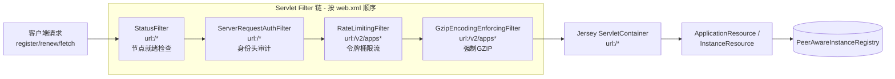
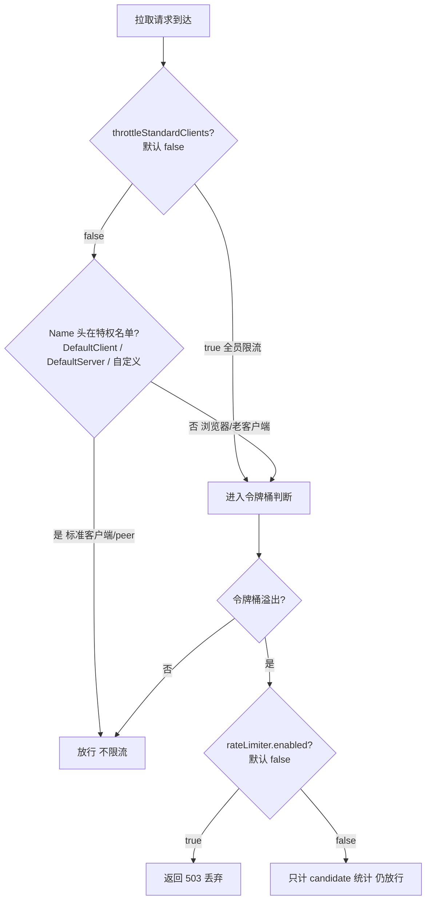

# 服务端请求过滤器链：进入 Resource 之前的四道关口

## 文档说明

本文档分析 Eureka Server 在 **Servlet 容器层**架设的过滤器链。客户端发来的每一个 HTTP 请求（注册/心跳/拉取/下线），在抵达 Jersey 路由、进入 `*Resource` 业务类之前，要先穿过四道 `Filter`。它们是注册风暴、未就绪节点、协议兼容性等问题的"入口侧防线"。

- 过滤器注册与顺序：`eureka-server/src/main/webapp/WEB-INF/web.xml`
- 四道关口：`eureka-core/.../eureka/` 下的 `StatusFilter`、`ServerRequestAuthFilter`、`RateLimitingFilter`、`GzipEncodingEnforcingFilter`
- 身份头体系：`eureka-client/.../appinfo/AbstractEurekaIdentity`、`eureka-core/.../eureka/EurekaServerIdentity`

---

## 零、TL;DR

> **一句话摘要**：客户端请求进入 `Resource` 前要按 web.xml 声明顺序穿过四道 Filter——`StatusFilter`（节点未就绪挡回）→ `ServerRequestAuthFilter`（身份头审计）→ `RateLimitingFilter`（令牌桶限流，区分标准/非标准客户端）→ `GzipEncodingEnforcingFilter`（强制 GZIP）；这是"自我保护机制之外"的入口侧防注册风暴与协议收敛手段。

- **复杂度域**：Complicated（责任链 + 令牌桶 + 身份鉴别）
- **业务入口**：Servlet 容器对 `/*` 与 `/v2/apps*` 的 `filter-mapping`
- **关键风险点**：
  1. `RateLimitingFilter` **默认不开启**（`rateLimiter.enabled=false`），即使开启也**默认放过标准客户端**——误以为"配了限流就有限流"是常见坑
  2. `GzipEncodingEnforcingFilter` 对不支持 gzip 的 GET 请求直接返回 406，老旧/非标准客户端会被挡

## 一、四道关口全景

`web.xml` 中 `filter-mapping` 的声明顺序就是 Filter 的执行顺序（Servlet 规范），四道之后才轮到名为 `jersey` 的 `ServletContainer`：



| 顺序 | Filter | url-pattern | 职责 | 默认行为 |
|------|--------|-------------|------|---------|
| ① | `StatusFilter` | `/*` | 节点非 UP（STARTING 等）时下发 307 提示换节点 | 始终生效 |
| ② | `ServerRequestAuthFilter` | `/*` | 读取身份头并计数审计，不拦截 | 始终生效（仅日志/计数） |
| ③ | `RateLimitingFilter` | `/v2/apps`、`/v2/apps/*` | 令牌桶限流注册表拉取请求 | **默认关闭**（仅统计候选） |
| ④ | `GzipEncodingEnforcingFilter` | `/v2/apps`、`/v2/apps/*` | GET 强制要求 gzip，否则 406 | 始终生效 |

注意 ① ② 作用于全部路径 `/*`，③ ④ 只作用于 `/v2/apps*`（即注册表相关接口），因为限流与压缩只针对"大流量、可被滥用"的注册表读写。

## 二、逐道关口详解

### 2.1 第一道 StatusFilter——未就绪期挡回（`StatusFilter.java:58`）

`doFilter` 读取本节点 `InstanceInfo` 的状态，只要不是 `UP` 就向客户端回一个 **307 Temporary Redirect**，提示"本节点尚未就绪，请换一台 DS 节点"：

```java
// StatusFilter.java:60-67
InstanceStatus status = myInfo.getStatus();
if (status != InstanceStatus.UP && response instanceof HttpServletResponse) {
    httpResponse.sendError(SC_TEMPORARY_REDIRECT,  // 307
            "Current node is currently not ready to serve requests -- current status: " + status + ...);
}
chain.doFilter(request, response);  // 注意：写完 error 仍继续向下传
```

**解决的问题**：Eureka Server 启动后要先从 peer 拉取注册表（`syncUp`）才把自己置为 UP（见 [05.服务端启动与集群同步流程](05.服务端启动与集群同步流程.md)）。这段"启动窗口"里若直接对外服务，客户端会拿到一份残缺的注册表，进而误删实例。307 让客户端的重定向层（`RedirectingEurekaHttpClient`，见 [06.客户端传输层与故障转移](06.客户端传输层与故障转移.md)）切到另一台已就绪的节点。

> **坑**：这里只是 `sendError` 写了响应码，但依旧调用了 `chain.doFilter` 继续向下。状态码已经写出，后续 Filter/Resource 的写入通常被容器忽略，但逻辑上并未 `return` 短路——阅读时容易看漏。

### 2.2 第二道 ServerRequestAuthFilter——身份头审计（`ServerRequestAuthFilter.java:48`）

这道关口**不拦截任何请求**，只做"看一眼并记账"。它从请求头读取调用方身份并打点：

```java
// ServerRequestAuthFilter.java:60-69
if (serverConfig.shouldLogIdentityHeaders()) {  // 默认 true
    String clientName    = getHeader(httpRequest, AbstractEurekaIdentity.AUTH_NAME_HEADER_KEY);    // DiscoveryIdentity-Name
    String clientVersion = getHeader(httpRequest, AbstractEurekaIdentity.AUTH_VERSION_HEADER_KEY); // DiscoveryIdentity-Version
    DynamicCounter.increment(MonitorConfig.builder("DiscoveryServerRequestAuth_Name_" + clientName + "-" + clientVersion).build());
}
```

身份头由客户端在请求时写入（`EurekaIdentityHeaderFilter.java:20-24`），前缀为 `DiscoveryIdentity-`（`AbstractEurekaIdentity.java:6`）：

| 头 | 常量 | 标准 Java 客户端取值 | peer 复制请求取值 |
|----|------|---------------------|------------------|
| `DiscoveryIdentity-Name` | `AUTH_NAME_HEADER_KEY` | `DefaultClient`（`EurekaClientIdentity.DEFAULT_CLIENT_NAME`） | `DefaultServer`（`EurekaServerIdentity.DEFAULT_SERVER_NAME`） |
| `DiscoveryIdentity-Version` | `AUTH_VERSION_HEADER_KEY` | 客户端版本 | `1.0`（`EurekaServerIdentity.java:11`） |
| `DiscoveryIdentity-Id` | `AUTH_ID_HEADER_KEY` | 实例 IP | server IP |

**与集群复制的关系**：peer 之间复制时（`JerseyReplicationClient`）身份头 Name 是 `DefaultServer`，且**另带一个 `x-netflix-discovery-replication: true` 头**（`PeerEurekaNode.java:74`，由 `JerseyReplicationClient.java:54` 写入）。这道身份头让运维侧能审计"流量来自标准客户端还是 peer 节点"；而 `replication` 标识则是下游 `Resource` 用来判断"这次注册是否需要再向其它 peer 转发"的依据——**正是它阻断了集群复制的无限环路**（详见 2.5）。

### 2.3 第三道 RateLimitingFilter——令牌桶限流（`RateLimitingFilter.java:130`）

这是四道里最复杂的一道，专治"注册表拉取风暴"。核心设计：

**(1) 只限流注册表读取，永不限流注册/心跳。** `getTarget`（`:150`）用正则 `^.*/apps(/[^/]*)?$` 把请求分成四类，只有 GET 类的 `FullFetch`/`DeltaFetch`/`Application` 进入限流逻辑，注册（POST）、心跳（PUT）落到 `Other` 直接放行（`:133`）。注释道明原因（`:46-52`）：注册和心跳"廉价且必须保证可用"，而全量拉取既贵又可被滥用。

**(2) 两个并行令牌桶，全量拉取被双重约束**（`isOverloaded`，`:197`）：

```java
// RateLimitingFilter.java:197-207
boolean overloaded = !registryFetchRateLimiter.acquire(burstSize, fetchAverageRate);  // 全量+增量共用桶
if (target == Target.FullFetch) {
    overloaded |= !registryFullFetchRateLimiter.acquire(burstSize, fullFetchAverageRate); // 全量再过一道更严的桶
}
```

增量拉取（delta）报文小、优先级高，只过第一个桶；全量拉取额外再过一个限速更低的桶。底层是 `RateLimiter`（`eureka-client/.../util/RateLimiter.java`）的**令牌桶算法**：`refillToken`（`:74`）按 `时间差 × 速率` 补充令牌，`consumeToken`（`:96`）用 CAS 消费，桶满（`consumedTokens >= burstSize`）即拒绝。

**(3) 区分"标准客户端 vs 非标准客户端"**（`isPrivileged`，`:188`）：



特权名单默认含 `DefaultClient`（标准 Java 客户端）和 `DefaultServer`（peer 节点），见 `DEFAULT_PRIVILEGED_CLIENTS`（`:92`）。这样设计的意图：**标准客户端有内建退避，不会打垮 Server；真正危险的是浏览器直连、脚本、老版本客户端这类"非标准客户端"**——它们的 `Name` 头不在名单里，会被令牌桶约束。若把 `rateLimiter.throttleStandardClients` 设为 `true`，则连标准客户端一并限流（`:189`）。

**(4) 默认"软限流"。** `rateLimiter.enabled` 默认 `false`（`DefaultEurekaServerConfig.java:84`）。此时即便令牌桶判定溢出，`doFilter` 也不会真的返回 503，只在 `incrementStats`（`:209`）里累加 `RATE_LIMITED_CANDIDATES` 指标——**让你在开启前先观测"如果开了会拦掉多少请求"**。只有 `enabled=true` 时才真正下发 503（`:142-145`）。

**默认参数**（`DefaultEurekaServerConfig.java:84-88`）：

| 配置项 | 默认值 | 含义 |
|--------|--------|------|
| `eureka.rateLimiter.enabled` | `false` | 是否真正执行限流（否则仅统计） |
| `eureka.rateLimiter.throttleStandardClients` | `false` | 是否连标准客户端也限流 |
| `eureka.rateLimiter.burstSize` | `10` | 令牌桶突发容量 |
| `eureka.rateLimiter.registryFetchAverageRate` | `500` | 全量+增量总平均速率（req/s） |
| `eureka.rateLimiter.fullFetchAverageRate` | `100` | 全量拉取平均速率（req/s） |

### 2.4 第四道 GzipEncodingEnforcingFilter——强制 GZIP（`GzipEncodingEnforcingFilter.java:35`）

注册表可能很大，非压缩传输极其浪费带宽。这道关口对 GET 请求强制收敛到 gzip：

```java
// GzipEncodingEnforcingFilter.java:37-47
if ("GET".equals(httpRequest.getMethod())) {
    String acceptEncoding = httpRequest.getHeader(HttpHeaders.ACCEPT_ENCODING);
    if (acceptEncoding == null) {
        chain.doFilter(addGzipAcceptEncoding(httpRequest), response);  // 没声明 → 包一层强行补上 gzip
        return;
    }
    if (!acceptEncoding.contains("gzip")) {
        ((HttpServletResponse) response).setStatus(HttpServletResponse.SC_NOT_ACCEPTABLE); // 406，明确拒绝
        return;
    }
}
```

两种处理：
- **没带 `Accept-Encoding` 头**（多见于程序化/老客户端）：用 `HttpServletRequestWrapper`（`addGzipAcceptEncoding`，`:55`）伪造一个 `Accept-Encoding: gzip` 再往下传，让下游 Jersey 一定压缩返回。
- **带了头但不含 gzip**：直接 406 Not Acceptable 拒绝，逼客户端升级。

类注释（`:19-24`）写明：早期 Eureka 只支持非压缩响应，大注册表下极其低效；现代 HTTP 客户端都透明支持 gzip，所以这层把"非压缩响应"逐步淘汰。

### 2.5 串起来：为什么集群复制不会无限环路

把第二、第三道关口和下游 `Resource` 串起来，能看清"复制不成环"的一环：

1. peer A 把一次注册复制给 peer B 时，请求带 `Name=DefaultServer`（落入限流特权名单，复制流量不会被限流误杀）和 `x-netflix-discovery-replication: true`。
2. 请求穿过四道 Filter 抵达 B 的 `Resource`，`Resource` 把 `replication` 解析为 `isReplication=true` 传给 `registry.register(info, true)`。
3. B 的 `PeerAwareInstanceRegistry` 看到 `isReplication=true` 后，**只更新本地注册表、不再向其它 peer 二次转发**（`PeerEurekaNode.java:378/391` 注释明确写了"防止二次复制"）。

身份头/复制头从入口（本文这条 Filter 链）一路带到出口（Registry），是"复制只走一跳"的关键依据。

## 三、与 Spring Cloud 的连接

Spring Cloud Netflix 的 `eureka-server` 直接复用了这条 Filter 链（它内嵌的就是这套 `web.xml` 等价配置），常见对应关系：

| 现象/配置 | 对应关口 |
|-----------|---------|
| 新起的 Eureka Server 短时间内对客户端返回 307 / "not ready" | `StatusFilter`：节点处于 STARTING，未完成 `syncUp` |
| `eureka.server.rate-limiter.enabled=true` 后拉取偶发 503 | `RateLimitingFilter` 真正生效，令牌桶溢出 |
| `eureka.server.rate-limiter.throttle-standard-clients=true` | 让标准客户端也参与限流（默认 peer/标准客户端豁免） |
| 浏览器直接访问 `/eureka/apps` 报 406 | `GzipEncodingEnforcingFilter`：浏览器 GET 未声明可接受 gzip 时被拒（实际浏览器一般会带 gzip，故多见于 curl 不加 `--compressed`） |
| 监控里的 `DiscoveryServerRequestAuth_Name_*` 计数 | `ServerRequestAuthFilter` 的身份审计打点 |

**定位**：这条链是"自我保护机制（self-preservation）之外"的**入口侧防注册风暴**手段。自我保护解决的是"已注册实例不被误删"，而 Filter 链解决的是"坏流量/未就绪期/协议不兼容的请求在进 Registry 之前就被收敛"。两者一前一后，互补。

## 四、面试常问

**Q1：Eureka Server 的限流默认开启吗？开启后会限制所有客户端吗？**
A：默认**不开启**（`rateLimiter.enabled=false`），此时只在 `RATE_LIMITED_CANDIDATES` 指标里统计"如果开了会拦多少"，便于评估。即使开启，默认也**只限非标准客户端**（浏览器、脚本、老客户端等 `Name` 头不在特权名单的请求）；标准 Java 客户端（`DefaultClient`）和 peer 节点（`DefaultServer`）默认豁免，要连它们一起限需把 `throttleStandardClients` 设为 `true`。且只针对注册表拉取（`/v2/apps*` 的 GET），注册和心跳永不限流。

**Q2：为什么对全量拉取和增量拉取用两个令牌桶？**
A：增量（delta）报文远小于全量，且若增量被拒，客户端往往会退化成一次全量拉取——成本更高。所以增量优先级更高、只过总桶（`registryFetchRateLimiter`，默认 500 req/s）；全量额外再过一个限速更低的桶（`registryFullFetchRateLimiter`，默认 100 req/s）双重约束。代码见 `RateLimitingFilter.isOverloaded`（`:197`）。

**Q3：Eureka 集群复制为什么不会无限循环转发？这条 Filter 链参与了吗？**
A：参与了入口侧。复制请求带 `x-netflix-discovery-replication: true` 头穿过 Filter 链，`Resource` 把它解析为 `isReplication=true`；`PeerAwareInstanceRegistry` 看到该标志后只更新本地、不再向其它 peer 二次转发，从而把复制限制在"一跳"。同时复制请求的身份头 `Name=DefaultServer` 让它落入限流特权名单，不会被 `RateLimitingFilter` 误伤。

## 五、代码索引

| 内容 | 位置 |
|------|------|
| 过滤器声明与执行顺序 | `eureka-server/src/main/webapp/WEB-INF/web.xml:52-79`（filter-mapping） |
| 节点就绪检查 / 307 | `StatusFilter.java:58-68` |
| 身份头审计打点 | `ServerRequestAuthFilter.java:48-71` |
| 身份头前缀与三个 key | `AbstractEurekaIdentity.java:6-10` |
| peer 身份取值（DefaultServer/1.0） | `EurekaServerIdentity.java:9-26` |
| 客户端写入身份头 | `EurekaIdentityHeaderFilter.java:20-24` |
| 复制标识头常量 | `PeerEurekaNode.java:74`（`x-netflix-discovery-replication`） |
| 复制请求写入复制头 | `JerseyReplicationClient.java:54` |
| 限流主流程 | `RateLimitingFilter.doFilter:130-148` |
| 请求分类正则 | `RateLimitingFilter.getTarget:150-173`（`^.*/apps(/[^/]*)?$`） |
| 特权客户端判定 | `RateLimitingFilter.isPrivileged:188-195` |
| 双令牌桶溢出判断 | `RateLimitingFilter.isOverloaded:197-207` |
| 默认特权名单 | `RateLimitingFilter.java:92-94`（DefaultClient/DefaultServer） |
| 令牌桶算法 | `RateLimiter.java:65-106`（refill/consume，CAS） |
| 限流默认参数 | `DefaultEurekaServerConfig.java:84-88` |
| 强制 GZIP / 406 | `GzipEncodingEnforcingFilter.doFilter:35-49` |
| 伪造 Accept-Encoding 包装 | `GzipEncodingEnforcingFilter.addGzipAcceptEncoding:55-79` |

## 六、文档元信息

- **文档版本**：v1.0 / **最后更新**：2026-06-04 / **复杂度域**：Complicated
- **相关类**：`StatusFilter`、`ServerRequestAuthFilter`、`RateLimitingFilter`、`GzipEncodingEnforcingFilter`、`AbstractEurekaIdentity`、`EurekaServerIdentity`、`EurekaClientIdentity`、`RateLimiter`、`DefaultEurekaServerConfig`、`PeerEurekaNode`
- **关联文档**：[05.服务端启动与集群同步流程](05.服务端启动与集群同步流程.md)（StatusFilter 为何挡未就绪节点）、[06.客户端传输层与故障转移](06.客户端传输层与故障转移.md)（307 触发客户端重定向/切换）、[10.SpringCloud集成与注册中心对比](10.SpringCloud集成与注册中心对比.md)（配置映射）
