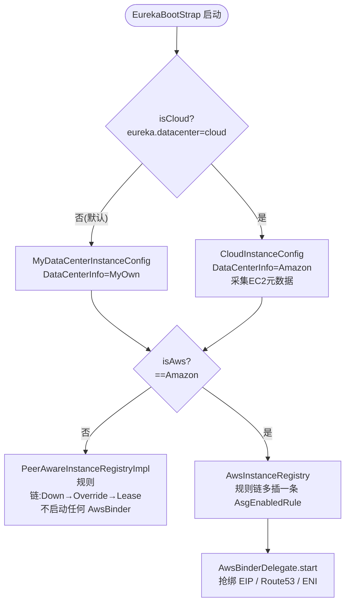

# Eureka 的 AWS 基因（选读）

> **一句话 TL;DR**：Eureka 出身于 Netflix 在 AWS EC2 上的中间层基础设施，`eureka-core` 里近 1700 行 `aws` 包代码是这段出身的遗产——EIP 绑定让 Server 拥有稳定地址、ASG 感知让"整个伸缩组一键摘流"。**这一整块只在数据中心为 `Amazon` 时才激活**；Spring Cloud / 自建机房默认 `MyOwn`，下面讲的代码全程休眠。但读懂它能解释三个"为什么"：为什么 `InstanceInfo` 里有 `DataCenterInfo`、为什么状态规则链里凭空多一条 `AsgEnabledRule`、为什么 peer 之间偏好用 IP 找彼此。

> ⚠️ **适用范围**：本文基于原生 Netflix `eureka-server` 的 `EurekaBootStrap` 启动路径。Spring Cloud 的 Server 端是另一套自动装配（`EurekaServerAutoConfiguration`），通常不会走这里的 AWS 绑定逻辑。读本文的目的是"知道它存在、知道它为何而生"，不是为了在 Spring Cloud 里启用它。

---

## 一、这套机制解决什么问题

Eureka 2012 年诞生时跑在 AWS EC2 上，那个环境有两个先天痛点：

1. **机器地址不稳定**：EC2 实例重启/替换后私有 IP 会变，而"客户端怎么找到 Eureka Server"这件事必须有个**稳定的入口地址**——否则 Server 自己都成了"需要被发现"的服务，鸡生蛋。
2. **按伸缩组运维**：Netflix 用 Auto Scaling Group（ASG，自动伸缩组）管理服务实例，运维需要一个"把整组实例从流量里摘掉"的开关（发布、演练、故障隔离），而不是逐个实例点。

`aws` 包就是这两个痛点的答案：**EIP/Route53/ENI 绑定**给 Server 稳定地址，**ASG 状态感知**给运维"整组摘流"的能力。

---

## 二、涉及的核心类

| 类 | 位置 | 职责 |
|----|------|------|
| `AwsBinder` / `AwsBinderDelegate` | `aws/` | 绑定策略接口与分发器；按 `serverConfig.getBindingStrategy()` 选 EIP/ROUTE53/ENI |
| `AwsBindingStrategy` | `aws/` | 枚举：`EIP`（默认）/ `ROUTE53` / `ENI` |
| `EIPManager` | `aws/EIPManager.java`（457行） | 启动时抢绑一个弹性 IP（EIP），让本 Server 拥有 zone 内稳定地址 |
| `Route53Binder` / `ElasticNetworkInterfaceBinder` | `aws/`（327 / 318行） | 另两种绑定策略：抢绑 Route53 DNS 记录 / 抢绑弹性网卡 ENI |
| `AwsAsgUtil` | `aws/AwsAsgUtil.java`（538行） | 调 AWS AutoScaling API 查询并缓存每个 ASG 的"启停"状态 |
| `AsgClient` | `aws/AsgClient.java` | `AwsAsgUtil` 实现的接口：`isASGEnabled(...)` / `setStatus(...)` |
| `AsgEnabledRule` | `registry/rule/AsgEnabledRule.java` | 状态覆盖规则链的一环：ASG 被禁用 → 实例强制 `OUT_OF_SERVICE` |
| `AwsInstanceRegistry` | `registry/AwsInstanceRegistry.java` | `PeerAwareInstanceRegistryImpl` 的子类，把 `AsgEnabledRule` 插进规则链 |
| `ASGResource` | `resources/ASGResource.java` | REST 接口：`PUT /{version}/asg/{asgName}/status?value=ENABLED|DISABLED` |
| `AsgReplicationTask` | `cluster/AsgReplicationTask.java` | 把 ASG 状态变更复制给集群其他 peer |
| `AmazonInfo` / `DataCenterInfo` | `appinfo/`（client 侧） | 客户端从 EC2 元数据服务采集的实例信息，及"数据中心类型"枚举 |

---

## 三、激活开关：`isAws` 决定一切

整套 AWS 逻辑挂在 `EurekaBootStrap` 的两道判断后面：

```java
// EurekaBootStrap.java:181  选实例配置
EurekaInstanceConfig instanceConfig = isCloud(deploymentContext)
        ? new CloudInstanceConfig()        // 云环境：DataCenterInfo = Amazon，采集 EC2 元数据
        : new MyDataCenterInstanceConfig(); // 自建：DataCenterInfo = MyOwn

// EurekaBootStrap.java:195  选注册表 + 启动绑定器
if (isAws(applicationInfoManager.getInfo())) {                 // ← 总开关
    registry  = new AwsInstanceRegistry(...);                  // 带 ASG 感知的注册表
    awsBinder = new AwsBinderDelegate(...);
    awsBinder.start();                                         // 抢绑 EIP/Route53/ENI
} else {
    registry  = new PeerAwareInstanceRegistryImpl(...);        // 普通注册表，无 AsgEnabledRule
}
```

而 `isAws` 的判定只有一行（`EurekaBootStrap.java:304-305`）：

```java
boolean result = DataCenterInfo.Name.Amazon == selfInstanceInfo.getDataCenterInfo().getName();
```

`DataCenterInfo.Name` 一共三种：`{Netflix, Amazon, MyOwn}`。**只有 `Amazon` 才会激活整块 AWS 代码**。原生 Server 用 archaius 属性 `eureka.datacenter=cloud`（+ `eureka.region`）把数据中心切成 cloud → `CloudInstanceConfig` 把 `DataCenterInfo` 置为 `Amazon`。默认值 `MyOwn` 下，`AwsInstanceRegistry` / `AwsBinder` / `AwsAsgUtil` 全都不会被创建。



---

## 四、EIPManager：为什么 Server 要"抢"一个弹性 IP

`EIPManager`（默认绑定策略）的使命：让每台 Eureka Server 拥有一个 **well-known 的稳定 IP**，这样客户端无需服务发现就能找到注册中心本身（解决"鸡生蛋"）。

启动流程（`@PostConstruct start()` → `handleEIPBinding()` → `bindEIP()`）：

1. 从自身 `AmazonInfo` 取 `instanceId` 与所在 zone；
2. `getCandidateEIPs(instanceId, zone)` 算出本 zone 应当持有的候选 EIP 列表（运维为每个 zone 预先 slot 好若干 EIP）；
3. 遍历候选 EIP，调 AWS `DescribeAddresses` 看每个 EIP 当前绑在谁身上：
   - **空闲** → 标记为可选；
   - **已经是我自己** → 直接命中，停止搜索；
   - **被别的实例占用** → 跳过；
4. 选中一个空闲 EIP，用 `AssociateAddressRequest` 绑定到本实例（区分 VPC 的 `allocationId` 与经典网络的 `publicIp`）。

几个关键设计点：

- **一 zone 一 Server 倾向**：每个 zone slot 至少一个 EIP，天然引导"每 zone 一台 Server"的高可用布局；本 zone 没有空闲 EIP 时会去借其他 zone 的 slot，再不行就 `sleep`（`EIP_BIND_SLEEP_TIME_MS=1000`）重试。
- **持续守护**：一个守护 `Timer("Eureka-EIPBinder")` 周期性重新检查/补绑，应对 EIP 漂移。
- **优雅退出**：`@PreDestroy shutdown()` 调 `unbindEIP()` 把 EIP 释放回池子（重试 `getEIPBindRebindRetries` 次），方便下一台 Server 顶上。

> `ROUTE53` 与 `ENI` 是同一思路的两种变体：`Route53Binder` 抢绑一条 DNS 记录、`ElasticNetworkInterfaceBinder` 抢绑一块弹性网卡，目标都是"给 Server 一个稳定的、可被预先约定的入口"。

---

## 五、ASG 整组摘流：规则链里多出来的那条规则

这是 AWS 基因里**最值得理解**的一块，因为它直接改写了状态覆盖规则链（见文档07）。

### 5.1 规则链的差异

`AwsInstanceRegistry.init()` 组装的规则链比普通版多一条：

| 场景 | 规则链（FirstMatchWins） |
|------|--------------------------|
| 普通（`PeerAwareInstanceRegistryImpl`） | `DownOrStartingRule` → `OverrideExistsRule` → `LeaseExistsRule` |
| **AWS**（`AwsInstanceRegistry`） | `DownOrStartingRule` → `OverrideExistsRule` → **`AsgEnabledRule`** → `LeaseExistsRule` |

`AsgEnabledRule` 插在"显式覆盖"之后、"沿用租约状态"之前（`AwsInstanceRegistry.java:61-63`）。

### 5.2 AsgEnabledRule 的裁决逻辑

```java
// AsgEnabledRule.apply()  registry/rule/AsgEnabledRule.java:27
if (instanceInfo.getASGName() != null) {                       // 实例属于某个 ASG
    boolean isASGDisabled = !asgClient.isASGEnabled(instanceInfo);
    return isASGDisabled
        ? StatusOverrideResult.matchingStatus(OUT_OF_SERVICE)  // ASG 禁用 → 整组摘流
        : StatusOverrideResult.matchingStatus(UP);
}
return StatusOverrideResult.NO_MATCH;                            // 没 ASG → 不管，交给后续规则
```

效果：**把一个 ASG 标记为 disabled，该组所有实例在 Eureka 里立刻被裁决成 `OUT_OF_SERVICE`，从服务发现中整组消失**——一个开关摘掉一整组流量。

### 5.3 "ASG 是否启用"怎么判断

`AwsAsgUtil` 调 AWS AutoScaling API 查 ASG 的 **SuspendedProcesses（被挂起的进程）**，看里面有没有 `"AddToLoadBalancer"`（`AwsAsgUtil.java:206-231`）：

- ASG 的 `AddToLoadBalancer` 进程被挂起 → 视为 **disabled**（运维显式把它从负载均衡里摘了）；
- 否则视为 enabled。

查询结果用 Guava `LoadingCache<CacheKey, Boolean>` 缓存（key = `accountId + asgName`），`expireAfterAccess(getASGCacheExpiryTimeoutMs)`，外加守护 `Timer("Eureka-ASGCacheRefresh")` 周期 `asgCache.refresh(...)`——避免每次裁决都打 AWS API。

### 5.4 状态也能手动改 + 集群复制

除了被动跟随 AWS 的 `AddToLoadBalancer`，运维还能直接打 Eureka 的 REST 接口改 ASG 状态：

```
PUT /{version}/asg/{asgName}/status?value=DISABLED      # ASGResource.statusUpdate
```

`ASGResource`（`ASGStatus` 枚举只有 `ENABLED` / `DISABLED`）收到后：① `awsAsgUtil.setStatus(asgName, !DISABLED)` 改本地缓存；② `registry.statusUpdate(...)` 触发后续处理；③ 通过 `AsgReplicationTask` 把这次状态变更**复制给集群其他 peer**（带 `HEADER_REPLICATION` 头，避免复制环路），保证整个集群对该 ASG 的认知一致。

---

## 六、客户端侧：`DataCenterInfo` 与 `AmazonInfo` 的来历

服务端这套能跑，前提是客户端上报的 `InstanceInfo` 里带了 AWS 身份信息：

- **`DataCenterInfo`**（`appinfo/DataCenterInfo.java`）：`Name = {Netflix, Amazon, MyOwn}`，每个 `InstanceInfo` 必带一个。这就是"为什么数据模型里有个看着用不上的 DataCenterInfo 字段"的答案——它是 AWS 出身的化石。
- **`AmazonInfo`**（`DataCenterInfo` 的 Amazon 实现）：实例在 EC2 上启动时，从实例元数据服务（`169.254.169.254`）拉一堆字段缓存起来，键由 `MetaDataKey` 枚举定义：`instanceId`（放第一个、作为 fail-fast 探针）、`amiId`、`instanceType`、`availabilityZone`、`publicHostname`、`localIpv4`、`macs`、`vpcId`、`accountId` 等。`EIPManager` 取 `instanceId`、`AsgEnabledRule` 取 `getASGName()`，源头都在这里。

Spring Cloud / 自建机房用 `MyDataCenterInfo`（`Name=MyOwn`），不采集这些字段，整条链路自然不触发。

---

## 七、与 Spring Cloud / 日常使用的连接

| 你可能见过的现象 | 与本文的关系 |
|------------------|--------------|
| `InstanceInfo` / Dashboard 里有 `dataCenterInfo: MyOwn` | 默认值；`MyOwn` 意味着 AWS 基因全程休眠 |
| 状态规则链文档（07）只有 3 条规则，但源码里有 `AsgEnabledRule` | 第 4 条规则只在 `AwsInstanceRegistry`（`Amazon` 数据中心）下才进链 |
| `eureka.datacenter` / `eureka.region` 配置项 | 原生 Server 切到 `cloud` 才会激活 `CloudInstanceConfig` → `Amazon` → 整块 AWS 逻辑 |
| 自建机房从不需要配 AWS 凭证 | 因为 `EIPManager`/`AwsAsgUtil` 根本没被实例化，不会去调 AWS API |

**一句话**：在 Spring Cloud 自建注册中心的世界里，这一整章是"知道有这么回事"即可的背景知识；它解释了 Eureka 数据模型与规则链里那些"看着多余"的设计，但你的生产链路不会碰到它。

---

## 八、常见问题

**Q1：不在 AWS，能安全忽略 `aws` 包吗？**
能。`isAws` 为 false 时这些类不会被创建。理解它的价值在于解释 `DataCenterInfo`、`AsgEnabledRule` 等"化石设计"，而非运行时依赖。

**Q2：`AsgEnabledRule` 和"运维摘流"（`OUT_OF_SERVICE` 覆盖状态）有什么区别？**
覆盖状态（`OverrideExistsRule`，文档07）是**按单个实例**打的人工覆盖；`AsgEnabledRule` 是**按整个 ASG** 联动 AWS 的伸缩组状态——一个开关摘一组。两者在规则链里 `OverrideExistsRule` 优先于 `AsgEnabledRule`，即针对单实例的显式覆盖优先级更高。

**Q3：为什么 Server 之间要用 EIP/IP 而不是域名互相发现？**
EIP 给了 Server 一个"预先约定、生命周期独立于 EC2 实例"的稳定地址，是 EC2 上最可靠的 Server 发现机制（类注释原文：*the most reliable mechanism to discover the Eureka servers*）。`ROUTE53` 策略则是用 DNS 记录达到同样目的。

---

## 九、代码索引

| 关注点 | 类:方法（行号） |
|--------|------------------|
| 激活总开关 | `EurekaBootStrap.java:195`（`isAws` 分支）、`:304`（`isAws` 判定） |
| 绑定策略分发 | `AwsBinderDelegate.java:23-36`（按 `getBindingStrategy()` switch） |
| EIP 抢绑 | `EIPManager.java:136`（`handleEIPBinding`）、`:193`（`bindEIP`）、`:263`（`unbindEIP`） |
| ASG 启停判定 | `AwsAsgUtil.java:206/228`（`isAddToLoadBalancerSuspended`）、`:113/123`（`asgCache`） |
| 规则链插入 | `AwsInstanceRegistry.java:56-64`（`init` 组装含 `AsgEnabledRule` 的链） |
| ASG 规则裁决 | `AsgEnabledRule.java:27-39`（`apply`：disabled → `OUT_OF_SERVICE`） |
| ASG REST 接口 | `ASGResource.java:103`（`statusUpdate`）、`:64`（`ASGStatus` 枚举） |
| ASG 集群复制 | `AsgReplicationTask.java`（`asgName` + `newStatus`） |
| 客户端元数据 | `DataCenterInfo.java:35`（`Name` 枚举）、`AmazonInfo.java:58`（`MetaDataKey` 枚举） |

---

*选读文档 · 隶属 docs/ 补充主题 · 基于 Netflix Eureka 1.x（原生 eureka-server 启动路径）*
