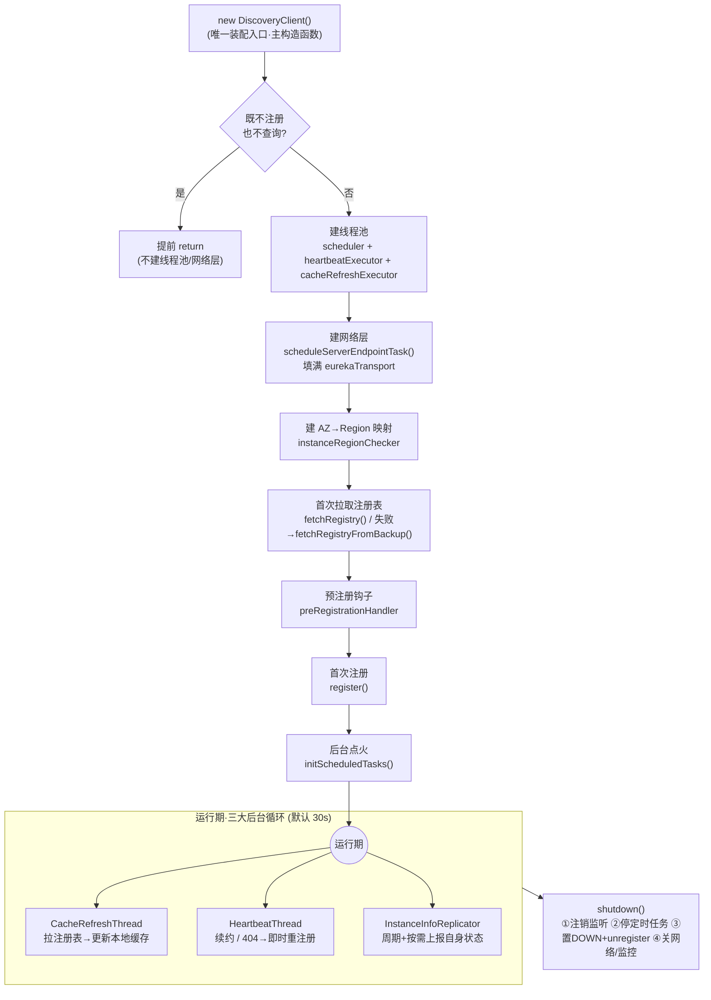
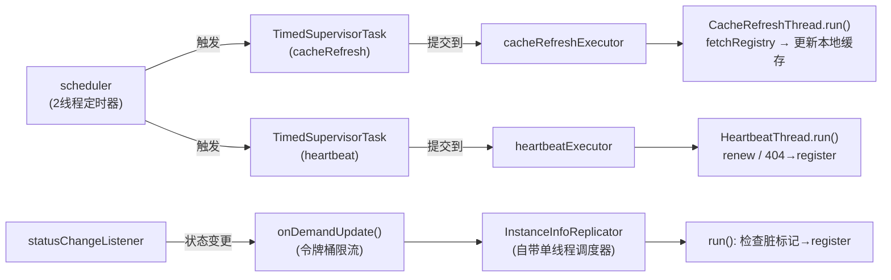
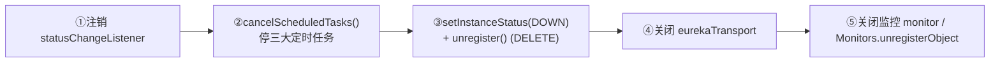

# DiscoveryClient 客户端总入口导读（以"类"为中心的导航地图）

## 文档说明

前面 01–18 篇文档都是**按流程**横切讲解（注册、心跳、拉取、下线、传输层……）。本篇换一个视角：以 `DiscoveryClient` 这一个**类**为中心，纵向把它讲清楚——它是 Eureka 客户端唯一的"总入口/上帝类"，约 1900 行，新人最容易在这里读丢。

本文不重抄各流程的细节（那些在专项文档里），只做三件事：

- 给你一张**生命周期主线图**，让你知道这个类"从生到死"经历了什么；
- 把 **40+ 个字段按职责分块**，让你看字段就知道它属于哪条流程；
- 给一张**入口方法 → 专项文档**的索引表，让你从这个类一跳即达对应流程。

- 主类：`com.netflix.discovery.DiscoveryClient`（`eureka-client/src/main/java/com/netflix/discovery/DiscoveryClient.java`，约 1904 行）
- 协作内部件：`EurekaTransport`（内部类，网络层聚合）、`TimedSupervisorTask`、`InstanceInfoReplicator`

---

## 零、TL;DR

> **一句话摘要**：`DiscoveryClient` 是应用进程里唯一常驻的 Eureka 客户端对象——对上层是"服务发现 + 自我注册"的**门面**，对内是把"网络传输 / 本地缓存 / 后台定时任务 / 自身状态上报 / 监控指标"五件事拢在一起的**协调者**；读懂它的钥匙是"一条生命周期主线 + 五类字段 + 三大后台循环"。

- **复杂度域**：Complex（门面与协调者双重职责、装配/启动/停机三阶段、三大并发后台循环交织）
- **它在客户端的位置**：业务代码 / `DiscoveryManager` / Spring Cloud 的 `EurekaClient` 抽象只跟本类打交道；真正干活的网络细节、定时退避、状态上报分别被收进 `EurekaTransport`、`TimedSupervisorTask`、`InstanceInfoReplicator` 三个零件，本类负责**组装、点火、停机时统一拆解**。
- **怎么读这个类（推荐顺序）**：
  1. 先读**主构造函数**（唯一装配入口），认清生命周期主线；
  2. 再看本文的**字段分块表**，建立"字段 → 流程"的映射；
  3. 最后顺着**入口方法索引表**跳进各专项文档读细节。
- **关键认知点**：
  1. "对象 new 出来即可用"——构造期就完成首次拉取与首次注册，宁可快速失败也不交付半启动客户端；
  2. 心跳与缓存刷新两条循环被 `TimedSupervisorTask` 包裹（自调度 + 超时退避），是它扛大规模、抗网络抖动的根基；`InstanceInfoReplicator` 则自带调度器；
  3. 停机顺序刻意为之：**先停定时任务再下线**，防止下线途中又被心跳"复活"。

---

## 一、为什么它是"上帝类"——一句话讲清职责边界

`DiscoveryClient` 同时扮演两个角色，这也是它体量大的根本原因：

| 角色 | 面向谁 | 体现 |
| --- | --- | --- |
| **门面（Facade）** | 上层业务 / Ribbon / Spring Cloud | `getApplications` / `getInstancesByVipAddress` / `getNextServerFromEureka` 等查询接口，屏蔽缓存与网络细节 |
| **协调者（Coordinator）** | 内部零件 | 组装 `EurekaTransport`、启动三大 `TimedSupervisorTask`、注册状态监听器、停机时统一收尾 |

记住这个划分，读到任何一段代码时先问："这是门面对外的那一面，还是协调者对内的那一面？"——答案能帮你迅速定位它属于哪条流程。

---

## 二、生命周期主线（认准这条线就不会迷路）

整个类的逻辑可以压缩成一条主线：**构造装配 → 首次拉取 → 预注册钩子 → 首次注册 → 后台点火 → 运行期三大循环 → 优雅停机**。

**装配顺序为什么是这样**（构造函数内）：基础字段 → 禁用分支提前返回 → 线程池 → 网络层 → 区域映射。把"既不注册也不查询"的分支放在最前面，是为了在该场景下省掉线程池与网络层的开销直接返回；网络层放在线程池之后，是因为解析器的后台刷新需要调度器就位；任何一步抛错都让构造直接失败（快速失败优于交付半成品）。

---

## 三、核心字段分类表（看字段就知道属于哪条流程）

字段约 40+ 个，硬记没意义，按**职责分五块**记即可。下表只给"职责定位 + 它服务于哪条流程"，逐字段的 why 见源码字段处注释。

### 3.1 读侧缓存（服务发现的数据来源）

| 字段 | 作用 | 服务于 |
| --- | --- | --- |
| `localRegionApps` | 本区域注册表缓存（`AtomicReference<Applications>`） | 所有查询接口的直接数据源 |
| `remoteRegionVsApps` | 各远程区域注册表映射 | 跨区域服务发现 |
| `fetchRegistryGeneration` | 单调递增的拉取代数，防过期线程覆盖新数据 | 拉取注册表的并发管制 |
| `fetchRegistryUpdateLock` | 增量更新场景的二层锁 | 拉取注册表的并发管制 |
| `remoteRegionsRef` / `remoteRegionsToFetch` | 远程区域列表的解析缓存与原始配置 | 拉取注册表（多区域） |
| `instanceRegionChecker` | 判断实例/请求属本地还是远程区域 | 路由到 local 还是 remote 缓存 |

### 3.2 传输层（"连谁、怎么发"）

| 字段 | 作用 |
| --- | --- |
| `eurekaTransport` | 聚合容器：把下面四件打包，统一创建、统一关闭 |
| └ `bootstrapResolver` | 维护可用服务端端点列表，支持故障转移 |
| └ `transportClientFactory` | HTTP client 工厂 |
| └ `registrationClient` | 注册/续约/下线（写） |
| └ `queryClient` | 拉取注册表/增量（读） |

> 设计意图：把网络细节关进 `EurekaTransport`，主类对网络层的变更"无感"，停机时一处 `shutdown()` 统一释放。

### 3.3 调度线程（后台引擎）

| 字段 | 作用 |
| --- | --- |
| `scheduler` | 2 线程的定时器，负责触发各 `TimedSupervisorTask` |
| `heartbeatExecutor` / `cacheRefreshExecutor` | 各自的工作线程池，用 `SynchronousQueue` 做隔离（忙则拒绝、不堆积） |
| `heartbeatTask` / `cacheRefreshTask` | `TimedSupervisorTask` 包装的两条周期任务 |
| `instanceInfoReplicator` | 自带调度器的状态同步器（第三条循环） |

> 两层设计：`scheduler` 只负责"何时触发"，真正执行落在独立工作池，避免心跳与缓存刷新争抢同一线程互相饿死（bulkhead 隔离）。

### 3.4 自身状态上报

| 字段 | 作用 |
| --- | --- |
| `applicationInfoManager` / `instanceInfo` | 本实例信息容器与快照（register/renew 请求体来源） |
| `statusChangeListener` | 状态变更回调，桥接到 `instanceInfoReplicator.onDemandUpdate()` 实现即时上报 |
| `healthCheckHandlerRef` / `*Provider` | 自定义健康检查器及其延迟初始化工厂 |
| `lastRemoteInstanceStatus` | 上次服务端感知到的状态，用于变更检测 |

### 3.5 监控指标与运行状态

| 字段 | 作用 |
| --- | --- |
| `registryStalenessMonitor` / `heartbeatStalenessMonitor` | 分级阈值监控（15/30/60/120/240/480s），追踪缓存/心跳陈旧度 |
| `lastSuccessfulRegistryFetchTimestamp` / `lastSuccessfulHeartbeatTimestamp` | 最近一次成功的时间戳，喂给上面两个监控器 |
| 一族 Servo `Counter`/`Timer`（如 `FETCH_REGISTRY_TIMER`、`REREGISTER_COUNTER`） | 上报查询/注册/对账频率 |
| `stats` / `initTimestampMs` / `initRegistrySize` / `registrySize` | 对外可查的运行快照，用于健康诊断（如检测注册表异常萎缩） |
| `isShutdown` | CAS 保证停机只执行一次 |

---

## 四、内部后台引擎（运行期"真正活着"的部分）

其中心跳与缓存刷新靠 `TimedSupervisorTask` 获得"自调度 + 超时退避"，而 `InstanceInfoReplicator` 自带单线程调度器；放一起讲是因为它们都是运行期常驻的后台循环（细节见《02 心跳》《03 拉取》专项文档，本节只讲它们的**共性与分工**）。

| 循环 | 干什么 | 关键特性 |
| --- | --- | --- |
| `CacheRefreshThread` | 拉服务端注册表，更新本地缓存（读侧数据源） | 拉模式；支持远程区域动态增删 |
| `HeartbeatThread` | 续约维持租约 | 最轻量（一个 PUT）；**心跳收 404 即时重注册**（"心跳即对账"自愈） |
| `InstanceInfoReplicator` | 周期/按需把自身 `InstanceInfo` 同步给服务端 | 三层设计：周期任务 + 按需触发(`onDemandUpdate`) + 脏标记；按需路径带令牌桶限流防抖动 |

**`TimedSupervisorTask` 为什么重要**：普通 `scheduleAtFixedRate` 在任务超时仍按固定频率投递新任务，会堆积请求压垮服务端。`TimedSupervisorTask` 改为"执行完才排下一次"，超时则间隔翻倍（30s→60s→…→最大 30s×backoff），网络恢复后一次成功立即回到 30s——这是它能承载海量客户端、抗网络抖动的根基。

---

## 五、入口方法 → 专项文档 索引表（从这个类一跳即达各流程）

> 下表是本文档的核心价值：你在 `DiscoveryClient` 里看到某个方法，想深入它背后的完整流程，直接查这张表跳到对应专项文档。方法位置用方法名软引用（行号以源码内已加的【小标题】注释为准）。

| 流程 | 入口方法（本类） | 一句话 | 深入阅读 |
| --- | --- | --- | --- |
| 装配/冷启动 | 主构造函数 → `scheduleServerEndpointTask` → `initScheduledTasks` | 组装→建网络→点火后台 | 本文第二节 + 《17 客户端冷启动与 backupRegistry 兜底》 |
| 服务注册 | `register()` | 把 `InstanceInfo` POST 给服务端 | 《01 服务注册流程》 |
| 心跳续约 | `renew()` / `HeartbeatThread` | PUT 续约，404 即时重注册 | 《02 心跳续约流程》 |
| 拉取注册表 | `fetchRegistry` → `getAndStoreFullRegistry`(全量) / `getAndUpdateDelta`(增量) / `reconcileAndLogDifference`(对账) / `CacheRefreshThread` | 全量+增量+hashcode 校验 | 《03 拉取注册表流程》 |
| 主动下线 | `unregister()` / `shutdown()` | 置 DOWN + DELETE | 《04 服务下线与剔除流程》 |
| 传输层 | `eurekaTransport.*`（`registrationClient`/`queryClient`/`bootstrapResolver`） | 装饰链 + 故障转移 | 《06 客户端传输层与故障转移》 |
| 状态覆盖 | `statusChangeListener` → `onDemandUpdate` | 状态变更即时上报 | 《07 状态覆盖规则链》 |
| 健康检查 | `healthCheckHandlerRef` / `registerHealthCheck` | 自定义健康判定影响上报状态 | 《15 客户端健康检查机制》 |
| 备份兜底 | `fetchRegistryFromBackup()` | 主集群不可用时读备份源 | 《17 客户端冷启动与 backupRegistry 兜底》 |
| 跨区域/AWS | `getApplicationsForARegion` / `instanceRegionChecker` | AZ→Region 映射与远程拉取 | 《18 Eureka 的 AWS 基因》 |
| 查询门面 | `getApplications` / `getApplication` / `getInstancesByVipAddress` / `getInstancesById` / `getNextServerFromEureka` | 读本地缓存，屏蔽网络 | 《03 拉取注册表流程》（数据来源） |

---

## 六、停机流程（为什么顺序不能乱）

`shutdown()` 由 `@PreDestroy` 在容器销毁 Bean 时触发，`isShutdown` CAS 保证只执行一次。顺序刻意为之：

关键在前两步：**必须先停定时任务，再发下线请求**。否则下线途中心跳/注册循环可能把实例"复活"，导致服务端反复收到 DOWN 又 UP 的抖动。`shouldUnregisterOnShutdown` 可关（如蓝绿发布希望保留注册信息）。

---

## 七、代码位置索引

> 行号会随版本漂移，定位以源码内已加的【小标题】中文注释为准（可在文件内搜索"【"快速跳转）。

| 内容 | 位置 | 说明 |
| --- | --- | --- |
| 类声明与总览注释 | `DiscoveryClient.java`（类声明上方块注释） | 本类地图 |
| 唯一装配入口 | `DiscoveryClient.java` 主构造函数（`@Inject` 标注） | 生命周期起点 |
| 网络层装配 | `DiscoveryClient.java#scheduleServerEndpointTask` | 填满 `eurekaTransport` |
| 后台点火 | `DiscoveryClient.java#initScheduledTasks` | 启动三大循环 |
| 注册 / 心跳 / 停机 | `register` / `renew` / `shutdown`（均有【】注释） | 写侧生命周期 |
| 拉取注册表 | `fetchRegistry` / `getAndStoreFullRegistry` / `getAndUpdateDelta`（均有【】注释） | 读侧数据来源 |
| 后台线程 | `HeartbeatThread` / `CacheRefreshThread`（均有【】注释） | 循环执行体 |
| 超时退避 | `TimedSupervisorTask.java` | 自调度 + 指数退避 |
| 状态同步 | `InstanceInfoReplicator.java` | 周期 + 按需 + 脏标记 |

---

## 文档元信息

文档版本：v1.0　最后更新：2026-06-08　复杂度域：Complex
负责模块：eureka-client
相关类：DiscoveryClient.java、EurekaTransport（内部类）、TimedSupervisorTask.java、InstanceInfoReplicator.java
关联文档：[01.服务注册流程] [02.心跳续约流程] [03.拉取注册表流程] [04.服务下线与剔除流程] [06.客户端传输层与故障转移] [15.客户端健康检查机制] [17.客户端冷启动与backupRegistry兜底] [18.Eureka的AWS基因]