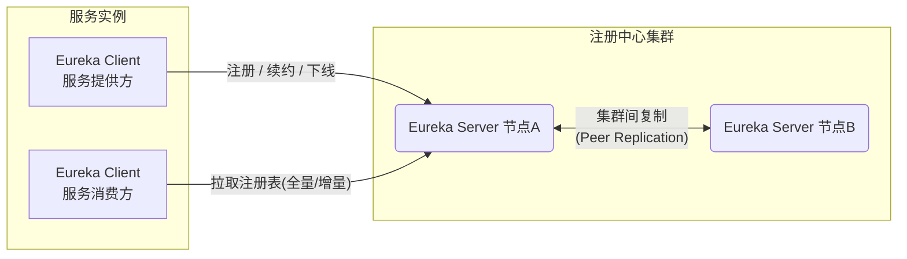

# Eureka 源码阅读指南

> 基于仓库 commit `8227a727`（master / dongmian 分支），生成日期：2026-06-01
> **更新**：核心源码已添加中文注释，5 条核心流程的详细分析文档已完成（见下方"流程文档索引"）

## 文档总索引

### 核心流程（深度分析，含时序图/状态图/ADR/FMEA）

| 文档 | 核心内容 |
|------|---------|
| [01.服务注册流程](01.服务注册流程.md) | InstanceInfoReplicator → register → 双层Map落库 → 集群复制 |
| [02.心跳续约流程](02.心跳续约流程.md) | 心跳的双重职责（保活+数据对账）、404/409 双向数据修复 |
| [03.拉取注册表流程](03.拉取注册表流程.md) | 三级缓存、增量+hashcode校验+全量兜底、读写锁互斥的真正原因 |
| [04.服务下线与剔除流程](04.服务下线与剔除流程.md) | 主动下线 vs 被动剔除、自我保护机制、三层剔除保护 |
| [05.服务端启动与集群同步流程](05.服务端启动与集群同步流程.md) | Server即Client自举、syncUp、启动保护期、批处理复制框架 |

### 横向主题

| 文档 | 核心内容 |
|------|---------|
| [06.客户端传输层与故障转移](06.客户端传输层与故障转移.md) | 装饰器链（会话/重试/重定向）、隔离区、Server列表解析 |
| [07.状态覆盖规则链](07.状态覆盖规则链.md) | 实例状态的裁决机制、运维摘流为什么不会被心跳冲掉 |
| [09.数据模型与序列化批处理](09.数据模型与序列化批处理.md) | InstanceInfo字段全景、hashcode算法、批处理框架三层队列 |

### 实践与扩展

| 文档 | 核心内容 |
|------|---------|
| [08.本地运行与测试验证指南](08.本地运行与测试验证指南.md) | JDK21+macOS实测：编译/war构建/51个测试全通过的完整步骤与坑 |
| [10.SpringCloud集成与注册中心对比](10.SpringCloud集成与注册中心对比.md) | @EnableEurekaServer的本质、Eureka vs Nacos/Consul/ZK |

### 总结与输出

| 文档 | 核心内容 |
|------|---------|
| [11.全景架构大图](11.全景架构大图.md) | 一图流：组件全景/实例生命周期/数据流向/定时任务表/时间链 |
| [12.源码级面试题集](12.源码级面试题集.md) | 16道高频题，普通答案 vs 源码级答案对照 |
| [13.博客系列索引](13.博客系列大纲与样例.md) | 10篇博客的规划、写作方法论与文档对应关系 |
| [14.源码学习方法论](14.源码学习方法论.md) | 五阶段闭环方法论：建图→深挖→补全→验证→输出（可复用） |

### 博客系列（blog/ 目录，10 篇全文，可直接发布）

| 篇目 | 标题 |
|------|------|
| [blog/01](blog/01.为什么说Eureka是AP的教科书.md) | 为什么说 Eureka 是 AP 的教科书？从一次注册请求说起 |
| [blog/02](blog/02.Eureka的心跳不只是保活.md) | Eureka 的心跳不只是保活：藏在续约里的分布式对账机制 |
| [blog/03](blog/03.新服务注册后为什么90秒才能被调用.md) | 新服务注册后为什么 90 秒才能被调用？扒一扒三级缓存 |
| [blog/04](blog/04.Eureka自我保护机制.md) | Eureka 自我保护机制：保的是什么？ |
| [blog/05](blog/05.EurekaServer启动时都干了什么.md) | Eureka Server 启动时都干了什么？ |
| [blog/06](blog/06.挂一台EurekaServer为什么客户端无感.md) | 挂一台 Eureka Server 为什么客户端无感？ |
| [blog/07](blog/07.运维摘流后实例为什么不会自己恢复.md) | 运维摘流后实例为什么不会自己恢复？ |
| [blog/08](blog/08.在macOS和JDK21上跑通2012年的Eureka.md) | 2026 年了，在 macOS + JDK 21 上跑通 2012 年的 Eureka |
| [blog/09](blog/09.Eureka集群复制的工程智慧.md) | Eureka 集群复制的工程智慧：去重、攒批与"丢了也没关系" |
| [blog/10](blog/10.学完Eureka源码再看Nacos.md) | 学完 Eureka 源码再看 Nacos：注册中心的演化与选型（完结篇） |

## 一、整体架构认知

Eureka 是 Netflix 开源的**服务注册与发现**组件（AP 型，可用性优先）。整个系统只有两个角色：

理解源码只需要抓住 **5 条核心流程**：

1. **客户端注册**（register）
2. **心跳续约**（renew）
3. **拉取注册表**（fetch registry，全量 + 增量）
4. **服务下线/剔除**（cancel / evict）
5. **集群间复制**（peer replication）

## 二、模块划分

| 模块 | 职责 | 优先级 |
|------|------|--------|
| **eureka-client** | 客户端：注册、心跳、拉取注册表 | ★★★★★ 必读 |
| **eureka-core** | 服务端核心：注册表、REST 接口、集群复制、缓存 | ★★★★★ 必读 |
| **eureka-server** | 服务端打包模块（war），只有 web.xml 配置 | ★★★ 看一眼即可 |
| **eureka-examples** | 使用示例 | ★★★ 入门起点 |
| eureka-resources | Dashboard 页面（JSP） | 跳过 |
| eureka-client-jersey2 / core-jersey2 | Jersey 2.x 适配层 | 跳过 |
| eureka-client-archaius2 | Archaius2 配置框架集成 | 跳过 |
| eureka-server-governator | Governator 生命周期管理 | 跳过 |
| eureka-test-utils | 测试工具 | 跳过 |

## 三、推荐阅读路径（5 个阶段）

### 阶段 1：从示例入手，理解使用方式（半天）

> 先知道"怎么用"，再看"怎么实现"。

| 顺序 | 文件 | 关注点 |
|------|------|--------|
| 1 | `eureka-examples/src/main/java/com/netflix/eureka/ExampleEurekaService.java` | 服务方如何注册自己 |
| 2 | `eureka-examples/src/main/java/com/netflix/eureka/ExampleEurekaClient.java` | 消费方如何发现服务 |
| 3 | `eureka-client/src/main/java/com/netflix/appinfo/InstanceInfo.java` | **核心数据模型**：实例的状态、租约、元数据 |
| 4 | `eureka-client/src/main/java/com/netflix/appinfo/LeaseInfo.java` | 租约模型：续约间隔 30s、过期时间 90s 两个关键默认值 |

### 阶段 2：客户端实现（1-2 天）

> 核心只有一个类：`DiscoveryClient`（1838 行），它是整个客户端的大脑。
> 路径：`eureka-client/src/main/java/com/netflix/discovery/DiscoveryClient.java`

| 顺序 | 位置 | 关注点 |
|------|------|--------|
| 1 | `DiscoveryClient` 构造函数 | 初始化流程：创建线程池、初始化定时任务 `initScheduledTasks()` |
| 2 | `DiscoveryClient.java:896` `register()` | 注册：把自己的 InstanceInfo POST 给服务端 → 详见[01.服务注册流程](01.服务注册流程.md) |
| 3 | `DiscoveryClient.java:1497` `HeartbeatThread` | 心跳线程：每 30s 调一次 `renew()`，收到 404 则重新注册 → 详见[02.心跳续约流程](02.心跳续约流程.md) |
| 4 | `DiscoveryClient.java:1572` `CacheRefreshThread` | 缓存刷新线程：每 30s 拉取注册表（首次全量，之后增量）→ 详见[03.拉取注册表流程](03.拉取注册表流程.md) |
| 5 | `DiscoveryClient.java:1035` `fetchRegistry()` / `:1146` `getAndStoreFullRegistry()` / `:1191` `getAndUpdateDelta()` | **全量 vs 增量拉取**的实现与一致性校验（hashcode 对比） |
| 6 | `DiscoveryClient.java:1011` `unregister()` | 优雅下线 → 详见[04.服务下线与剔除流程](04.服务下线与剔除流程.md) |
| 7 | `InstanceInfoReplicator.java`（同包） | 实例信息变更后如何异步同步给服务端 |
| 8 | `TimedSupervisorTask.java`（同包） | 定时任务的超时监督与自适应间隔（设计精巧，值得细看） |

### 阶段 3：服务端实现（2-3 天）

> 入口是 `EurekaBootStrap`，核心是 `AbstractInstanceRegistry`（注册表本体）。
> 路径前缀：`eureka-core/src/main/java/com/netflix/eureka/`

| 顺序 | 位置 | 关注点 |
|------|------|--------|
| 1 | `eureka-server/src/main/webapp/WEB-INF/web.xml` | 启动监听器 + Jersey Servlet 路由配置 |
| 2 | `EurekaBootStrap.java:116` `contextInitialized()` → `:162` `initEurekaServerContext()` | 服务端启动全流程 → 详见[05.服务端启动与集群同步流程](05.服务端启动与集群同步流程.md) |
| 3 | `resources/ApplicationResource.java:150` `addInstance()` | **注册的 REST 入口**（POST /v2/apps/{appName}） |
| 4 | `resources/InstanceResource.java:110` `renewLease()` | **续约的 REST 入口**（PUT .../{instanceId}） |
| 5 | `registry/AbstractInstanceRegistry.java:198` `register()` | 注册表数据结构：`ConcurrentHashMap<appName, Map<instanceId, Lease<InstanceInfo>>>` |
| 6 | `registry/AbstractInstanceRegistry.java:384` `renew()` | 续约逻辑 |
| 7 | `registry/AbstractInstanceRegistry.java:330` `internalCancel()` | 下线逻辑 |
| 8 | `registry/AbstractInstanceRegistry.java:650` `evict()` | **剔除任务**：清理超时未续约的实例（注意分批随机剔除的设计） |
| 9 | `registry/ResponseCacheImpl.java` | **三级缓存**：registry → readWriteCacheMap → readOnlyCacheMap，理解为什么读写分离 |
| 10 | `lease/Lease.java` | 租约 holder，注意 `evictionTimestamp` 多算一个 duration 的著名问题 |

### 阶段 4：集群与自我保护（1-2 天）

| 顺序 | 位置 | 关注点 |
|------|------|--------|
| 1 | `registry/PeerAwareInstanceRegistryImpl.java` | 在 AbstractInstanceRegistry 基础上增加**集群复制**：register/renew/cancel 都广播给 peer 节点 |
| 2 | `cluster/PeerEurekaNodes.java` / `cluster/PeerEurekaNode.java` | 对等节点管理、复制任务的批处理与重试 |
| 3 | `util/batcher/` 包 | 任务批处理框架（TaskDispatcher），复制请求如何合并发送 |
| 4 | `PeerAwareInstanceRegistryImpl.isLeaseExpirationEnabled()` | **自我保护机制**：续约数低于阈值（默认 85%）时停止剔除实例 |
| 5 | `PeerAwareInstanceRegistryImpl.syncUp()` | 服务端启动时从 peer 节点同步注册表 |

### 阶段 5：横向主题（按需深入）

- **传输层**：`eureka-client/.../discovery/shared/transport/` —— HTTP 客户端的封装、重试、会话保持
- **序列化**：`discovery/converters/` 包 —— JSON/XML 编解码，注意 `Applications` 的 hashcode 一致性设计
- **配置体系**：`EurekaClientConfig`（客户端行为） / `EurekaServerConfig`（服务端行为） / `EurekaInstanceConfig`（实例元数据）三个配置接口的区别
- **监控指标**：近期提交（如 `665dab53`）在 DiscoveryClient 中加了 VIP 查询的 metrics，可参考 Netflix 的埋点方式

## 四、核心流程速查表

| 想知道什么 | 直接看这里 | 详细文档 |
|-----------|-----------|---------|
| 客户端怎么注册 | `DiscoveryClient.java:896` → 服务端 `ApplicationResource.java:150 addInstance()` → `AbstractInstanceRegistry.java:198` | [01](01.服务注册流程.md) |
| 心跳怎么续约 | `DiscoveryClient.java:920 renew()` → `InstanceResource.java:110 renewLease()` → `AbstractInstanceRegistry.java:384` | [02](02.心跳续约流程.md) |
| 注册表怎么拉取 | `DiscoveryClient.java:1572 CacheRefreshThread` → `ApplicationsResource.java:125 getContainers()` → `ResponseCacheImpl` | [03](03.拉取注册表流程.md) |
| 实例怎么被剔除 | `EvictionTask:1334` → `AbstractInstanceRegistry.java:650 evict()` | [04](04.服务下线与剔除流程.md) |
| 自我保护怎么触发 | `PeerAwareInstanceRegistryImpl.java:507 isLeaseExpirationEnabled()` | [04](04.服务下线与剔除流程.md) |
| 集群怎么同步 | `PeerAwareInstanceRegistryImpl.java:697 replicateToPeers()` → `PeerEurekaNode` | [05](05.服务端启动与集群同步流程.md) |
| 服务端怎么启动 | `web.xml` → `EurekaBootStrap.java:116` | [05](05.服务端启动与集群同步流程.md) |

## 五、阅读方法建议

1. **带着流程读，不要按文件读**——每次只追一条流程（如注册），从客户端发起一直追到服务端落库。
2. **注意 Eureka 的 AP 取舍**——很多"奇怪"的设计（多级缓存、自我保护、增量同步容忍不一致）都是为了可用性牺牲一致性。
3. **数据结构先行**——先把 `InstanceInfo`、`Lease`、`Applications` 三个模型吃透，流程就只是这些数据的搬运。
4. **善用工具**——深入某个具体方法时，可用 `/mfd <方法名>` 生成带时序图的详细流程文档，例如：
   - `mfd AbstractInstanceRegistry#register` —— 服务端注册流程
   - `mfd DiscoveryClient#fetchRegistry` —— 注册表拉取流程

## 六、关键默认参数（理解流程时的背景知识）

| 参数 | 默认值 | 含义 |
|------|--------|------|
| 心跳间隔 | 30s | 客户端每 30s 续约一次 |
| 租约过期时间 | 90s | 服务端 90s 没收到心跳就认为实例过期 |
| 注册表拉取间隔 | 30s | 客户端每 30s 拉取一次增量 |
| 自我保护阈值 | 0.85 | 实际续约数 < 期望值的 85% 时进入自我保护 |
| 剔除任务间隔 | 60s | 服务端每 60s 执行一次过期实例剔除 |
| readOnly 缓存同步间隔 | 30s | 只读缓存与读写缓存的同步周期 |
